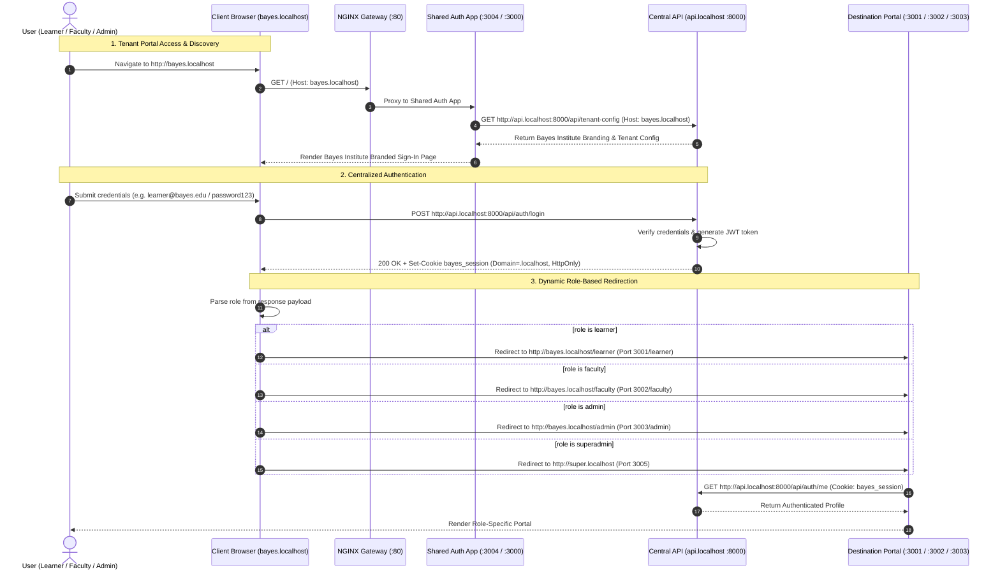

# BayesStack Shared Authentication App (`apps/auth`)

The Shared Authentication App manages institutional user login, self-service portals, session cookies, and role-based post-login redirection across BayesStack multi-tenant environments.

---

## 1. Multi-Tenant Architecture & Centralized API Routing

BayesStack uses a **centralized, tenant-agnostic API gateway** alongside dedicated frontends for each tenant role and experience.

### Why the API is Centralized (`api.bayesstack.com` / `api.localhost`)
- **Tenant-Agnostic Core**: The backend API (`services/api`) is a single, unified FastAPI monolith. There are **no tenant-specific API endpoints** (e.g., `bayes.bayesstack.com/api/*` is not used).
- **Direct Frontend-to-API Communication**: All frontend applications (`apps/auth`, `apps/learner`, `apps/faculty`, `apps/admin`) communicate directly with the central API gateway at `https://api.bayesstack.com` (production) or `http://api.localhost:8000` (local).
- **Dynamic Context Resolution**: Tenant context is resolved dynamically per request using the `Host` header, `X-Tenant-Slug`, or the authenticated user's JWT session payload.
- **Cross-Subdomain Session Cookies**: Because session cookies are scoped to the parent domain (`Domain=.bayesstack.com` in production, `Domain=.localhost` locally), a single login session is seamlessly shared across all tenant portals without needing tenant-proxied API routes.

### Gateway Routing Table

| Domain Pattern | Gateway Target | Description |
| :--- | :--- | :--- |
| `api.bayesstack.com` / `api.localhost` | `services/api` (`:8000`) | **Centralized API Gateway**: Platform-wide REST API, OpenAPI docs, and auth endpoints |
| `*.bayesstack.com` / `*.localhost` (e.g. `bayes.*`) | `apps/auth` (`:3004` / `:3000`) | Root tenant URL forwards to Auth App for login & session management |
| `*.bayesstack.com/learner` / `*.localhost/learner` | `apps/learner` (`:3001` / `:3000`) | Continuous student learning application |
| `*.bayesstack.com/faculty` / `*.localhost/faculty` | `apps/faculty` (`:3002` / `:3000`) | Course authoring and curriculum review portal |
| `*.bayesstack.com/admin` / `*.localhost/admin` | `apps/admin` (`:3003` / `:3000`) | Institutional administration and governance portal |
| `super.bayesstack.com` / `super.localhost` | `apps/super` (`:3005` / `:3000`) | Platform SuperAdmin control plane |

### Dynamic Tenant Resolution & Unknown Institution Handling (404)

- **Fully Dynamic**: The architecture is 100% dynamic and does **not** hardcode `"bayes"`. Any institution added to the database (`tenants` / `institutions` table) is automatically recognized and rendered with its custom branding.
- **Sample Onboarded Tenant**: `bayes` (Bayes Institute) is the primary sample tenant seeded in the database for demonstration and testing.
- **Unregistered Institutions (404 Not Found)**: When an un-onboarded subdomain is requested (e.g., `http://xyz.localhost` or `https://xyz.bayesstack.com`):
  1. NGINX Gateway dynamically extracts the slug `xyz` and forwards the request to `apps/auth`.
  2. The Auth App calls `GET /api/tenant-config` with `Host: xyz.localhost`.
  3. The backend queries PostgreSQL for active tenant `xyz`, fails to find a matching record, and returns `HTTP 404 (TENANT_NOT_FOUND)`.
  4. The Auth App renders the dedicated **"Institution 'xyz' Is Not With Us"** 404 screen, providing links back to Platform Home and the SuperAdmin portal.

---

## 2. Sample User Profiles & Credentials (Bayes Institute)

The database seed (`services/api/src/db/seed.py`) populates three distinct sample user profiles for the **Bayes Institute** tenant (`tenant-bayes` / `bayes`), representing the core operational roles:

| Role Profile | User ID | Email | Password | Full Name | Tenant | Post-Login Redirection |
| :--- | :--- | :--- | :--- | :--- | :--- | :--- |
| **Learner Profile** | `user-bayes-learner` | `learner@bayes.edu` | `password123` | Bayes Institute Learner | Bayes Institute (`bayes`) | `http://bayes.localhost/learner`<br/>(Port `3001/learner` in standalone dev) |
| **Faculty Profile** | `user-bayes-faculty` | `faculty@bayes.edu` | `password123` | Prof. Alan Bayes | Bayes Institute (`bayes`) | `http://bayes.localhost/faculty`<br/>(Port `3002/faculty` in standalone dev) |
| **Admin Profile** | `user-bayes-admin` | `admin@bayes.edu` | `password123` | Bayes Institute Administrator | Bayes Institute (`bayes`) | `http://bayes.localhost/admin`<br/>(Port `3003/admin` in standalone dev) |

### Platform SuperAdmin Profile (Platform Control Plane)

| Role Profile | User ID | Email | Password | Full Name | Tenant | Post-Login Redirection |
| :--- | :--- | :--- | :--- | :--- | :--- | :--- |
| **SuperAdmin** | `user-superadmin` | `admin@bayesstack.com` | `admin123` | BayesStack Platform SuperAdmin | Platform Tenant (`bayes`) | `http://super.localhost`<br/>(Port `3005` in standalone dev) |

---

## 3. End-to-End Authentication & Redirection Workflow




### Flow Breakdown:
1. **Tenant Identification**: Incoming HTTP requests to `bayes.localhost` or `bayes.bayesstack.com` are captured by NGINX and routed to the Auth App.
2. **Branding & Context**: Auth App detects the tenant slug `bayes` and queries `GET /api/tenant-config` from the central API, displaying "Sign In to Bayes Institute".
3. **Authentication**: Form submission sends `POST /api/auth/login` directly to the central API with `{ email, password }`.
4. **Session Cookie**: On success, the API sets an `HttpOnly`, `SameSite=lax` session cookie (`bayes_session`) valid across the domain (`.localhost` or `.bayesstack.com`).
5. **Role-Based Redirection**:
   - `learner` is redirected to `http://bayes.localhost/learner` (or port `3001/learner`).
   - `faculty` is redirected to `http://bayes.localhost/faculty` (or port `3002/faculty`).
   - `admin` is redirected to `http://bayes.localhost/admin` (or port `3003/admin`).
   - `superadmin` is redirected to `http://super.localhost` (or port `3005`).
6. **Session Check & Auto-Routing**: If a user with an active session returns to the auth page or accesses a portal directly, `/api/auth/me` detects the active cookie and authenticates them.

---

## 4. Local Development & Verification

### Running the Stack

```bash
# Option A: Run native local development
./scripts/start-local.sh --core

# Option B: Run with Docker Compose
docker compose up api auth learner faculty admin nginx postgres
```

### Direct Port Access (without NGINX)

- **Auth App**: [http://localhost:3004](http://localhost:3004) or [http://bayes.localhost:3004](http://bayes.localhost:3004)
- **Learner App**: [http://localhost:3001/learner](http://localhost:3001/learner) or [http://bayes.localhost:3001/learner](http://bayes.localhost:3001/learner)
- **Faculty App**: [http://localhost:3002/faculty](http://localhost:3002/faculty) or [http://bayes.localhost:3002/faculty](http://bayes.localhost:3002/faculty)
- **Admin App**: [http://localhost:3003/admin](http://localhost:3003/admin) or [http://bayes.localhost:3003/admin](http://bayes.localhost:3003/admin)
- **SuperAdmin App**: [http://localhost:3005](http://localhost:3005) or [http://super.localhost:3005](http://super.localhost:3005)
- **FastAPI Backend**: [http://localhost:8000/docs](http://localhost:8000/docs)
