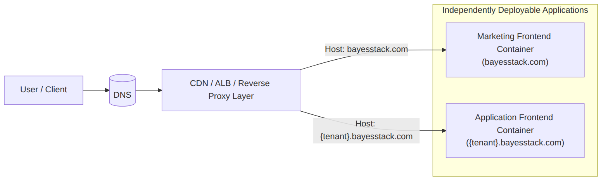
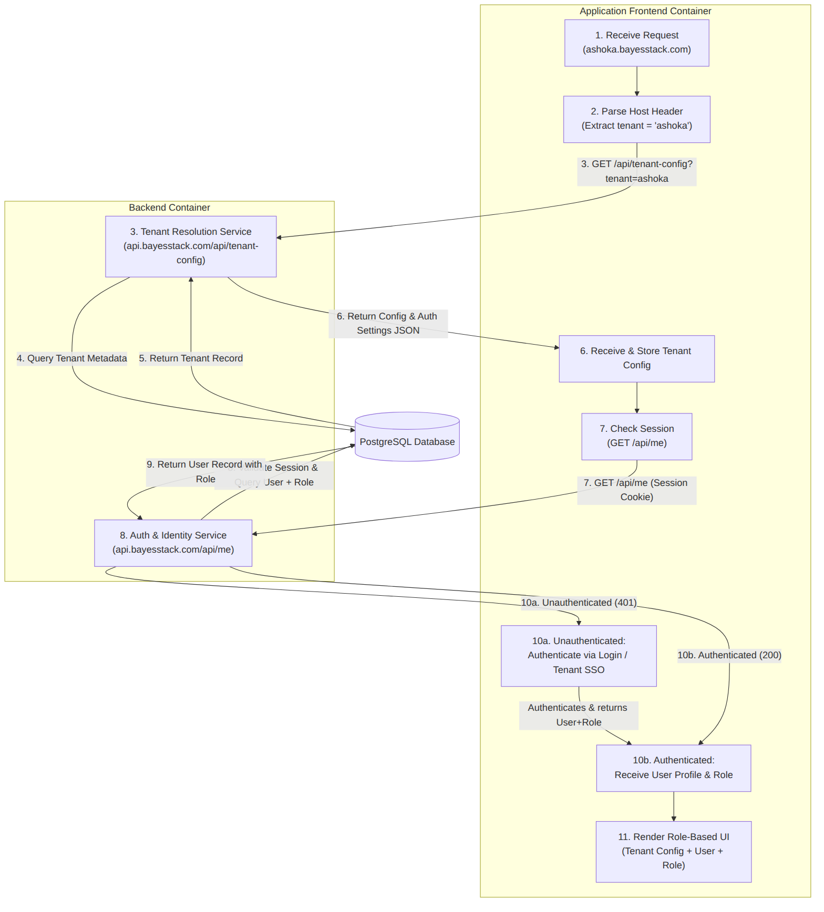
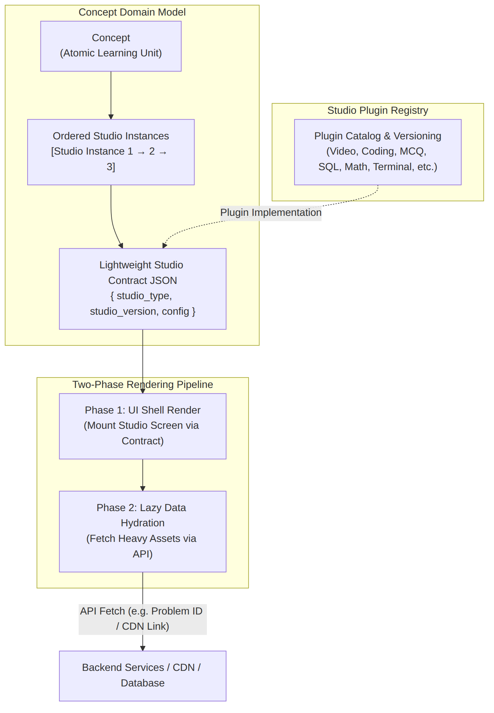
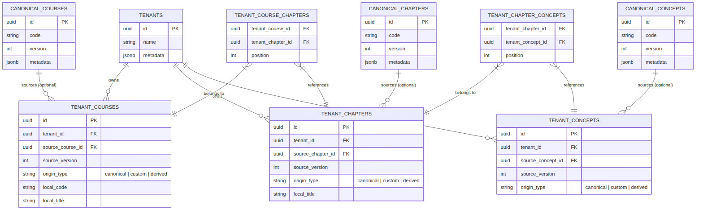
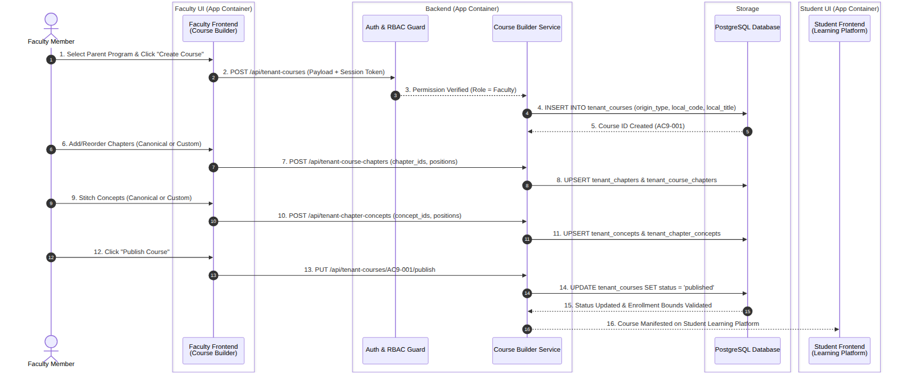
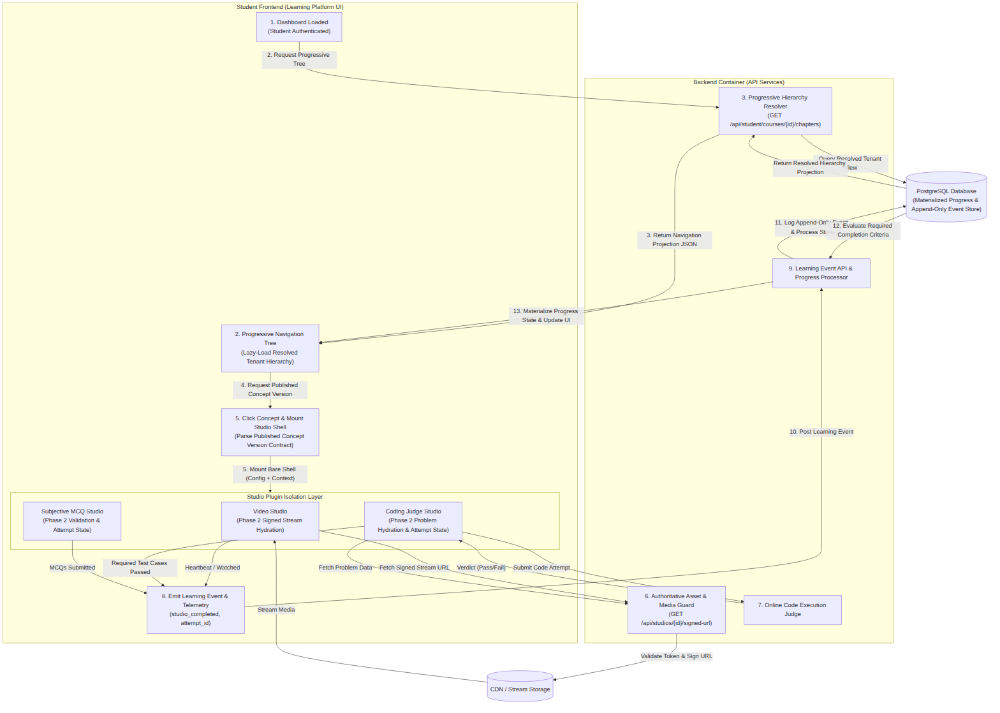
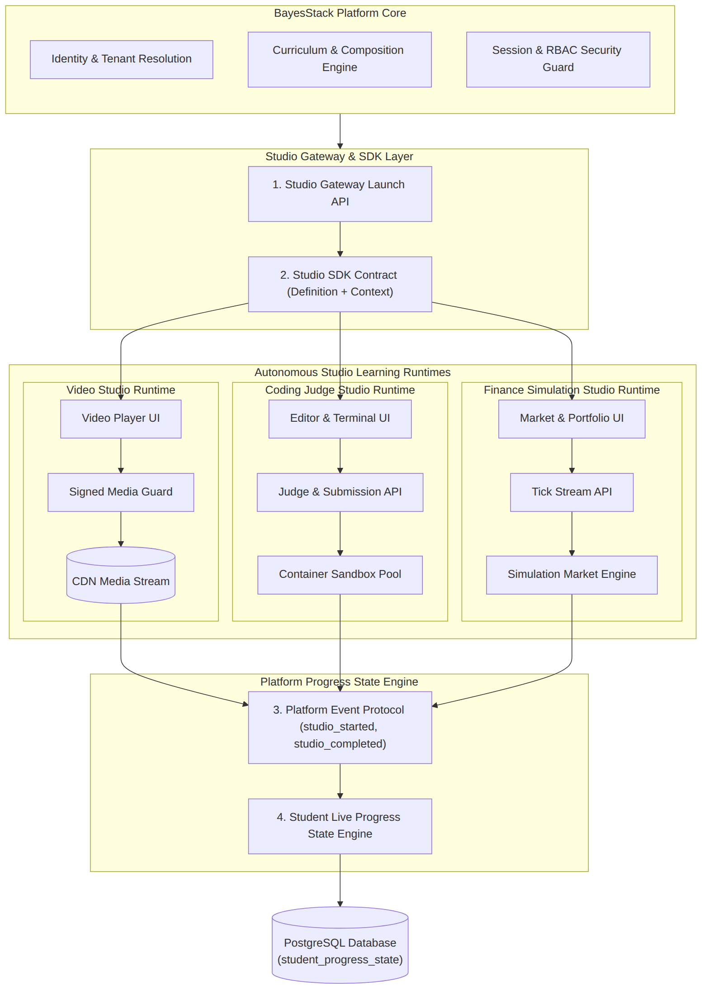

# Step 01: First Thought HLD

```text
Document:    01_first_thought_hld.md
Step:        Product Architecture Trace Origin
Status:      First Thought Architecture Blueprint
Date:        2026-08-29
Author:      Sagar Udasi
Location:    docs/system-design/01_first_thought_hld.md
```

---

## Executive Summary & MVP Scope

BayesStack is a multi-tenant learning infrastructure platform built for higher-education institutions to customize, author, and run domain-specific learning environments at scale.

### What the MVP Delivers

The initial release establishes three core architectural pillars:
1. **Multi-Tenant Routing & Identity**: Strict separation between marketing traffic (`bayesstack.com`) and institutional subdomains (`{tenant}.bayesstack.com`), backed by a single continuous Learner SPA host, role-tailored frontends, and independent server-side authorization.
2. **Canonical Content Library & Composition Engine**: A 6-tier academic content graph (Tenant, Curriculum, Program, Course, Chapter, Concept) that isolates immutable platform content from tenant-specific compositions. Universities borrow, sequence, or extend courses with zero data duplication.
3. **Autonomous Studio Runtimes & Live Progress Engine**: Pluggable learning environments (Video, Online Code Execution, MCQ, Math, Finance) packaged as self-contained React packages mounted inside the Learner SPA, backed by independent polyglot backend services, an append-only event log, and a materialized student progress engine.

## System Architecture

The platform uses a monorepo containing application shells and microservices. The Learner app (`apps/learner`) serves as the single host application shell. Studios are engineered as modular React packages on the frontend that mount directly inside the Learner SPA, while their backend microservices, judges, and sandbox pools run on independent compute infrastructure.

## User Journey

### 1. Landing Page Isolation
The root domain `bayesstack.com` serves strictly static marketing content and lead capture endpoints. It contains no application code, session handlers, or backend database access paths.

### 2. Tenant Subdomain Access & Role Hierarchy
Institutional users access the application through tenant subdomains such as `ashoka.bayesstack.com` or `coep.bayesstack.com`.

An Edge Infrastructure layer (CDN, ALB, and reverse proxy) inspects the HTTP Host header at the entry point and routes requests to the appropriate application container.

The platform enforces a four-tier user hierarchy:
1. Super Admin (Platform owner)
2. Tenant Admin (Institutional administrator)
3. Faculty (Course author and instructor)
4. Student (Learner)

#### Diagram 1: Request Routing Architecture

   

### 3. Tenant Resolution, Authentication & Role-Based Rendering
Rendering the correct tenant experience securely requires resolving three independent inputs: Tenant Configuration, User Identity, and Tenant Membership Role.

1. **Tenant Resolution**: The application frontend reads the host header (`ashoka.bayesstack.com`) and queries `GET /api/tenant-config`. The API fetches the tenant record from PostgreSQL and returns branding assets, auth configuration, and feature flags.
2. **Session Verification (`/api/me`)**: The frontend calls `GET /api/me`. If unauthenticated, the user is redirected to the tenant login page or institutional SSO endpoint. On success, the API returns the user profile attached to their tenant membership context.
3. **Role-Based UI Rendering**: The frontend evaluates the tenant configuration, authenticated identity, and verified role to render the appropriate dashboard and fetch role-specific data.

> **Security Rule**: Client-supplied tenant host headers are routing hints, not authorization proofs. The backend independently validates tenant membership, user status, and RBAC permissions on every protected endpoint call.

> **Membership Model**: User roles are attached to Tenant Memberships (`User -> Tenant Membership -> Role -> Permissions`) rather than stored globally on the user record. A single user can act as Faculty for Ashoka University while holding Super Admin rights on BayesStack Platform.

After authentication, the frontend branches into three distinct UI surfaces: Student Frontend, Faculty Frontend, and Admin Frontend.

#### Diagram 2: Tenant Resolution & Authentication Flow



### 4. Primitive Learning Model: Concept & Studio Engine
The atomic building block of learning content is a **Concept**, defined as an ordered sequence of **Studio Instances** (for example, a Video Studio followed by a Coding Judge Studio and an MCQ Studio).

- **Continuous Learner SPA Integration**: The student experiences a single, seamless application shell (`apps/learner`). Studios mount inside the `ConceptPlayer` host component. Moving between studios within a concept triggers an instant React component mount/unmount transition with zero browser page reloads.
- **Frontend Packages vs Independent Backends**: Studio frontends are engineered as modular React/TypeScript packages (`@bayesstack/studio-video`, `@bayesstack/studio-coding`). Their backend infrastructure (Code Execution Judges, Financial Simulation Engines, Media Services) operates as independent microservices.
- **Studio Plugin Registry**: Studio UI packages are registered in a versioned platform catalog (`studio_version`), allowing us to deploy updated studio features without breaking existing course content.
- **Lightweight Contracts**: A Concept stores an array of minimal JSON contracts specifying `studio_type`, `studio_version`, and initialization `config` (such as `{ "studio_type": "coding", "studio_version": "v1.2", "config": { "problem_id": "LC704", "language": "python" } }`).
- **Two-Phase Rendering & Prefetching Pipeline**:
  1. *Phase 1 (Shell Render & Bundle Resolution)*: The Learner SPA reads the contract JSON, resolves the registered React package, and mounts the studio UI shell.
  2. *Phase 2 (Lazy Data Hydration & Background Prefetching)*: The mounted studio fetches its runtime payloads from backend APIs. Simultaneously, the Learner SPA pre-fetches the JavaScript bundle and metadata for the next Studio in the sequence.

> **Database Isolation Boundary**: Studios never connect directly to the primary database. All interactions pass through dedicated backend APIs and authorized microservices.

#### Diagram 3: Concept & Studio Data Model and Hydration Flow



### 5. Content Hierarchy & Multi-Tenant Canonical Reuse Engine

#### Structural Content Hierarchy
Learning content is organized in a 6-tier hierarchy:
- **Tenant / University**: Institutional container for academic programs.
- **Curriculum**: Ordered sequence of Programs.
- **Program**: Ordered sequence of Courses.
- **Course**: Ordered sequence of Chapters.
- **Chapter**: Ordered sequence of Concepts.
- **Concept**: Atomic unit containing ordered Studio Instances.

#### Canonical Library & Composition Engine
The platform maintains a global **Canonical Learning Library** storing standardized Programs, Courses, Chapters, and Concepts.
- **Multi-Level Borrowing**: Using the Course Builder, faculty can adopt canonical content at any tier (for example, subscribing to an entire course, importing a single chapter, or linking a single concept like "Gradient Descent" across multiple courses).
- **Custom Composition**: Institutions can re-sequence, stitch, or override borrowed canonical structures to form custom curriculums.

> **Core Architectural Spine**: We separate immutable canonical entities from tenant-owned composition objects. Canonical entities are versioned and immutable. Tenant compositions store references to canonical versions, tenant-created custom entities, or derived forks. Ordered relationship edges record tenant-specific sequence positions and composition deltas. This approach supports multi-tenant reuse without data duplication or state collisions.

#### Why We Decouple Entities From Compositions
Cloning full content trees whenever an institution adopts a course is an anti-pattern. If 100 universities adopt a course containing 20 chapters, cloning creates 2,000 redundant database rows, inflates storage, and severs platform content updates. Conversely, allowing tenants to edit shared canonical rows causes instant data corruption across institutions.

Decoupling entity definitions from tenant compositions and position edges gives us complete customization alongside zero-duplication reuse:
- **Immutable Version Pinning (`source_version`)**: A tenant adopting a course pins to a specific release (e.g. `ML-001 / V7`). Upstream platform updates (`V8`) will not alter live course content mid-semester.
- **Explicit Provenance (`origin_type`)**: Tracks whether content is unmodified (`canonical`), tenant-created (`custom`), or forked (`derived`).

#### Data Architecture: Entities, Compositions, and Ordered Edges
The schema isolates three operational layers:

1. **Canonical Library Entities (`courses`, `chapters`, `concepts`)**:
   - Immutable platform definitions owned by `BayesStack_System`.
   - Versioned releases (`version`) authored by platform curriculum engineers.

2. **Tenant Compositions (`tenant_courses`, `tenant_chapters`, `tenant_concepts`)**:
   - Tenant wrappers holding institutional metadata (local course code, local title, semester, assigned faculty).
   - Provenance (`origin_type`):
     - `canonical`: Direct reference to a canonical library entity version.
     - `custom`: Brand new entity created by a tenant.
     - `derived`: Modified fork of a canonical entity.

3. **Ordered Composition Relationships (`tenant_course_chapters`, `tenant_chapter_concepts`)**:
   - Relational join tables storing `parent_id`, `child_id`, and `position`. Decoupling entity identity from display sequence allows different courses to share identical chapters while enforcing custom ordering (1-2-3 versus 2-3-1).

#### Diagram 4: Canonical Library vs Tenant Composition ER Diagram



#### Scenario 1: Borrowing an Entire Canonical Course As-Is
*Walkthrough*: Ashoka University adopts platform course `ML-001 / V7` ("Machine Learning") without structural modifications.

- **Execution**:
  1. `tenant_courses`: Creates 1 wrapper row (`id = AC9-001`, `tenant_id = Ashoka`, `source_course_id = ML-001`, `source_version = 7`, `origin_type = canonical`, `local_title = "Introduction to Machine Learning"`).
  2. `Composition Resolution`: The API inherits child chapter mappings directly from `ML-001 / V7`. No child relationship records are duplicated.
- **Database Footprint**: Exactly 1 row in `tenant_courses`.

#### Scenario 2: Borrowing a Canonical Course with Composition Deltas (Derived Course)
*Walkthrough*: Ashoka adopts `ML-001 / V7`, reorders existing chapters, and injects a custom chapter.

- **Execution**:
  1. `tenant_courses`: Creates 1 row with `origin_type = derived` (`source_course_id = ML-001`, `source_version = 7`).
  2. `tenant_chapters`: Creates 1 custom chapter row `ACH-ASHOKA-01` (`origin_type = custom`, `local_title = "Ashoka Applied ML Case Studies"`).
  3. `tenant_course_chapters`: Stores explicit composition deltas against the source course:
     - `(AC9-001 -> CH-2 [Canonical], position: 1)`
     - `(AC9-001 -> CH-1 [Canonical], position: 2)`
     - `(AC9-001 -> ACH-ASHOKA-01 [Custom], position: 3)`
- **Database Footprint**: 1 `tenant_courses` row, 1 `tenant_chapters` row, and 3 explicit relationship rows in `tenant_course_chapters`.

#### Scenario 3: Custom Course Building with Selective Concept Borrowing
*Walkthrough*: Ashoka builds a custom course (`AC9-100`, "Advanced Quantitative Finance") containing custom chapter `ACH-QUANT-1`, combining borrowed canonical concepts with custom concepts.

- **Execution**:
  1. `tenant_courses`: Creates 1 custom course row (`origin_type = custom`, `tenant_id = Ashoka`).
  2. `tenant_chapters`: Creates 1 custom chapter row (`ACH-QUANT-1`, `origin_type = custom`). Provenance reflects entity origin: the chapter is `custom` even though it links to canonical child concepts.
  3. `tenant_chapter_concepts`: Creates 3 explicit relationship rows:
     - `(ACH-QUANT-1 -> Concept C-123 / V4 [Canonical], position: 1)`
     - `(ACH-QUANT-1 -> Concept C-456 / V2 [Canonical], position: 2)`
     - `(ACH-QUANT-1 -> Concept AC-789 [Custom Tenant Concept], position: 3)`
- **Database Footprint**: Clean composition and explicit provenance without data duplication or cross-tenant state leakage.

#### Role Governance & Universal Fractal Abstraction

1. **Role Scoping (Faculty vs Tenant Admin)**:
   - **Faculty**: Authoring scope is limited to course-level instructional design. Permissions are enforced at the resource level (`Faculty -> Course`) so an instructor can edit assigned courses without altering unassigned material.
   - **Tenant Admin**: Institutional governance across macro academic structures (**Curriculums** and **Programs**), holding admin permissions across all institution courses.

2. **Universal Fractal Pattern**:
   - The entity-versus-composition model applies recursively across all 6 tiers of the academic graph:
     - **Curriculum Tier**: `tenant_curriculums` linked to `tenant_programs` via `tenant_curriculum_programs`.
     - **Program Tier**: `tenant_programs` linked to `tenant_courses` via `tenant_program_courses`.
   - The composition resolver, provenance rules, and ordering mechanics use shared logic across tiers, while PostgreSQL maintains explicit domain tables (`tenant_courses`, `tenant_chapters`, `tenant_concepts`).

### 6. Course Builder & Publishing End-to-End Workflow

This workflow details how the Faculty Frontend, Backend API Services, PostgreSQL Database, and Student Frontend interact during course creation and publishing.

#### Student Enrollment Model
Students are enrolled at the Program or Curriculum level (for example, a student enrolled in Ashoka's *B.Tech Computer Science Program*). Students do not enroll in individual courses manually. Any course attached to their program automatically appears on their student dashboard once published.

#### End-to-End Execution Trace

1. **Course Creation & Authorization Guard**:
   - Faculty opens the Course Builder, selects an assigned Program, and clicks Create Course.
   - The frontend calls `POST /api/tenant-courses` with session token and host headers.
   - The backend validates resource authorization (`Faculty -> Program/Course`) and creates a record in `tenant_courses` (`origin_type = custom` or `derived`, `status = draft`).
2. **Chapter Assembly**:
   - Faculty selects canonical chapters from the catalog or creates custom chapters.
   - The frontend calls `POST /api/tenant-course-chapters`. The backend updates `tenant_chapters` and `tenant_course_chapters` with sequential `position` values.
3. **Concept Stitching**:
   - Faculty attaches concepts to each chapter (borrowing canonical concepts like "Gradient Descent" or adding custom concepts).
   - The frontend calls `POST /api/tenant-chapter-concepts`. The backend updates `tenant_concepts` and `tenant_chapter_concepts` with `position` values.
4. **Publishing & Cohort Snapshotting**:
   - Faculty clicks Publish Course. The frontend calls `PUT /api/tenant-courses/{id}/publish`.
   - The backend updates course status to `published` and locks an immutable composition snapshot for active student cohorts. Subsequent authoring edits take place in a new draft version rather than mutating active coursework.
   - The published course becomes visible to enrolled students on the Student Frontend.

#### Diagram 5: Course Builder & Publishing End-to-End Sequence Flow



### 7. Student Learning Experience & Live Progress State Engine

This section describes how a student navigates content, mounts Studio instances inside the continuous Learner SPA, and how the Student Progress Engine processes learning events while persisting student state.

#### Learner SPA Host Architecture (`apps/learner`)
The student experience is governed by a single Next.js application shell. Navigation (`ashoka.bayesstack.com/concept/gradient-descent?step=2`) remains continuous. 

The Learner SPA includes a dedicated frontend runtime architecture:
```text
apps/learner/
├── app/
│   └── concept/[id]/page.tsx      # Route handler
├── components/
│   ├── ConceptPlayer/             # Shell wrapper (Header, Sidebar, Next/Prev)
│   └── StudioHost/                # Mount container for active Studio React package
└── runtime/
    ├── StudioRegistry             # Catalog mapping studio_type -> React package
    ├── StudioLoader               # Dynamic chunk importer
    ├── StudioPrefetcher           # Prefetches upcoming Studio JS bundles and API data
    ├── StudioStateManager         # Preserves attempt state across step transitions
    └── StudioLifecycleManager     # Manages mount/unmount and saveState calls
```

#### End-to-End Execution Trace

1. **Progressive Navigation Projection**:
   - Student logs into `{tenant}.bayesstack.com`.
   - The frontend calls `GET /api/student/courses/{id}/chapters` to lazy-load hierarchy nodes on demand.
   - The backend queries tenant composition tables and returns a clean navigation JSON without exposing internal authoring metadata.

2. **Concept Selection & Contract Resolution**:
   - Student selects a Concept (e.g. "Gradient Descent").
   - The frontend calls `GET /api/student/concepts/{id}` and receives a published Concept Version contract containing ordered Studio specs:
     ```json
     {
       "concept_id": "C123",
       "studios": [
         { "instance_id": "SI1", "studio_type": "video", "studio_version": "v1", "config": { "video_id": "V901" } },
         { "instance_id": "SI2", "studio_type": "coding", "studio_version": "v2", "config": { "problem_id": "P721" } },
         { "instance_id": "SI3", "studio_type": "mcq", "studio_version": "v1", "config": { "quiz_id": "Q304" } }
       ]
     }
     ```

3. **Active Rendering & Background Prefetching**:
   - **Active Studio (Studio 1: Video)**: `StudioHost` mounts `@bayesstack/studio-video`. It calls `GET /api/studios/V901/signed-url` to receive a signed CDN streaming link.
   - **Background Prefetching (Studio 2: Coding)**: While the student watches the video, `StudioPrefetcher` dynamically downloads the `@bayesstack/studio-coding` JS chunk and pre-fetches problem metadata (`P721`) from the Coding API.

4. **Instant Step Transition (Clicking Next)**:
   - When the student clicks Next, `StudioLifecycleManager` calls `saveState()` on Studio 1 and unmounts it.
   - `StudioHost` instantly mounts the pre-loaded `@bayesstack/studio-coding` package with zero browser page reloads or network wait screens.

5. **Telemetry vs Learning Events**:
   - High-frequency interaction data (video position ticks, mouse movements) streams asynchronously to telemetry storage for analytics.
   - Milestone learning events (`studio_started`, `studio_completed`, `practice_submitted`) post synchronously to `POST /api/student/progress/event`.
   - The Student Progress Engine:
     1. Appends the raw event to an append-only event store.
     2. Evaluates completion rules: A concept completes when all required studio instances (`required = true`) satisfy their completion criteria.
     3. Updates materialized state in `student_concept_progress` (`student_id`, `tenant_id`, `concept_version_id`, `studio_instance_id`, `status: completed`, `timestamp`), updating dashboard state immediately.

> **Durable Progress Identity**: Student progress is bound to immutable `studio_instance_id` (e.g. `SI2`), never to array index or display position. Reordering studios inside a concept preserves historical student progress records.

#### Diagram 6: Student Learning Journey & Progress State Flow



#### Architectural Rationale
- **Progressive Navigation Projection**: Sending the full 6-tier content tree in a single payload transfers thousands of unnecessary nodes over the wire. Lazy loading returns clean, tenant-resolved navigation projections on demand.
- **Continuous SPA Experience**: Next.js provides the overarching application shell (`apps/learner`), while Studios are imported as self-contained React UI packages. This decouples frontend smoothness from backend microservice independence.
- **Two-Tier State Storage**: High-frequency UI telemetry is decoupled from progress milestones. Events write to an append-only log with durable `attempt_id` tracking, while a state processor updates `student_concept_progress` for fast dashboard queries.

### 8. Studio Architecture, SDK Platform & Autonomous Runtimes

Studios are independently engineered learning applications. On the frontend, they are packaged as React libraries (`@bayesstack/studio-[name]`) mounted by the Learner SPA. On the backend, they run specialized microservices and infrastructure.

#### Architectural Rule: Next.js Host vs React Studio Packages

> **Next.js is the shell application framework**: `apps/learner`, `apps/faculty`, `apps/admin`, and `apps/landing` are Next.js applications that manage routing, SSR, layout, and session state.
>
> **React is the Studio frontend format**: Studio frontends (`studios/[name]/frontend`) are built as self-contained React/TypeScript packages. They do not maintain independent routing layers; the Learner SPA owns navigation and layout.

#### Platform vs Studio Ownership

> **BayesStack Platform Core owns the learning journey**: Identity, tenant resolution, curriculum sequencing, RBAC authorization, and materialized progress state.
>
> **Autonomous Studios own the learning environment**: Domain UI, specialized compute, execution sandboxes, simulation engines, evaluation logic, and local UI state.

#### The Three Protocol Boundaries

1. **Boundary 1: Platform -> Studio (Contract Handoff)**:
   The Learner SPA passes an initialization payload containing Studio Definition and Runtime Context:
   ```json
   {
     "studio_type": "coding",
     "studio_version": "v2",
     "instance_id": "SI_92381",
     "context": {
       "concept_id": "C123",
       "attempt_id": "A8921"
     },
     "config": {
       "problem_id": "P721",
       "language": "python"
     }
   }
   ```

2. **Boundary 2: Studio -> Autonomous Runtime & Infrastructure**:
   Studio UI packages communicate directly with their independent backend microservices:
   - **Video Studio**: `@bayesstack/studio-video` -> Signed Asset API -> CDN Stream.
   - **Coding Judge Studio**: `@bayesstack/studio-coding` -> Problem API -> Submission API -> Ephemeral Sandbox Container Pool.
   - **Finance Simulation Studio**: `@bayesstack/studio-finance` -> Tick Stream API -> Order & Portfolio Simulation Engine.
   - **Math Studio**: `@bayesstack/studio-math` -> Canvas UI -> Numerical Compute Engine.

3. **Boundary 3: Studio -> Platform (Standardized Event Protocol)**:
   Studios report standardized learning events (`studio_started`, `studio_completed`, `practice_submitted`) back to the platform without interacting with PostgreSQL schemas.

#### Expanded Studio SDK Lifecycle Interface

Studio developers implement the `BayesStackStudio` SDK contract, declaring capabilities (`stateful`, `submittable`, `gradable`, `completable`, `streaming`, `interactive`, `sandboxed`):

```typescript
interface BayesStackStudio {
  prepare?(config: StudioConfig): Promise<void>;            // Prefetch JS bundle & heavy metadata
  initialize(context: StudioRuntimeContext): Promise<void>; // Bind attempt_id and tenant context
  mount(container: HTMLElement): Promise<void>;             // Attach UI component to Learner SPA DOM
  resume(state: any): Promise<void>;                        // Restore cached attempt inputs
  saveState(): Promise<any>;                               // Export current local state
  unmount(): Promise<void>;                                // Detach DOM listeners & cleanup
  destroy(): void;                                         // Release worker memory
}
```

Studios invoke platform capabilities based on declared features:
- `emitTelemetry(data)`: Emits high-frequency telemetry.
- `submitAttempt(payload)`: Submits evaluation attempts (Coding, MCQ, Math).
- `requestCompletion()`: Triggers progress engine evaluation.

> **Sandbox Boundary**: Studios can run dedicated backend microservices, but they must use BayesStack identity, tenant authorization, and event protocols. Code execution and shell environments run inside isolated, ephemeral container sandboxes behind authorized API gateways.

#### Studio Directory Layout & Lifecycle

Monorepo layout isolating frontend React packages from backend services:
```text
studios/
├── video/
│   ├── frontend/     # React package (@bayesstack/studio-video)
│   ├── backend/      # Service / Signed asset guard
│   └── contract/
│
├── coding/
│   ├── frontend/     # React package (@bayesstack/studio-coding)
│   ├── backend/      # FastAPI submission API
│   ├── judge/        # Judge worker
│   └── sandbox/      # Ephemeral Docker container pool
│
├── finance/
│   ├── frontend/     # React package (@bayesstack/studio-finance)
│   ├── backend/      # FastAPI simulation API
│   └── simulation/   # Market order tick engine
│
└── math/
    ├── frontend/     # React package (@bayesstack/studio-math)
    └── backend/      # Numerical compute engine
```

#### Diagram 7: Studio Architecture, SDK Platform & Autonomous Runtimes



### 9. Monorepo Layout, Technology Stack & Production Topology

The platform codebase lives in a pnpm and Turborepo monorepo enforcing clear component boundaries, shared SDK packages, and independent application runtimes.

#### Monorepo Structure

```text
bayesstack/
│
├── apps/
│   ├── landing/          # Next.js landing & lead capture
│   ├── learner/          # Next.js main student SPA host application
│   ├── faculty/          # Next.js course builder & authoring frontend
│   └── admin/            # Next.js institutional administration frontend
│
├── services/
│   ├── platform-api/     # FastAPI core API gateway & business logic
│   ├── composition/      # Canonical reuse & hierarchy composition engine
│   ├── progress/         # Event ingestion & progress engine
│   └── auth/             # Identity & tenant RBAC service
│
├── studios/
│   ├── video/
│   │   ├── frontend/     # React package (@bayesstack/studio-video)
│   │   ├── backend/      # Signed asset guard service
│   │   └── contract/     # Studio schema specification
│   │
│   ├── coding/
│   │   ├── frontend/     # React package (@bayesstack/studio-coding)
│   │   ├── backend/      # FastAPI submission API
│   │   ├── judge/        # Code execution judge worker
│   │   └── sandbox/      # Ephemeral Docker container pool
│   │
│   ├── finance/
│   │   ├── frontend/     # React package (@bayesstack/studio-finance)
│   │   ├── backend/      # FastAPI simulation API
│   │   └── simulation/   # Tick stream order book engine
│   │
│   ├── sql/
│   │   ├── frontend/     # React package (@bayesstack/studio-sql)
│   │   └── backend/      # Query execution & sandbox database
│   │
│   ├── mcq/
│   │   ├── frontend/     # React package (@bayesstack/studio-mcq)
│   │   └── backend/      # Assessment auto-grader service
│   │
│   └── terminal/
│       ├── frontend/     # React package (@bayesstack/studio-terminal)
│       └── backend/      # Shell emulator container runtime
│
├── packages/
│   ├── ui/               # Shared Tailwind design system & UI library
│   ├── studio-sdk/       # BayesStack Studio SDK & event client
│   ├── contracts/        # Shared OpenAPI & Pydantic schemas
│   ├── auth-sdk/         # Tenant session & RBAC helpers
│   ├── telemetry/        # Telemetry client
│   └── types/            # TypeScript domain interfaces
│
├── database/
│   ├── migrations/       # Alembic schema migration scripts
│   ├── seeds/            # Canonical course library & default seeds
│   └── fixtures/         # Test environment fixtures
│
├── infra/
│   ├── docker/           # Container definitions & compose profiles
│   ├── cloudflare/       # DNS, WAF rules & edge routing
│   └── aws/              # Infrastructure automation
│
└── docs/                 # System documentation & API specifications
```

#### Technology Selection Matrix

| Layer | Choice | Rationale |
| :--- | :--- | :--- |
| **App Framework** | **Next.js + React + TypeScript** | Shell applications (`apps/learner`, `apps/faculty`, `apps/admin`, `apps/landing`) managing SSR, routing, and session state. |
| **Studio Frontends** | **React / TS Packages (`@bayesstack/studio-*`)** | Self-contained UI components mounted inside the Learner SPA, avoiding full-page domain transitions. |
| **UI Design System** | **Tailwind CSS + Shared Component Library** | Standardizes UI components (`packages/ui`) across app shells and Studio packages. |
| **Server State** | **TanStack Query** | Manages data fetching, caching, background updates, and cache invalidation. |
| **Client State** | **Zustand** | Lightweight client state management; keeps Studio internal UI state encapsulated. |
| **Platform Backend** | **FastAPI + Python** | High-performance async API framework offering native support for AI, simulation, and data processing. |
| **API Contracts** | **Pydantic + OpenAPI** | Auto-generating schema validation ensuring typed contracts across frontend, backend, and Studios. |
| **ORM / Data Access** | **SQLAlchemy 2.x** | Fine-grained control over relational queries, JOINs, and composition mappings. |
| **Migrations** | **Alembic** | PostgreSQL schema evolution and migration tracking. |
| **Primary Database** | **PostgreSQL** | Relational core for tenant identity, content compositions, version contracts, and materialized progress state. |
| **Caching** | **Redis** | High-speed caching, tenant session storage, rate limiting, and temporary state. |
| **Async Tasks** | **Redis Workers (Celery/ARQ) -> SQS** | Handles V1 background jobs cleanly, upgrading to AWS SQS as message volumes increase. |
| **Object Storage** | **Cloudflare R2** | High-performance S3-compatible storage with zero egress fees. |
| **Video CDN** | **Bunny CDN** | Cost-effective global video delivery with signed token verification. |
| **Edge & WAF** | **Cloudflare** | DNS management, wildcard subdomains (`*.bayesstack.com`), SSL/TLS termination, and WAF security. |
| **Containers** | **Docker** | Packages applications, backend services, and studio runtimes into reproducible containers. |
| **Initial Compute** | **Consolidated VPS / EC2** | Cost-effective V1 footprint hosting platform containers on shared compute. |
| **Scale Compute** | **AWS ECS/Fargate / Dedicated Pools** | Decouples services and code execution sandboxes into independently autoscaling compute pools. |
| **Observability** | **Sentry + OpenTelemetry** | Application error tracking and distributed tracing across microservices. |
| **CI/CD** | **GitHub Actions** | Automated monorepo linting, testing, container building, and deployment workflows. |

#### Specialized Studio Execution Independence
As specialized Studio modalities grow, their compute requirements diverge from core platform APIs. Studios can split away from shared infrastructure into dedicated execution environments without changing platform contracts:

- **Coding & Terminal Studios**: Route code execution requests through submission APIs to queue-backed **Judge Workers** that spin up ephemeral, resource-restricted Docker containers for untrusted code execution.
- **Finance Simulation Studio**: Connects market UIs directly to dedicated Python workers executing real-time order books and market tick streams.
- **Video Studio**: Offloads video processing and streaming directly to Bunny CDN behind short-lived signed URLs.

#### Polyglot Studio Philosophy & Cost Strategy
Platform Core requires FastAPI and Python, but Studios are polyglot runtimes bound only by the BayesStack Studio SDK. Studios can use specialized internal stacks (such as C++ execution judges, WebAssembly math libraries, or Node.js socket servers) as long as they implement the SDK lifecycle and event protocol.

Cost efficiency is baked into the topology:
1. **Edge Protection & Storage**: Cloudflare eliminates object storage egress fees (R2) and protects wildcard subdomains via WAF.
2. **Media Delivery**: Bunny CDN minimizes bandwidth costs for high-volume video streaming.
3. **Progressive Compute Scale**: Consolidated Docker containers handle initial workloads at low cost, upgrading to AWS ECS/Fargate or dedicated Kubernetes judge pools only when tenant usage demands it.

### 10. Production Readiness & Implementation TODOs

This section tracks the technical backlog, security hardening tasks, and engineering milestones required before deploying the V1 production infrastructure.

#### Phase 1: Core Platform & Security Hardening
- [ ] **Tenant Routing & Middleware Guard**: Implement Host header validation middleware in `services/auth/` to verify host names against database records and prevent host spoofing attacks.
- [ ] **RBAC Permission Matrix**: Finalize JWT claim structures to encode Organization Memberships (`user_id`, `tenant_id`, `role_id`, `permissions`) and implement resource-level policy enforcement in FastAPI.
- [ ] **Database Schema & Migrations**: Finalize initial Alembic migration scripts for `tenants`, `canonical_*`, `tenant_*`, `student_concept_progress`, and `event_log`.

#### Phase 2: Content Composition Engine
- [ ] **Composition Resolver Service**: Implement the tree-resolution service in `services/composition/` that evaluates parent-child relationship edges (`tenant_course_chapters`, `tenant_chapter_concepts`) and resolves dynamic canonical inheritance.
- [ ] **Version Snapshotting Engine**: Implement the snapshot trigger on course publish (`PUT /api/tenant-courses/{id}/publish`) to lock composition trees for active student cohorts.
- [ ] **Canonical Seed Pipeline**: Populate `database/seeds/` with foundational canonical courses, chapters, and concepts.

#### Phase 3: Studio SDK & Plugin Ecosystem
- [ ] **Studio SDK Package (`@bayesstack/studio-sdk`)**: Package the core TypeScript interfaces (`BayesStackStudio`, `StudioRuntimeContext`, `StudioConfig`) and publish as an internal monorepo package.
- [ ] **Learner SPA Runtime Components**: Build `ConceptPlayer`, `StudioHost`, `StudioRegistry`, `StudioLoader`, `StudioPrefetcher`, `StudioStateManager`, and `StudioLifecycleManager` inside `apps/learner/`.
- [ ] **Core Studio Packages**:
  - [ ] `@bayesstack/studio-video`: Implement player UI with Bunny CDN token signing endpoint integration.
  - [ ] `@bayesstack/studio-coding`: Implement Monaco/CodeMirror editor UI with code submission API integration.
  - [ ] `@bayesstack/studio-mcq`: Implement auto-graded assessment component.
  - [ ] `@bayesstack/studio-math`: Implement canvas and numerical compute bindings.
  - [ ] `@bayesstack/studio-finance`: Implement portfolio simulation tick stream component.

#### Phase 4: Execution Sandbox Infrastructure
- [ ] **Code Execution Judge Microservice**: Build the submission gateway and Celery/ARQ queue workers for untrusted code execution.
- [ ] **Docker Sandbox Hardening**: Apply `seccomp` profiles, `gVisor` runtime boundaries, strict resource limits (memory, CPU, network isolation), and execution timeouts for coding and terminal judges.

#### Phase 5: Progress Engine & Telemetry Pipeline
- [ ] **Event Ingestion Endpoint**: Implement high-throughput `POST /api/student/progress/event` ingestion service.
- [ ] **Async Materialization Worker**: Build Redis worker service that reads from raw event log and updates materialized `student_concept_progress` rows.
- [ ] **Telemetry Stream Buffer**: Implement Redis buffer for non-blocking telemetry data (video position ticks, interaction heatmaps).

#### Phase 6: Infrastructure & DevOps Strategy
- [ ] **Terraform Infrastructure As Code**: Codify AWS EC2/ALB compute resources, Cloudflare DNS, WAF rules, and Cloudflare R2 bucket policies in `infra/aws/` and `infra/cloudflare/`.
- [ ] **Bunny CDN Token Signing Middleware**: Implement edge-compatible URL signing service for video stream authorization.
- [ ] **Monorepo CI/CD Pipelines**: Configure GitHub Actions workflows to run targeted linting, unit testing, and Docker image builds on Turborepo path changes.
