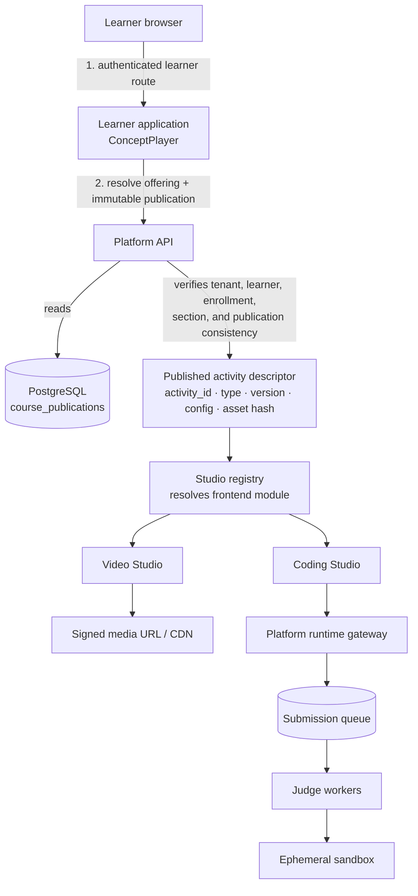

# Step 03: Studio Runtime Architecture

```text
Document:    03_studio_runtime_architecture.md
Step:        Learner Activity Delivery and Studio Runtime Design
Status:      Target architecture; current implementation and implementation plan
Date:        2026-09-07
Author:      Sagar Udasi
Location:    docs/system-design/03_studio_runtime_architecture.md
```

---

## 1. Decision Summary

BayesStack uses three deliberately different terms:

| Term | Meaning | Example |
| --- | --- | --- |
| **Concept** | The atomic learning objective in a course publication. | Knapsack problem |
| **Activity** | A configured learner task attached to a concept. It determines order, requiredness, runtime type, and content reference. | “Implement 0/1 Knapsack in Python” |
| **Studio** | The reusable runtime that renders and operates an activity. It owns modality-specific UI and, when needed, specialized execution infrastructure. | Coding Studio |

An activity is not a backend service and a studio is not a row in the academic hierarchy. One Coding Studio implementation can deliver thousands of coding activities across many concepts, courses, institutions, and learners. The activity provides the immutable, context-specific configuration; the studio provides the reusable experience and execution capability.

Keep the repository directory named [`studios/`](../../studios/README.md). It represents the runtime/plugin boundary. The database entities are correctly named `catalog_activities` and `institution_activities`.

The core rule is:

> A studio must be able to run an authorized activity without knowing the curriculum, course, chapter, or tenant-composition path that led the learner there.

It receives only a narrowly scoped runtime session and an immutable activity descriptor. The platform API remains responsible for identity, enrollment, authorization, publication selection, audit records, and gradebook state.

---

## 2. What Exists Today

The first implementation already establishes the correct data boundaries.

| Existing element | Responsibility |
| --- | --- |
| `catalog_concepts` | Immutable, versioned platform concepts. |
| `catalog_activities` | Ordered activities for a catalog concept: `activity_type`, `activity_version`, `position`, `is_required`, `config_summary`, and optional CAS `asset_hash`. |
| `institution_activities` | Institution-owned activities for institution concepts, scoped by `tenant_id`. |
| `course_publications` | Immutable compiled learner manifests, pinned by course offering so a term never changes under active learners. |
| `studio_assets` | Content-addressed metadata for large bundles stored outside PostgreSQL. |
| `enrollments` | The learner-to-section authorization boundary. |
| `learning_progress` | Concept-level progress, keyed by enrollment and concept release. |
| `assessment_submissions` | Attempt, payload, grading status, score, and feedback for an activity. |
| `studios/video` and `studios/coding` | Explicit frontend/backend/contract boundaries. They are folders only; the API monolith is currently the sole backend process. |

The publication compiler already emits activity descriptors from the ordered activity rows. The learner application is still a presentation prototype with hard-coded video and code views; it does not yet resolve a published activity manifest into a dynamically loaded studio.

---

## 3. Runtime Topology

The learner should make one platform request to resolve their assigned course publication, then mount activities locally from that immutable manifest. Runtime hydration happens only after the selected studio is known.



The browser never receives a database credential, never selects an arbitrary activity by ID, and never calls a sandbox directly. The platform API is the policy enforcement point. Studios may be independently deployed later, but they must still receive capability-limited credentials from the platform rather than direct access to the primary database.

---

## 4. The Published Activity Descriptor

The course publication is the learner-facing source of truth. It must contain enough information to select a studio without joining the authoring hierarchy at playback time.

```json
{
  "activity_id": "activity-knapsack-python-v1",
  "activity_release_id": "activity-release-knapsack-python-1",
  "activity_type": "coding",
  "activity_version": "1.0.0",
  "contract_version": "2026-09-01",
  "position": 2000000,
  "is_required": true,
  "title": "Implement 0/1 Knapsack",
  "config": {
    "problem_id": "knapsack-01",
    "problem_version": 3,
    "default_language": "python",
    "allowed_languages": ["python", "cpp", "java"],
    "time_limit_ms": 2000,
    "memory_limit_mb": 256
  },
  "asset_hash": "sha256:..."
}
```

`config` is small, safe-to-publish orchestration data. It must not contain private test cases, judge credentials, answer keys, S3 credentials, or unrestricted internal URLs. Sensitive and large data belongs behind a runtime bootstrap endpoint or in object storage reached by short-lived signed URLs.

The immutable publication freezes the activity release ID and its referenced problem/content releases for an offering. Publishing a new course release may introduce a newer activity release, but an active offering continues to serve the exact publication that it was assigned.

---

## 5. Activity Releases and Studio Contract Model

An `Activity` is the logical authoring identity. An `ActivityRelease` is the immutable learner-deliverable version of that activity. A course publication must pin an `activity_release_id`; it must not reconstruct a release from mutable authoring rows at playback time.

The release contains the stable activity contract and its versioned configuration. The Studio implementation is a replaceable runtime detail:

```text
Activity
    ↓
ActivityRelease
    ↓
Activity contract
    ↓
Studio registry
    ↓
Studio implementation
```

This allows `coding@1.x` to be served by different compatible implementations, such as web, mobile, or embedded variants, without changing the academic activity or its publication.

Every studio implements the same outer contract, then owns a strongly typed inner configuration contract for its activity type and version.

```ts
type ActivityDescriptor = {
  activity_id: string;
  activity_release_id: string;
  activity_type: string;
  activity_version: string;
  contract_version: string;
  position: number;
  is_required: boolean;
  title: string;
  config: Record<string, unknown>;
  asset_hash?: string;
};

type StudioContext = {
  runtime_session_token: string;
  enrollment_id: string;
  course_publication_id: string;
  activity: ActivityDescriptor;
  locale: string;
  feature_flags: Record<string, boolean>;
};

interface StudioModule {
  validate(activity: ActivityDescriptor): ValidationResult;
  mount(element: HTMLElement, context: StudioContext): Unmount;
}
```

The learner application owns a code-controlled `StudioRegistry`. Discovery is platform-controlled; configuration is data-driven. The registry is not a database-driven plugin marketplace.

```ts
registry.register("video", "1.x", loadVideoStudio);
registry.register("coding", "1.x", loadCodingStudio);
// Multiple compatible implementations may be selected by platform policy.
registry.register("coding", "1.x", loadEmbeddedCodingStudio, { variant: "embedded" });
```

The registry rejects unknown or incompatible `(activity_type, activity_version)` pairs before rendering. A failed validation must show a recoverable learner error and emit an observability event; it must not silently fall back to another activity type.

### ConceptPlayer responsibilities

`ConceptPlayer` is an orchestrator, not the owner of every learner-runtime concern. Keep these responsibilities separable even if they initially live in one package:

```text
ConceptPlayer
    ├── PublicationResolver
    ├── StudioRegistry
    ├── ActivityLifecycle
    └── Navigation / preload policy
```

It coordinates descriptor selection, lifecycle, mounting, navigation, and preload. Authorization, progress persistence, event ingestion, and submission policy remain platform responsibilities.

### Contract ownership

| Contract | Owner | Versioning rule |
| --- | --- | --- |
| Platform envelope | Platform API and Learner application | Backward-compatible fields only within a major contract version. |
| Video config | `studios/video/contract` | New optional fields are compatible; incompatible player changes require a new major version. |
| Coding config | `studios/coding/contract` | Pins problem release, allowed languages, limits, and assessment policy. |
| Runtime bootstrap response | Platform runtime gateway | Contains only the data and capabilities needed for one mounted activity. |
| Submission/result events | Platform API | Idempotent, versioned event schemas. |

Do not put the only copy of these schemas in a database JSON column. Keep JSON Schema, Zod, or Pydantic contract definitions in each studio's `contract/` directory, validate them during authoring and publication, and use the same schema in the studio runtime.

---

## 6. Learner Request Flow

### 6.1 Resolve and mount

1. The learner opens an assigned course offering.
2. The platform resolves host tenant, signed session, enrollment, section, and the offering's exact `course_publication_id`.
3. The learner application downloads the compiled publication manifest. It selects the requested concept and its ordered activities locally; each descriptor is pinned to an activity release.
4. `ConceptPlayer` validates the descriptor and lazy-loads the matching studio frontend bundle.
5. The mounted studio calls a platform **runtime bootstrap** endpoint with the selected activity ID. The platform re-derives authorization from the runtime session; it does not trust browser-supplied enrollment or tenant IDs.
6. The response contains safe runtime data, a short-lived capability token, current attempt/progress state, and signed URLs where needed.
7. `ConceptPlayer` preloads the next activity's frontend bundle and non-sensitive metadata only after the current activity begins.

### 6.2 Recommended target endpoints

These are target endpoints, not all currently implemented routes.

```text
GET  /api/v1/learner/offerings/{offering_id}/publication
POST /api/v1/runtime/activities/{activity_id}/bootstrap
POST /api/v1/runtime/activities/{activity_id}/events
POST /api/v1/runtime/coding/submissions
GET  /api/v1/runtime/coding/submissions/{submission_id}
```

The platform should continue exposing general academic APIs such as `/api/v1/operations/progress` and `/api/v1/operations/submissions` for administration and internal workflows. The learner runtime endpoints should be purpose-built façade endpoints that validate the publication binding and prevent a studio from querying arbitrary tenant records.

### 6.3 Runtime event model

Studios emit a small, versioned event vocabulary through the runtime gateway. Events are accepted idempotently, authenticated by the runtime capability, and processed asynchronously:

```text
Studio event
    ↓
Runtime event ingestion
    ↓
append-only event stream / log
    ├── progress projection
    ├── analytics
    └── audit / operational reporting
```

Core event names are `activity.started`, `activity.viewed`, `activity.progressed`, `activity.paused`, `activity.completed`, `submission.created`, and `submission.completed`. Event payloads must include an event ID, activity release ID, client occurrence time, server receipt time, and contract version. High-frequency events may be sampled or coalesced; academically meaningful milestones must be durable.

---

## 7. Video Studio

Video is a read-heavy, low-compute studio. It should not need a dedicated always-on backend at the beginning.

```text
Video Studio
    -> bootstrap(activity_id)
    <- title, captions, playback policy, progress checkpoint, signed manifest URL
    -> CDN streams HLS/DASH segments directly
    -> batched watch/progress events to Platform API
```

Store video metadata and the immutable media/content release reference in the activity configuration. Store large media, transcripts, thumbnails, and caption files in object storage. `studio_assets` can index content-addressed bundles, but the API should mint short-lived URLs after verifying enrollment.

Avoid writing to PostgreSQL for every playback heartbeat. The studio should buffer progress in memory and send a checkpoint on meaningful milestones, tab visibility loss, pause, completion, or a bounded interval such as 30–60 seconds. The API coalesces those events into `learning_progress` and an optional append-only analytics stream.

---

## 8. Coding Studio and the Online Judge

Coding is fundamentally different from video: it executes untrusted code. Never execute learner code in the platform API process, on the API host filesystem, or in a long-lived shared container.

### 8.1 Submission lifecycle

```text
Coding Studio
    | POST source code + idempotency key
    v
Platform runtime gateway
    | validates runtime token, activity release, language, size, attempt policy
    | creates assessment_submissions row: grading_status = pending
    v
Durable queue
    v
Judge worker
    | fetches protected test bundle and creates isolated sandbox
    v
Ephemeral sandbox
    | no tenant/database credentials, no host mounts, no outbound network
    v
Judge worker
    | persists verdict, score, resource use, sanitized feedback
    v
Platform API --> learner polls or receives a push notification
```

### 8.2 What is persistent and what is on-demand

| Component | Lifecycle | Why |
| --- | --- | --- |
| Platform API | Always running | Identity, authorization, database writes, runtime-token issuance. |
| Queue/broker | Always running and durable | Absorbs submission bursts and decouples API latency from judging time. |
| Judge worker pool | Always running at a small baseline; autoscaled by queue depth | Executes trusted judge orchestration only. |
| Sandbox | Created per submission or per bounded job; destroyed after result collection | Safely isolates untrusted learner code. |
| Coding Studio frontend | Mounted only while the learner opens the activity | Browser UI lifecycle, not backend lifecycle. |

The answer to “does every studio need a port?” is **no**. A studio needs a separate deployable backend only when its operational profile demands it. Video can begin with platform API endpoints plus CDN/object storage. Coding needs a queue and isolated workers, but its sandboxes are jobs, not user-facing services with fixed ports. A quiz can remain entirely in the API monolith initially. A real-time simulation may later justify its own service.

### 8.3 Sandbox minimum controls

- Run as a non-root user in an isolated container, microVM, or hardened sandbox runtime.
- Apply CPU, wall-clock, memory, process-count, file-size, and output-size limits.
- Disable outbound network access by default; allow no Docker socket, host mount, cloud credential, or database connection.
- Use immutable language images and a small allowlist of compilers/runtimes.
- Keep private test cases in protected object storage or a judge-only data store; never return them to the browser.
- Destroy the sandbox and temporary filesystem after every job.
- Record execution metadata and a sanitized verdict, not raw secrets or unrestricted stderr.

For early scale, a managed job/container platform is preferable to inventing a custom per-request process manager. For larger scale, run the same worker contract on Kubernetes Jobs, a dedicated judge fleet, or a sandbox product that provides microVM isolation. The queue contract and result model should remain unchanged.

---

## 9. Database Responsibilities and Load Discipline

PostgreSQL is authoritative for academic state, not a stream processor or file store.

| Data | Store | Reason |
| --- | --- | --- |
| Concepts, activities, publication manifests, enrollment, grades | PostgreSQL | Transactional and auditable academic state. |
| Large video, starter repositories, public bundles | Object storage + CDN | Cheap, cacheable, high-throughput delivery. |
| Private test cases and solutions | Judge-protected object storage or private judge data store | Must never be exposed through activity manifests. |
| Submission queue state | Durable broker plus submission row | Handles bursts and survives worker restarts. |
| High-volume telemetry | Event stream/analytics sink | Keeps playback and interaction events out of transactional tables. |
| Hot runtime/session data | Redis or equivalent cache with TTL | Avoids repeated publication and authorization lookups. |

### Required query behavior

- Resolve the learner's assigned course publication once per course session and cache it by immutable publication ID.
- Read the activity descriptor from the already-compiled manifest, not by re-walking curriculum, program, course, chapter, and concept tables for every click.
- Revalidate authorization at runtime bootstrap and submission, using the offering/enrollment binding.
- Use idempotency keys for all submission-creating requests. A retry must return the existing submission rather than create a second attempt.
- Update concept progress from durable activity events or terminal submission results; do not infer completion solely because a studio mounted.
- Batch non-critical activity telemetry. Preserve a separate, minimal transactional record only for milestones that matter academically.

---

## 10. Security Model

The activity descriptor tells a studio *what* to render. A short-lived runtime token tells it *what it may do*.

The bootstrap endpoint should issue a signed, audience-restricted token containing at least:

```json
{
  "sub": "learner-user-id",
  "tenant_id": "tenant-ashoka",
  "enrollment_id": "uuid",
  "course_publication_id": "uuid",
  "activity_id": "activity-knapsack-python-v1",
  "activity_release_id": "activity-release-knapsack-python-1",
  "activity_type": "coding",
  "scopes": ["runtime:read", "submission:create"],
  "exp": "short-lived"
}
```

The token lifecycle is:

```text
publication resolution → bootstrap → short-lived capability
        → studio actions → expiry or explicit revocation
```

For the initial platform, use a short-lived signed JWT with an audience for the runtime gateway and one activity scope. It may be reused across that activity's requests until expiry, but it is not renewable by the studio and cannot be exchanged for a broader token. If immediate revocation becomes necessary, record a server-side session ID or token identifier and check it at the gateway; do not make a database write mandatory for every render. An opaque introspected token is an acceptable later alternative when independent studio deployments require centralized revocation.

The API and judge must check that all of these values are mutually consistent. The browser must never be allowed to change the activity, enrollment, tenant, or publication through a request body. Use the server-derived token claims as the source of authority.

Rate-limit bootstrap and submission endpoints by learner, enrollment, activity, and tenant. Apply stricter submission limits for expensive activity types. Log authorization failures and judge policy violations with correlation IDs, but never place source code, private tests, or runtime tokens in application logs.

---

## 11. Failure Handling

| Failure | Learner experience | System behavior |
| --- | --- | --- |
| Unknown studio version | Clear “activity temporarily unavailable” state | Emit alert; do not render an arbitrary fallback. |
| CDN/media failure | Retry control and recoverable player state | Refresh signed URL after authorization; do not expose origin URL. |
| Queue delay | Submission shown as queued | Return durable submission ID immediately; worker updates result later. |
| Worker or sandbox crash | Submission marked retryable/system error | Retry only safe jobs; preserve idempotency key and audit state. |
| API retry | No duplicate attempt | Idempotency key returns same submission. |
| Publication mismatch | Learner denied safely | Re-resolve enrollment/section/offering and require the bound publication. |

Use explicit submission states beyond a single generic outcome where required: `pending`, `queued`, `running`, `completed`, `failed`, `timed_out`, `cancelled`, and `manual_review`. The existing `grading_status` remains the academic-grading state; execution state can be stored in a future `activity_execution_jobs` table or in a durable queue/result store linked to `assessment_submissions`.

---

## 12. Recommended Data Additions

The current schema is sufficient to begin activity delivery. Add these only as implementation requires them.

| Addition | Purpose |
| --- | --- |
| `activity_runtime_sessions` or signed-token audit events | Optional traceability for bootstrap and revocation; do not make it a hot write for every render. |
| `coding_problems` and versioned problem releases | Authorable public problem statement, language policy, starter code, and grading policy. |
| `coding_problem_test_bundles` | Reference to protected private tests; accessible only to judge workers. |
| `activity_execution_jobs` | Durable execution state, queue correlation ID, verdict, resource use, and retry history. |
| `activity_event_log` | Append-only analytics and learning events, processed asynchronously into progress projections. |
| `activity_releases` | Immutable learner-deliverable activity identity, contract version, and validated configuration pinned by publications. |
| Static Studio Registry in code | Maps type/version ranges to frontend loader and runtime schema. Start in source control; introduce a database registry only when platform administrators must govern third-party studio plugins. |

Use `config_summary` for references such as `problem_id`, `problem_version`, playback policy, or a public asset hash. Keep content that changes the academic meaning of an activity versioned and validated before publication.

---

## 13. Delivery Plan

### Phase 1 — Dynamic learner delivery

- Implement `ConceptPlayer` in `apps/learner`.
- Fetch the learner's pinned course publication and select concept activities from its manifest.
- Add a code-owned `StudioRegistry` for `video@1.x` and `coding@1.x`.
- Validate activity configs during authoring and publication.
- Add a protected activity bootstrap endpoint that returns a scoped runtime session and safe runtime data.
- Move the learner prototype's hard-coded video/code panels behind studio modules.

### Phase 2 — Video production path

- Store media and captions in object storage/CDN.
- Add signed-URL hydration, bounded progress checkpoints, captions, resume position, and accessibility metadata.
- Keep all video delivery behind the platform API authorization check; do not deploy a separate video backend unless media policy or transcoding requires it.

### Phase 3 — Coding judge path

- Add versioned coding problem contracts and durable submission creation.
- Introduce a queue, a small judge worker pool, and isolated sandbox jobs.
- Expose result polling first; add websocket or server-sent-event status updates only after the durable path is correct.
- Autoscale workers from queue depth and enforce tenant/activity quotas.

### Phase 4 — Platform plugin maturity

- Add contract compatibility tests for every studio version.
- Establish a studio SDK for lifecycle, telemetry, accessibility, error handling, and runtime-token use.
- Allow independently deployable studio backends where justified by compute, security, or release cadence.
- Add observability dashboards for bootstrap latency, bundle load time, queue age, sandbox duration, error rate, completion rate, and database query volume.

---

## 14. Non-Negotiable Invariants

1. A learner receives activities only from the immutable publication bound to their active offering.
2. A studio receives a scoped runtime capability, never database credentials or broad tenant credentials.
3. The platform API owns authorization, enrollment checks, submission records, grades, and progress projections.
4. Untrusted code runs only in disposable sandboxes with no network or platform secrets.
5. Large assets and high-frequency telemetry bypass PostgreSQL whenever transactional storage is unnecessary.
6. Studio contracts are versioned, validated, and backward compatible within a declared major version.
7. Backend services are long-lived where they coordinate work; compute instances are on-demand only where they execute isolated jobs.

This model gives BayesStack a fast learner experience and reusable studios without coupling a coding exercise, video, or future simulation to a particular institution's course tree. It also gives the system a clean progression from the current modular monolith to specialized runtime infrastructure only when scale and operational complexity justify it.
