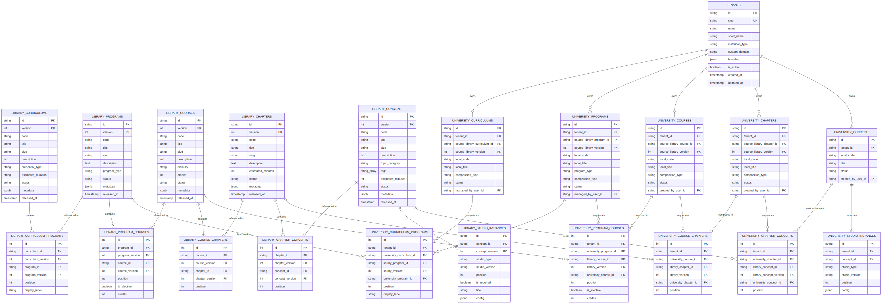
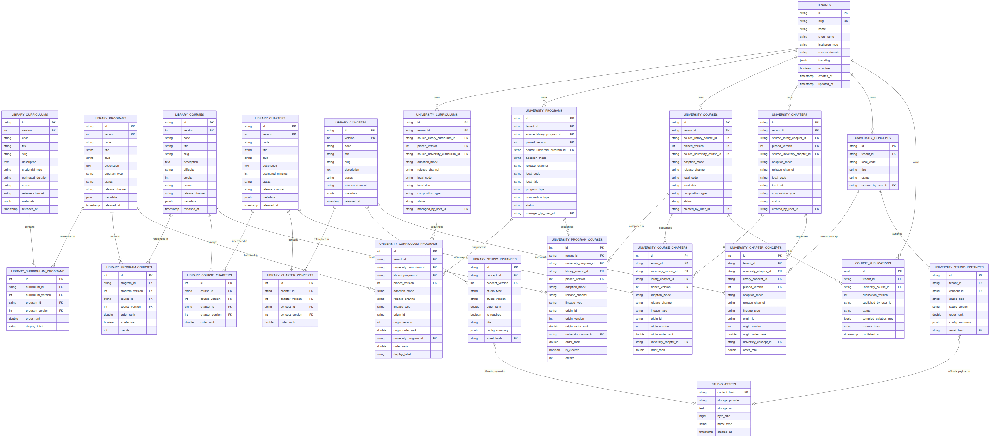

# BayesStack Data Model & Architecture Roadmap - September 6, 2026

This document tracks the planning, requirements, and design checkpoints for formalizing the BayesStack Data Model.

---

## 1. Architectural Model: Two Clear Layers

To avoid ambiguous compiler jargon like "canonical", the system clearly separates data into two distinct layers:

1. **The Platform Master Repository (`library_*`)**:
   - The authoritative, expert-authored **Master Learning Library** stored and maintained by BayesStack.
   - Versioned (`version > 0`) and strictly **immutable**.
   - These are the *actual, foundational content tables*.

2. **The University Composition Layer (`university_*`)**:
   - The institutional assembly layer where universities (tenants) construct their own curricula, reorder modules, and create custom or derived courses.
   - References content from `library_*` with zero data duplication.

3. **Atomic Concept Model**:
   - Every **Concept** (`library_concepts`) is an atomic, self-contained pedagogical unit (e.g., *Gradient Descent in Multivariate Calculus*).
   - Concepts have no hardcoded parent dependencies and can be reused across any chapter, course, or university.

4. **Studios as Runtime Mini-Apps**:
   - Each concept launches one or more interactive **Studios** (`library_studio_instances`) (e.g. Video, Code Judge, Finance Sheet).
   - Studios mount dynamically via `studio_type` and `studio_version`. They receive a runtime `config` payload and remain completely unaware of the university, degree, or syllabus hierarchy.

---

## 2. University Root Table (`tenants`)

Represents institutions and universities that borrow from the library and deliver education to students.

```sql
CREATE TABLE tenants (
    id                   VARCHAR(64) PRIMARY KEY,          -- e.g. "inst_ashoka_01"
    slug                 VARCHAR(64) UNIQUE NOT NULL,      -- Subdomain: "ashoka" -> ashoka.bayesstack.com
    name                 VARCHAR(255) NOT NULL,            -- "Ashoka University"
    short_name           VARCHAR(64),                      -- "Ashoka"
    institution_type     VARCHAR(32) DEFAULT 'university',   -- 'university' | 'college' | 'edtech' | 'enterprise'
    custom_domain        VARCHAR(255) UNIQUE,              -- Optional custom domain: "learn.ashoka.edu.in"
    branding             JSONB DEFAULT '{}',               -- { "logo_url": "...", "primary_color": "#0B3C5D", ... }
    is_active            BOOLEAN DEFAULT TRUE NOT NULL,
    created_at           TIMESTAMPTZ DEFAULT NOW() NOT NULL,
    updated_at           TIMESTAMPTZ DEFAULT NOW() NOT NULL
);
```

---

## 3. Layer 1: Platform Master Repository (`library_*`)

These are the actual, immutable platform tables storing master curriculum definitions, courses, and atomic concepts.

### 3.1 Master Curriculum (`library_curriculums`)
The overarching degree or credential roadmap (e.g., *4-Year B.Tech Computer Science*, *2-Year M.Sc Data Science*, or *9-Month Executive PG Program*).

```sql
CREATE TABLE library_curriculums (
    id                   VARCHAR(64) NOT NULL,             -- e.g. "curr_ai_ml_master"
    version              INTEGER NOT NULL DEFAULT 1,       -- Immutable release: 1, 2, ...
    code                 VARCHAR(64) NOT NULL,             -- e.g. "BAYES-CURR-01"
    title                VARCHAR(255) NOT NULL,            -- "Bayes Master AI & ML Curriculum"
    slug                 VARCHAR(128) NOT NULL,
    description          TEXT,
    credential_type      VARCHAR(64),                      -- 'bachelors' | 'masters' | 'diploma' | 'certificate'
    estimated_duration   VARCHAR(64),                      -- e.g. "4 Years", "9 Months"
    status               VARCHAR(16) DEFAULT 'draft',      -- 'draft' | 'published' | 'archived'
    metadata             JSONB DEFAULT '{}',
    released_at          TIMESTAMPTZ DEFAULT NOW() NOT NULL,
    PRIMARY KEY (id, version)
);
```

#### Curriculum $\rightarrow$ Program Junction (`library_curriculum_programs`)
```sql
CREATE TABLE library_curriculum_programs (
    id                   SERIAL PRIMARY KEY,
    curriculum_id        VARCHAR(64) NOT NULL,
    curriculum_version   INTEGER NOT NULL,
    program_id           VARCHAR(64) NOT NULL,
    program_version      INTEGER NOT NULL,
    position             INTEGER NOT NULL,                 -- 1, 2, 3...
    display_label        VARCHAR(128),                     -- e.g. "Year 1 / Foundation"
    FOREIGN KEY (curriculum_id, curriculum_version) REFERENCES library_curriculums(id, version) ON DELETE CASCADE,
    FOREIGN KEY (program_id, program_version) REFERENCES library_programs(id, version),
    UNIQUE (curriculum_id, curriculum_version, position)
);
```

---

### 3.2 Master Program (`library_programs`)
A major academic phase, term, or specialization track (e.g., *Semester 1*, *Year 1 Core*, *Module 1: Data Analytics Foundations*).

```sql
CREATE TABLE library_programs (
    id                   VARCHAR(64) NOT NULL,             -- e.g. "prog_data_foundations"
    version              INTEGER NOT NULL DEFAULT 1,
    code                 VARCHAR(64) NOT NULL,             -- e.g. "BAYES-PROG-DS-01"
    title                VARCHAR(255) NOT NULL,            -- "Foundations of Data Science & Machine Learning"
    slug                 VARCHAR(128) NOT NULL,
    description          TEXT,
    program_type         VARCHAR(32) DEFAULT 'semester',   -- 'semester' | 'term' | 'module' | 'track'
    status               VARCHAR(16) DEFAULT 'draft',
    metadata             JSONB DEFAULT '{}',
    released_at          TIMESTAMPTZ DEFAULT NOW() NOT NULL,
    PRIMARY KEY (id, version)
);
```

#### Program $\rightarrow$ Course Junction (`library_program_courses`)
```sql
CREATE TABLE library_program_courses (
    id                   SERIAL PRIMARY KEY,
    program_id           VARCHAR(64) NOT NULL,
    program_version      INTEGER NOT NULL,
    course_id            VARCHAR(64) NOT NULL,
    course_version       INTEGER NOT NULL,
    position             INTEGER NOT NULL,                 -- 1, 2, 3...
    is_elective          BOOLEAN DEFAULT FALSE NOT NULL,
    credits              INTEGER DEFAULT 4,
    FOREIGN KEY (program_id, program_version) REFERENCES library_programs(id, version) ON DELETE CASCADE,
    FOREIGN KEY (course_id, course_version) REFERENCES library_courses(id, version),
    UNIQUE (program_id, program_version, position)
);
```

---

### 3.3 Master Course (`library_courses`)
A single subject unit (e.g., *Multivariate Calculus & Optimization*, *Introduction to Machine Learning*).

```sql
CREATE TABLE library_courses (
    id                   VARCHAR(64) NOT NULL,             -- e.g. "course_math_opt"
    version              INTEGER NOT NULL DEFAULT 1,
    code                 VARCHAR(64) NOT NULL,             -- e.g. "MATH-201"
    title                VARCHAR(255) NOT NULL,            -- "Multivariate Calculus & Optimization"
    slug                 VARCHAR(128) NOT NULL,
    description          TEXT,
    difficulty           VARCHAR(32) DEFAULT 'intermediate', -- 'beginner' | 'intermediate' | 'advanced'
    credits              INTEGER DEFAULT 4,
    status               VARCHAR(16) DEFAULT 'draft',
    metadata             JSONB DEFAULT '{}',
    released_at          TIMESTAMPTZ DEFAULT NOW() NOT NULL,
    PRIMARY KEY (id, version)
);
```

#### Course $\rightarrow$ Chapter Junction (`library_course_chapters`)
```sql
CREATE TABLE library_course_chapters (
    id                   SERIAL PRIMARY KEY,
    course_id            VARCHAR(64) NOT NULL,
    course_version       INTEGER NOT NULL,
    chapter_id           VARCHAR(64) NOT NULL,
    chapter_version      INTEGER NOT NULL,
    position             INTEGER NOT NULL,                 -- 1, 2, 3...
    FOREIGN KEY (course_id, course_version) REFERENCES library_courses(id, version) ON DELETE CASCADE,
    FOREIGN KEY (chapter_id, chapter_version) REFERENCES library_chapters(id, version),
    UNIQUE (course_id, course_version, position)
);
```

---

### 3.4 Master Chapter (`library_chapters`)
A coherent module or topic within a course (e.g., *Gradient Descent & Numerical Optimization*, *Linear Transformations*).

```sql
CREATE TABLE library_chapters (
    id                   VARCHAR(64) NOT NULL,             -- e.g. "chap_opt_grad_descent"
    version              INTEGER NOT NULL DEFAULT 1,
    code                 VARCHAR(64) NOT NULL,             -- e.g. "CH-GRAD-DESCENT"
    title                VARCHAR(255) NOT NULL,            -- "Gradient Descent and Loss Optimization"
    slug                 VARCHAR(128) NOT NULL,
    description          TEXT,
    estimated_minutes    INTEGER DEFAULT 120,
    status               VARCHAR(16) DEFAULT 'draft',
    metadata             JSONB DEFAULT '{}',
    released_at          TIMESTAMPTZ DEFAULT NOW() NOT NULL,
    PRIMARY KEY (id, version)
);
```

#### Chapter $\rightarrow$ Concept Junction (`library_chapter_concepts`)
Chapters are ordered sequences of concepts. Because a **Concept is atomic and independent**, the exact same concept can be linked into multiple chapters across different courses with zero data duplication.
```sql
CREATE TABLE library_chapter_concepts (
    id                   SERIAL PRIMARY KEY,
    chapter_id           VARCHAR(64) NOT NULL,
    chapter_version      INTEGER NOT NULL,
    concept_id           VARCHAR(64) NOT NULL,
    concept_version      INTEGER NOT NULL,
    position             INTEGER NOT NULL,                 -- 1, 2, 3...
    FOREIGN KEY (chapter_id, chapter_version) REFERENCES library_chapters(id, version) ON DELETE CASCADE,
    FOREIGN KEY (concept_id, concept_version) REFERENCES library_concepts(id, version),
    UNIQUE (chapter_id, chapter_version, position)
);
```

---

### 3.5 Master Concept (`library_concepts`)
**The Atomic Pedagogy Unit.** A concept is self-contained pedagogical knowledge (e.g., *Stochastic Gradient Descent Fundamentals*). It is completely decoupled from any specific course, chapter, or university.

```sql
CREATE TABLE library_concepts (
    id                   VARCHAR(64) NOT NULL,             -- e.g. "cpt_sgd_fundamentals"
    version              INTEGER NOT NULL DEFAULT 1,
    code                 VARCHAR(64) NOT NULL,             -- e.g. "CPT-SGD-01"
    title                VARCHAR(255) NOT NULL,            -- "Stochastic Gradient Descent Fundamentals"
    slug                 VARCHAR(128) NOT NULL,
    description          TEXT,                             -- Pedagogical objective
    topic_category       VARCHAR(64),                      -- e.g. "Calculus / Optimization"
    tags                 TEXT[] DEFAULT '{}',              -- ['gradient-descent', 'sgd', 'machine-learning']
    estimated_minutes    INTEGER DEFAULT 30,
    status               VARCHAR(16) DEFAULT 'draft',
    metadata             JSONB DEFAULT '{}',
    released_at          TIMESTAMPTZ DEFAULT NOW() NOT NULL,
    PRIMARY KEY (id, version)
);
```

---

### 3.6 Studio Instance & Config (`library_studio_instances`)
When a student launches a Concept, it mounts one or more **Studios** in an ordered sequence (e.g., Step 1: Video Studio $\rightarrow$ Step 2: Coding Judge Studio $\rightarrow$ Step 3: MCQ Studio).

The Studio is a completely isolated mini-app:
* Unaware of university, curriculum, program, course, chapter, or student.
* Dynamically mounted by `apps/learner` using `studio_type` and `studio_version`.
* Reads its initialization payload from `config`.

```sql
CREATE TABLE library_studio_instances (
    id                   VARCHAR(64) PRIMARY KEY,          -- e.g. "studio_inst_sgd_code_01"
    concept_id           VARCHAR(64) NOT NULL,
    concept_version      INTEGER NOT NULL,
    studio_type          VARCHAR(64) NOT NULL,             -- 'coding' | 'video' | 'mcq' | 'finance' | 'spreadsheet'
    studio_version       VARCHAR(32) NOT NULL,             -- 'v1.0' (Semver for pluggable frontend package)
    position             INTEGER NOT NULL,                 -- 1 (Video) -> 2 (Coding) -> 3 (MCQ)
    is_required          BOOLEAN DEFAULT TRUE NOT NULL,    -- Must pass/complete to advance
    title                VARCHAR(255),                     -- e.g. "Lab: Implement SGD in Python"
    config               JSONB NOT NULL DEFAULT '{}',      -- Studio runtime initialization payload
    FOREIGN KEY (concept_id, concept_version) REFERENCES library_concepts(id, version) ON DELETE CASCADE,
    UNIQUE (concept_id, concept_version, position)
);
```

#### Studio Configuration (`config`) JSON Examples
* **Coding Studio:** `{ "problem_id": "PROB-SGD", "language": "python", "test_cases": [...] }`
* **Video Studio:** `{ "video_url": "https://cdn.bayesstack.com/...", "duration_seconds": 720 }`
* **Finance Studio:** `{ "template": "discounted_cash_flow", "initial_sheet_data": { ... } }`

---

## 4. Layer 2: University Composition Layer (`university_*`)

When an institution (e.g., Ashoka University) adopts content or builds their own courses, they assemble them in the **`university_*`** composition tables.

### 4.1 University Course (`university_courses`)
A course offered by a university. It can borrow directly from a `library_courses` release, or be a custom institutional course.

### 4.1 University Curriculums (`university_curriculums`)
The overarching degree or credential roadmap at a university (e.g. *B.Tech Computer Science (Batch of 2026)*). Managed by **Tenant Admins**.

```sql
CREATE TABLE university_curriculums (
    id                      VARCHAR(64) PRIMARY KEY,          -- e.g. "ucurr_ashoka_btech_cs_2026"
    tenant_id               VARCHAR(64) NOT NULL REFERENCES tenants(id) ON DELETE CASCADE,
    source_library_curriculum_id VARCHAR(64),                 -- Set if forked/borrowed from library
    source_library_version  INTEGER,                          -- Pinned library release
    local_code              VARCHAR(128) NOT NULL,            -- e.g. "BTECH-CS-2026"
    local_title             VARCHAR(255) NOT NULL,            -- "B.Tech in Computer Science & Engineering"
    description             TEXT,
    credential_type         VARCHAR(64),                      -- 'bachelors' | 'masters' | 'diploma' | 'certificate'
    estimated_duration      VARCHAR(64),                      -- e.g. "4 Years", "9 Months"
    composition_type        VARCHAR(16) NOT NULL DEFAULT 'custom', -- 'library' | 'custom' | 'hybrid'
    status                  VARCHAR(16) DEFAULT 'draft',      -- 'draft' | 'published' | 'archived'
    managed_by_user_id      VARCHAR(64) REFERENCES users(id), -- Tenant Admin
    created_at              TIMESTAMPTZ DEFAULT NOW() NOT NULL,
    updated_at              TIMESTAMPTZ DEFAULT NOW() NOT NULL,
    FOREIGN KEY (source_library_curriculum_id, source_library_version) REFERENCES library_curriculums(id, version),
    UNIQUE (tenant_id, local_code)
);
```

### 4.2 University Curriculum $\rightarrow$ Program Junction (`university_curriculum_programs`)
Curriculums are ordered sequences of university programs (e.g. Year 1, Year 2, or Semester 1, Semester 2). Managed by **Tenant Admins**.

```sql
CREATE TABLE university_curriculum_programs (
    id                      SERIAL PRIMARY KEY,
    tenant_id               VARCHAR(64) NOT NULL REFERENCES tenants(id) ON DELETE CASCADE,
    university_curriculum_id VARCHAR(64) NOT NULL REFERENCES university_curriculums(id) ON DELETE CASCADE,
    library_program_id      VARCHAR(64),                      -- Borrowed as-is library program
    library_version         INTEGER,
    university_program_id   VARCHAR(64) REFERENCES university_programs(id) ON DELETE CASCADE, -- University custom/forked program
    position                INTEGER NOT NULL,                 -- 1, 2, 3...
    display_label           VARCHAR(128),                     -- e.g. "Semester 1 / Foundation"
    CHECK (
        (library_program_id IS NOT NULL AND university_program_id IS NULL) OR
        (library_program_id IS NULL AND university_program_id IS NOT NULL)
    ),
    FOREIGN KEY (library_program_id, library_version) REFERENCES library_programs(id, version),
    UNIQUE (university_curriculum_id, position)
);
```

### 4.3 University Programs (`university_programs`)
A major academic phase or semester container (e.g. *Semester 1*, *Semester 2*, *Year 1 Foundation*). Managed by **Tenant Admins**.

```sql
CREATE TABLE university_programs (
    id                      VARCHAR(64) PRIMARY KEY,          -- e.g. "uprog_ashoka_sem1"
    tenant_id               VARCHAR(64) NOT NULL REFERENCES tenants(id) ON DELETE CASCADE,
    source_library_program_id VARCHAR(64),                    -- Set if forked/borrowed from library
    source_library_version  INTEGER,                          -- Pinned library release
    local_code              VARCHAR(128) NOT NULL,            -- e.g. "SEM-01-CORE"
    local_title             VARCHAR(255) NOT NULL,            -- "Semester 1: Foundation in Computing"
    description             TEXT,
    program_type            VARCHAR(32) DEFAULT 'semester',   -- 'semester' | 'term' | 'track' | 'module'
    composition_type        VARCHAR(16) NOT NULL DEFAULT 'custom', -- 'library' | 'custom' | 'hybrid'
    status                  VARCHAR(16) DEFAULT 'draft',      -- 'draft' | 'published' | 'archived'
    managed_by_user_id      VARCHAR(64) REFERENCES users(id), -- Tenant Admin
    created_at              TIMESTAMPTZ DEFAULT NOW() NOT NULL,
    updated_at              TIMESTAMPTZ DEFAULT NOW() NOT NULL,
    FOREIGN KEY (source_library_program_id, source_library_version) REFERENCES library_programs(id, version),
    UNIQUE (tenant_id, local_code)
);
```

### 4.4 University Program $\rightarrow$ Course Junction (`university_program_courses`)
Maps courses (authored by Faculty or borrowed as-is) into the university's academic programs. Supports elective tags, credit weights, and local sequencing.

```sql
CREATE TABLE university_program_courses (
    id                      SERIAL PRIMARY KEY,
    tenant_id               VARCHAR(64) NOT NULL REFERENCES tenants(id) ON DELETE CASCADE,
    university_program_id   VARCHAR(64) NOT NULL REFERENCES university_programs(id) ON DELETE CASCADE,
    library_course_id       VARCHAR(64),                      -- Borrowed as-is library course
    library_version         INTEGER,
    university_course_id    VARCHAR(64) REFERENCES university_courses(id) ON DELETE CASCADE, -- Faculty created/forked course
    position                INTEGER NOT NULL,                 -- 1, 2, 3...
    is_elective             BOOLEAN DEFAULT FALSE NOT NULL,
    credits                 INTEGER DEFAULT 4,
    display_label           VARCHAR(128),                     -- e.g. "Core Computer Science Requirement"
    CHECK (
        (library_course_id IS NOT NULL AND university_course_id IS NULL) OR
        (library_course_id IS NULL AND university_course_id IS NOT NULL)
    ),
    FOREIGN KEY (library_course_id, library_version) REFERENCES library_courses(id, version),
    UNIQUE (university_program_id, position)
);
```

### 4.5 University Courses (`university_courses`)
A course delivered by the university. Can be adopted directly from a library course release with local cosmetic renaming, forked, or built custom by Faculty.

```sql
CREATE TABLE university_courses (
    id                      VARCHAR(64) PRIMARY KEY,          -- e.g. "ucourse_ashoka_ml101"
    tenant_id               VARCHAR(64) NOT NULL REFERENCES tenants(id) ON DELETE CASCADE,
    source_library_course_id VARCHAR(64),                     -- NULL if 100% custom course
    source_library_version  INTEGER,                          -- Pinned version from library
    local_code              VARCHAR(128) NOT NULL,            -- e.g. "ML-101" (Local cosmetic code override)
    local_title             VARCHAR(255) NOT NULL,            -- "Introduction to Machine Learning & Pattern Recognition"
    description             TEXT,
    composition_type        VARCHAR(16) NOT NULL DEFAULT 'custom', 
                            -- 'library' : 100% of chapters are borrowed library_chapters
                            -- 'custom'  : 100% of chapters are university proprietary
                            -- 'hybrid'  : Mix of library and custom chapters
    status                  VARCHAR(16) DEFAULT 'draft',      -- 'draft' | 'published' | 'archived'
    created_by_user_id      VARCHAR(64) REFERENCES users(id), -- Faculty author
    created_at              TIMESTAMPTZ DEFAULT NOW() NOT NULL,
    updated_at              TIMESTAMPTZ DEFAULT NOW() NOT NULL,
    FOREIGN KEY (source_library_course_id, source_library_version) REFERENCES library_courses(id, version),
    UNIQUE (tenant_id, local_code)
);
```

### 4.2 University Course $\rightarrow$ Chapter Composition (`university_course_chapters`)
Universities choose their own chapter sequencing, mix-and-matching borrowed library chapters with custom university chapters.

```sql
CREATE TABLE university_course_chapters (
    id                   SERIAL PRIMARY KEY,
    tenant_id            VARCHAR(64) NOT NULL REFERENCES tenants(id) ON DELETE CASCADE,
    university_course_id VARCHAR(64) NOT NULL REFERENCES university_courses(id) ON DELETE CASCADE,
    library_chapter_id   VARCHAR(64),                      -- Borrowed library chapter
    library_version      INTEGER,
    university_chapter_id VARCHAR(64) REFERENCES university_chapters(id) ON DELETE CASCADE, -- Or custom university chapter
    position             INTEGER NOT NULL,                 -- Local sequence position in course
    CHECK (
        (library_chapter_id IS NOT NULL AND university_chapter_id IS NULL) OR
        (library_chapter_id IS NULL AND university_chapter_id IS NOT NULL)
    ),
    FOREIGN KEY (library_chapter_id, library_version) REFERENCES library_chapters(id, version),
    UNIQUE (university_course_id, position)
);
```

### 4.3 University Chapters (`university_chapters`)
Chapters assembled or authored by university faculty. A chapter can be composed 100% from library concepts, 100% from proprietary university concepts, or a hybrid mix.

```sql
CREATE TABLE university_chapters (
    id                      VARCHAR(64) PRIMARY KEY,          -- e.g. "uchap_ashoka_py_01"
    tenant_id               VARCHAR(64) NOT NULL REFERENCES tenants(id) ON DELETE CASCADE,
    source_library_chapter_id VARCHAR(64),                    -- Set if forked/derived from library
    source_library_version  INTEGER,                          -- Pinned library release
    local_code              VARCHAR(128) NOT NULL,            -- e.g. "PY-INTRO-01"
    local_title             VARCHAR(255) NOT NULL,            -- "Python Basics & Ashoka Coding Standards"
    description             TEXT,
    composition_type        VARCHAR(16) NOT NULL DEFAULT 'custom', 
                            -- Analytics classification:
                            -- 'library' : 100% of concepts are from library_concepts
                            -- 'custom'  : 100% of concepts are university proprietary
                            -- 'hybrid'  : Mix of library and university concepts
    status                  VARCHAR(16) DEFAULT 'draft',      -- 'draft' | 'published' | 'archived'
    created_by_user_id      VARCHAR(64) REFERENCES users(id), -- Faculty author
    created_at              TIMESTAMPTZ DEFAULT NOW() NOT NULL,
    updated_at              TIMESTAMPTZ DEFAULT NOW() NOT NULL,
    FOREIGN KEY (source_library_chapter_id, source_library_version) REFERENCES library_chapters(id, version),
    UNIQUE (tenant_id, local_code)
);

```

### 4.4 University Chapter $\rightarrow$ Concept Composition (`university_chapter_concepts`)
The sequencing junction for university chapters. Supports mix-and-matching concepts from the platform's global library or proprietary university concepts at any position.

```sql
CREATE TABLE university_chapter_concepts (
    id                      SERIAL PRIMARY KEY,
    tenant_id               VARCHAR(64) NOT NULL REFERENCES tenants(id) ON DELETE CASCADE,
    university_chapter_id   VARCHAR(64) NOT NULL REFERENCES university_chapters(id) ON DELETE CASCADE,
    library_concept_id      VARCHAR(64),                   -- Referenced library concept
    library_concept_version INTEGER,                       -- Pinned library release
    university_concept_id   VARCHAR(64) REFERENCES university_concepts(id) ON DELETE CASCADE, -- Referenced proprietary concept
    position                INTEGER NOT NULL,              -- Local sequence order: 1, 2, 3...
    FOREIGN KEY (library_concept_id, library_concept_version) REFERENCES library_concepts(id, version),
    CHECK (
        (library_concept_id IS NOT NULL AND university_concept_id IS NULL) OR
        (library_concept_id IS NULL AND university_concept_id IS NOT NULL)
    ),
    UNIQUE (university_chapter_id, position)
);
```

### 4.5 University Proprietary Concepts (`university_concepts`)
Concepts created by university faculty for their own students. Strictly scoped to the tenant and never visible to other institutions.

```sql
CREATE TABLE university_concepts (
    id                   VARCHAR(64) PRIMARY KEY,          -- e.g. "uconcept_ashoka_guidelines"
    tenant_id            VARCHAR(64) NOT NULL REFERENCES tenants(id) ON DELETE CASCADE,
    local_code           VARCHAR(128) NOT NULL,            -- e.g. "CPT-ASHOKA-STANDARDS"
    title                VARCHAR(255) NOT NULL,            -- "Ashoka Python PEP-8 & Submission Protocol"
    description          TEXT,
    topic_category       VARCHAR(64),
    tags                 TEXT[] DEFAULT '{}',
    estimated_minutes    INTEGER DEFAULT 20,
    created_by_user_id   VARCHAR(64) REFERENCES users(id), -- Faculty author
    status               VARCHAR(16) DEFAULT 'draft',
    created_at           TIMESTAMPTZ DEFAULT NOW() NOT NULL,
    updated_at           TIMESTAMPTZ DEFAULT NOW() NOT NULL,
    UNIQUE (tenant_id, local_code)
);
```

### 4.6 University Studio Instances (`university_studio_instances`)
Studio configs for proprietary university concepts. Uses the exact same studio runtime engine (`coding`, `video`, `finance`), but stores configurations privately for the tenant.

```sql
CREATE TABLE university_studio_instances (
    id                   VARCHAR(64) PRIMARY KEY,          -- e.g. "ustudio_ashoka_01"
    tenant_id            VARCHAR(64) NOT NULL REFERENCES tenants(id) ON DELETE CASCADE,
    concept_id           VARCHAR(64) NOT NULL REFERENCES university_concepts(id) ON DELETE CASCADE,
    studio_type          VARCHAR(64) NOT NULL,             -- 'coding' | 'video' | 'mcq' | 'finance'
    studio_version       VARCHAR(32) NOT NULL,             -- 'v1.0'
    position             INTEGER NOT NULL,
    is_required          BOOLEAN DEFAULT TRUE NOT NULL,
    title                VARCHAR(255),
    config               JSONB NOT NULL DEFAULT '{}',      -- Private studio initialization config
    UNIQUE (concept_id, position)
);
```

---

## 5. Entity Relationship Diagram (ERD)



*Source file: [`docs/todo/img/canonical_library_er.mmd`](file:///home/sagar/Desktop/bayesstack/bayesstack/docs/todo/img/canonical_library_er.mmd)*

---

## 6. Real-World Walkthrough Scenarios

This section tests and validates our schema against practical day-to-day workflows. For each scenario, we trace the exact **database mutations** (inserts, updates, deletes, and foreign key references) to verify that the tables cleanly support the requirement without friction or redundancy.

---

### Scenario 1: SuperAdmin Authors a Concept with Studios and Reuses it Across Multiple Library Chapters

#### 1. Goal
A SuperAdmin (platform curriculum engineer) authors a new atomic concept: **"Stochastic Gradient Descent (SGD) Fundamentals"**. 
To make it interactive, they attach two studio runtimes:
1. A **Video Studio** (explaining the mathematical intuition).
2. A **Coding Judge Studio** (a live Python exercise to implement the gradient update rule).

Once created, this single concept is linked into two separate library chapters:
- **Chapter A**: *"Optimization Techniques in Calculus"* (assigned as concept position #3).
- **Chapter B**: *"Training Deep Neural Networks"* (assigned as concept position #1).

No universities or tenants are involved; this is strictly SuperAdmin managing the platform's Master Learning Library.

---

#### 2. Step-by-Step Database Mutations

##### Step 1: Insert the Atomic Concept
The SuperAdmin creates the concept. It is completely standalone and contains zero knowledge of any chapter or course.

```sql
INSERT INTO library_concepts (
    id, version, code, title, slug, description, topic_category, tags, estimated_minutes, status, released_at
) VALUES (
    'cpt_sgd_01', 
    1, 
    'MATH-OPT-SGD', 
    'Stochastic Gradient Descent Fundamentals', 
    'stochastic-gradient-descent-fundamentals', 
    'Understand the mathematical convergence and minibatch updates of SGD.', 
    'Optimization', 
    ARRAY['gradient-descent', 'calculus', 'machine-learning'], 
    45, 
    'published', 
    NOW()
);
```

**State in `library_concepts`:**
| id | version | code | title | topic_category | status |
| :--- | :--- | :--- | :--- | :--- | :--- |
| `cpt_sgd_01` | `1` | `MATH-OPT-SGD` | Stochastic Gradient Descent Fundamentals | Optimization | `published` |

---

##### Step 2: Configure the Runtime Studios for this Concept
The SuperAdmin configures two ordered studio instances for `(cpt_sgd_01, v1)`:
- `position = 1`: Video Studio
- `position = 2`: Coding Studio

```sql
-- 1. Video Studio Instance
INSERT INTO library_studio_instances (
    id, concept_id, concept_version, studio_type, studio_version, position, is_required, title, config
) VALUES (
    'st_sgd_vid_01',
    'cpt_sgd_01',
    1,
    'video',
    'v1.0',
    1,
    TRUE,
    'Lecture: Intuition behind Mini-batch SGD',
    '{
        "video_url": "https://cdn.bayesstack.com/opt/sgd_theory.mp4",
        "duration_seconds": 600,
        "playback_provider": "hls"
    }'::jsonb
);

-- 2. Coding Studio Instance
INSERT INTO library_studio_instances (
    id, concept_id, concept_version, studio_type, studio_version, position, is_required, title, config
) VALUES (
    'st_sgd_code_01',
    'cpt_sgd_01',
    1,
    'coding',
    'v1.0',
    2,
    TRUE,
    'Lab: Implement SGD Weight Update in Python',
    '{
        "problem_id": "PROB-SGD-UPDATE",
        "language": "python",
        "starter_code": "def sgd_update(w, grad, lr):\n    # TODO: return updated weights\n    pass",
        "test_cases": [
            {"input": "[1.0, 2.0], [0.1, 0.2], 0.01", "expected_output": "[0.999, 1.998]", "is_hidden": false}
        ]
    }'::jsonb
);
```

**State in `library_studio_instances`:**
| id | concept_id | concept_version | position | studio_type | title |
| :--- | :--- | :--- | :--- | :--- | :--- |
| `st_sgd_vid_01` | `cpt_sgd_01` | `1` | `1` | `video` | Lecture: Intuition behind Mini-batch SGD |
| `st_sgd_code_01` | `cpt_sgd_01` | `1` | `2` | `coding` | Lab: Implement SGD Weight Update in Python |

---

##### Step 3: Link Concept into Chapter A (*"Optimization Techniques in Calculus"*)
Suppose Chapter A already exists: `id = 'chap_calc_opt'`, `version = 1`.
The SuperAdmin places our SGD concept at **position #3** of this chapter.

```sql
INSERT INTO library_chapter_concepts (
    chapter_id, chapter_version, concept_id, concept_version, position
) VALUES (
    'chap_calc_opt',
    1,
    'cpt_sgd_01',
    1,
    3
);
```

---

##### Step 4: Link the Exact Same Concept into Chapter B (*"Training Deep Neural Networks"*)
Suppose Chapter B already exists: `id = 'chap_nn_training'`, `version = 1`.
The SuperAdmin places the exact same concept at **position #1** of this chapter.

```sql
INSERT INTO library_chapter_concepts (
    chapter_id, chapter_version, concept_id, concept_version, position
) VALUES (
    'chap_nn_training',
    1,
    'cpt_sgd_01',
    1,
    1
);
```

**State in `library_chapter_concepts`:**
| id | chapter_id | chapter_version | concept_id | concept_version | position | Resulting Order in Chapter |
| :--- | :--- | :--- | :--- | :--- | :--- | :--- |
| 101 | `chap_calc_opt` | `1` | `cpt_sgd_01` | `1` | **3** | Appears 3rd in Calculus Optimization |
| 102 | `chap_nn_training` | `1` | `cpt_sgd_01` | `1` | **1** | Appears 1st in Deep Learning Training |

---

#### 3. Schema Evaluation & Key Observations

1. **Zero Content Duplication**:
   - The Concept payload and the two Studio configurations are authored **exactly once**.
   - Multiple chapters reference the exact same `(cpt_sgd_01, version: 1)` via junction rows.
2. **Independent Sequencing**:
   - Position ordering lives in `library_chapter_concepts.position`, not on the Concept table. This allows SGD to be step 3 in Calculus and step 1 in Deep Learning without conflict.
3. **Safe Dissociation / Deletion**:
   - If SuperAdmin decides SGD should no longer be taught in Calculus, deleting the association is clean and non-destructive:
     ```sql
     DELETE FROM library_chapter_concepts 
     WHERE chapter_id = 'chap_calc_opt' AND concept_id = 'cpt_sgd_01';
     ```
   - Chapter B, the concept itself, and both studio configurations remain completely intact.
4. **Conclusion**:
   - **Scenario 1 is 100% natively supported by the current schema design with zero modifications required.**

---

### Scenario 2: SuperAdmin Assembles the Full Content Hierarchy with Multi-Level Reuse (Chapter $\rightarrow$ Course $\rightarrow$ Program $\rightarrow$ Curriculum)

#### 1. Goal
SuperAdmin (Platform Curriculum Engineer) builds out an entire end-to-end academic structure within the Master Learning Library:
$$\text{Concepts} \longrightarrow \text{Chapters} \longrightarrow \text{Courses} \longrightarrow \text{Programs} \longrightarrow \text{Curriculums}$$

This scenario validates that the **zero-duplication association model** works symmetrically at *every* level of the hierarchy:
1. **Chapter Level**: A single chapter (*"Gradient Descent & Optimization"*) is reused across two different courses (*"Multivariate Calculus"* and *"Intro to Machine Learning"*).
2. **Course Level**: A single course (*"Python for Data Science"*) is reused across two different programs (*"Undergraduate AI Track"* and *"Executive Data Science Certificate"*).
3. **Program Level**: A single program (*"Year 1 Engineering Foundation"*) is shared between two degrees (*"B.Tech Computer Science"* and *"B.Tech Artificial Intelligence"*).

All mutations remain strictly inside the platform library (`library_*`); no universities or tenants are involved.

---

#### 2. Step-by-Step Database Mutations

##### Step 1: Create Master Chapters and Sequence Concepts
SuperAdmin authors two chapters:
1. `chap_linear_algebra` (*"Vectors & Matrix Transformations"*)
2. `chap_optimization` (*"Gradient Descent & Optimization Techniques"*)

```sql
INSERT INTO library_chapters (id, version, code, title, slug, status, released_at)
VALUES 
  ('chap_linear_algebra', 1, 'MATH-LA-01', 'Vectors and Matrix Transformations', 'vectors-and-matrices', 'published', NOW()),
  ('chap_optimization', 1, 'MATH-OPT-01', 'Gradient Descent and Optimization', 'gradient-descent-optimization', 'published', NOW());

-- Sequence existing concept 'cpt_sgd_01' into 'chap_optimization' at position 1
INSERT INTO library_chapter_concepts (chapter_id, chapter_version, concept_id, concept_version, position)
VALUES ('chap_optimization', 1, 'cpt_sgd_01', 1, 1);
```

---

##### Step 2: Create Master Courses and Demonstrate Chapter Reuse
SuperAdmin creates two courses:
- **Course A (`course_calc_opt`)**: *"Multivariate Calculus & Numerical Optimization"*
- **Course B (`course_intro_ml`)**: *"Introduction to Machine Learning"*

SuperAdmin now attaches Chapter `chap_optimization` to **both** courses with different local positions:
- In Course A, it is **Chapter #2** (after linear calculus).
- In Course B, it is **Chapter #1** (introductory learning algorithm).

```sql
INSERT INTO library_courses (id, version, code, title, slug, difficulty, credits, status, released_at)
VALUES 
  ('course_calc_opt', 1, 'MATH-201', 'Multivariate Calculus & Numerical Optimization', 'multivariate-calculus', 'intermediate', 4, 'published', NOW()),
  ('course_intro_ml', 1, 'CS-301', 'Introduction to Machine Learning', 'intro-machine-learning', 'intermediate', 4, 'published', NOW());

-- Course A: Calculus includes chap_optimization at position 2
INSERT INTO library_course_chapters (course_id, course_version, chapter_id, chapter_version, position)
VALUES ('course_calc_opt', 1, 'chap_optimization', 1, 2);

-- Course B: Intro to ML includes the EXACT SAME chap_optimization at position 1
INSERT INTO library_course_chapters (course_id, course_version, chapter_id, chapter_version, position)
VALUES ('course_intro_ml', 1, 'chap_optimization', 1, 1);
```

**State in `library_course_chapters` (Zero Chapter Duplication):**
| id | course_id | course_version | chapter_id | chapter_version | position | Local Sequence Role |
| :--- | :--- | :--- | :--- | :--- | :--- | :--- |
| 201 | `course_calc_opt` | `1` | `chap_optimization` | `1` | **2** | Second chapter in Calculus course |
| 202 | `course_intro_ml` | `1` | `chap_optimization` | `1` | **1** | First chapter in Machine Learning course |

---

##### Step 3: Create Master Programs and Demonstrate Course Reuse
SuperAdmin creates two programs:
- **Program 1 (`prog_undergrad_core`)**: *"B.Tech Core Machine Learning Track"* (Full semester program)
- **Program 2 (`prog_exec_cert`)**: *"Executive Certificate in Applied Data Science"* (Accelerated 12-week professional track)

Both programs require foundational Python and ML, so SuperAdmin links `course_intro_ml` to **both programs**:

```sql
INSERT INTO library_programs (id, version, code, title, slug, program_type, status, released_at)
VALUES 
  ('prog_undergrad_core', 1, 'PROG-CS-UG', 'B.Tech Core Machine Learning Track', 'btech-core-ml', 'semester', 'published', NOW()),
  ('prog_exec_cert', 1, 'PROG-DS-EXEC', 'Executive Certificate in Applied Data Science', 'exec-cert-data-science', 'track', 'published', NOW());

-- Program 1: UG track links course_intro_ml at position 3 (Semester 3 course)
INSERT INTO library_program_courses (program_id, program_version, course_id, course_version, position, is_elective, credits)
VALUES ('prog_undergrad_core', 1, 'course_intro_ml', 1, 3, FALSE, 4);

-- Program 2: Executive track links the EXACT SAME course_intro_ml at position 1 (Immediate starter course)
INSERT INTO library_program_courses (program_id, program_version, course_id, course_version, position, is_elective, credits)
VALUES ('prog_exec_cert', 1, 'course_intro_ml', 1, 1, FALSE, 4);
```

**State in `library_program_courses` (Zero Course Duplication):**
| id | program_id | program_version | course_id | course_version | position | Local Program Role |
| :--- | :--- | :--- | :--- | :--- | :--- | :--- |
| 301 | `prog_undergrad_core` | `1` | `course_intro_ml` | `1` | **3** | Mid-degree course in B.Tech |
| 302 | `prog_exec_cert` | `1` | `course_intro_ml` | `1` | **1** | Opening course in Executive program |

---

##### Step 4: Create Master Curriculums and Sequence Programs
SuperAdmin creates two top-level degree roadmaps:
- **Curriculum 1 (`curr_btech_cs`)**: *"4-Year B.Tech in Computer Science & Engineering"*
- **Curriculum 2 (`curr_btech_ai`)**: *"4-Year B.Tech in Artificial Intelligence & Data Science"*

Suppose both degree curriculums share the foundational freshman year program: `prog_eng_foundation` (*"Year 1 Engineering Foundation"*).
SuperAdmin attaches this program to **both degree curriculums** at position 1:

```sql
INSERT INTO library_curriculums (id, version, code, title, slug, credential_type, estimated_duration, status, released_at)
VALUES 
  ('curr_btech_cs', 1, 'DEG-BTECH-CS', '4-Year B.Tech in Computer Science & Engineering', 'btech-cs', 'bachelors', '4 Years', 'published', NOW()),
  ('curr_btech_ai', 1, 'DEG-BTECH-AI', '4-Year B.Tech in Artificial Intelligence & Data Science', 'btech-ai', 'bachelors', '4 Years', 'published', NOW());

-- Both degrees share Year 1 Engineering Foundation at position 1
INSERT INTO library_curriculum_programs (curriculum_id, curriculum_version, program_id, program_version, position, display_label)
VALUES 
  ('curr_btech_cs', 1, 'prog_eng_foundation', 1, 1, 'Year 1: Engineering Core'),
  ('curr_btech_ai', 1, 'prog_eng_foundation', 1, 1, 'Year 1: Engineering Core');

-- Curriculum 2 (AI degree) adds prog_undergrad_core at position 2 (Year 2)
INSERT INTO library_curriculum_programs (curriculum_id, curriculum_version, program_id, program_version, position, display_label)
VALUES 
  ('curr_btech_ai', 1, 'prog_undergrad_core', 1, 2, 'Year 2: Specialized AI Core');
```

---

#### 3. Visual Graph of Multi-Level Content Reuse

```text
[Curriculum: B.Tech CS]               [Curriculum: B.Tech AI]
           \                                     /
            \                                   /
             ▼                                 ▼
      [Program: Year 1 Engineering Foundation] (Reused across Curriculums)
                                               |
                                               ▼
                              [Program: Core AI Track]   [Program: Exec Certificate]
                                         \                         /
                                          \                       /
                                           ▼                     ▼
                                    [Course: Intro to Machine Learning] (Reused across Programs)
                                               \                         /
                                                \                       /
                                                 ▼                     ▼
                                          [Chapter: Gradient Descent Optimization] (Reused across Courses)
                                                                 |
                                                                 ▼
                                                 [Concept: SGD Fundamentals] (Reused across Chapters)
                                                           /          \
                                                          ▼            ▼
                                                    [Video Studio]  [Coding Judge Studio]
```

---

#### 4. Schema Evaluation & Key Observations

1. **Uniform Symmetrical Pattern Across All 4 Junction Tables**:
   - `library_curriculum_programs`: `(curriculum_id, curriculum_version, program_id, program_version, position)`
   - `library_program_courses`: `(program_id, program_version, course_id, course_version, position)`
   - `library_course_chapters`: `(course_id, course_version, chapter_id, chapter_version, position)`
   - `library_chapter_concepts`: `(chapter_id, chapter_version, concept_id, concept_version, position)`
   Every single tier uses the exact same pattern: **position ordering lives on the junction edge**, and **both parent and child are version-pinned**.
2. **DAG (Directed Acyclic Graph) Structural Soundness**:
   - Content is never duplicated. Any entity at level $N$ can have multiple parents at level $N+1$.
   - Any modifications or updates to an entity can be released as a new version without unexpectedly shifting or breaking other parent programs or courses.
3. **Safe Dissociation**:
   - Unlinking a course from a program or a chapter from a course is a simple single-row `DELETE` on the corresponding junction table. The underlying chapter, concepts, and studios remain untouched.
4. **Conclusion**:
   - **Scenario 2 is 100% natively supported by the current schema design with zero modifications required.**

---

### Scenario 3: University Faculty Borrows an Entire Chapter As-Is from the Library (Zero-Copy Adoption)

#### 1. Goal & Actor Context
In this scenario, we move from platform-wide library maintenance into a real institutional tenant: **Ashoka University** (`tenant_id = 'ashoka'`).

##### Institutional Role & Permission Boundaries:
* **Learner / Student**: View-only. Cannot create, edit, or sequence content.
* **Faculty (`dr_arjun`, `user_id = 'usr_faculty_ashoka_01'`)**: Authorized to manage **Courses, Chapters, and Concepts** for Ashoka University. Faculty *cannot* create or alter university-level Curriculums or Programs (those remain restricted to Tenant Admins).
* **Tenant Admin**: Full administrative authority over all university levels (Curriculum, Program, Course, Chapter, Concept).

##### The Practical Task:
Dr. Arjun is configuring a semester course for Ashoka students: **`ucourse_ashoka_ml_01`** (*"Machine Learning Fundamentals"*).
The platform library already contains an expertly authored chapter: **`chap_optimization`** (version 1), which packages 5 concepts with full video lectures and live Python coding judges. 

Dr. Arjun wants to **borrow this entire chapter completely as-is** into his course at **position #2** without re-creating concepts, duplicating configs, or writing redundant rows.

---

#### 2. Step-by-Step Database Mutations

##### Step 1: Direct Zero-Copy Link into the University Course
Dr. Arjun adds the library chapter directly to the course sequence in `university_course_chapters`:

```sql
INSERT INTO university_course_chapters (
    tenant_id,
    university_course_id,
    library_chapter_id,
    library_version,
    university_chapter_id,
    position
) VALUES (
    'ashoka',
    'ucourse_ashoka_ml_01',
    'chap_optimization',      -- Direct reference to the library chapter release
    1,
    NULL,                     -- No university chapter wrapper needed!
    2
);
```

**State in `university_course_chapters`:**
| id | tenant_id | university_course_id | library_chapter_id | library_version | university_chapter_id | position | Local Course Role |
| :--- | :--- | :--- | :--- | :--- | :--- | :--- | :--- |
| 601 | `ashoka` | `ucourse_ashoka_ml_01` | `chap_optimization` | `1` | *NULL* | **2** | 2nd module in ML course |

---

#### 3. How the Learner SPA Resolves As-Is Chapters
When an Ashoka student opens Course `ucourse_ashoka_ml_01` in `apps/learner`:
1. The backend inspects `university_course_chapters`.
2. It detects that `university_chapter_id IS NULL` and `library_chapter_id = 'chap_optimization'`.
3. The API streams the concepts and runtime studio instances directly from `library_chapter_concepts`:
   - Step 1: Concept `cpt_loss_functions_01` (Video + Quiz)
   - Step 2: Concept `cpt_gradient_descent_01` (Video + Coding Judge)
   - Step 3: Concept `cpt_sgd_01` (Video + Coding Judge)
4. **Versioning & Consumption Semantics**:
   - **Pinned Adoption (`adoption_mode = 'pinned', pinned_version = 1`)**: Ashoka is locked to release `v1` indefinitely. Even if the platform publishes `v2`, Ashoka remains safely on `v1` until faculty explicitly triggers an upgrade audit.
   - **Floating Adoption (`adoption_mode = 'floating', release_channel = 'stable')**: Ashoka tracks the latest approved platform release on the `stable` channel during authoring. When faculty publishes the course snapshot (`course_publications`), the compiler bakes the exact resolved release (e.g. `v2`) into the immutable publication manifest, ensuring student semester stability without mid-term drift.

---

#### 4. Schema Evaluation & Key Observations
1. **Absolute Zero Data Overhead**:
   - Exactly **1 row** inserted into `university_course_chapters`.
   - `0` rows in `university_chapters`.
   - `0` rows in `university_chapter_concepts`.
2. **Infinite Multi-Tenant Scalability**:
   - 100 universities adopting this same chapter as-is generate only 100 junction rows total across the entire database, sharing the single immutable library chapter definition.
3. **Conclusion**:
   - **Scenario 3 is 100% natively supported by the current schema design with zero modifications required.**

---

### Scenario 4: Faculty Customizes a Borrowed Chapter (Copy-on-Write Fork) & Creates Proprietary/Hybrid Concepts

#### 1. Goal & Architectural Requirement
Building directly upon Scenario 3, Dr. Arjun has two new requirements:
1. **The Customization Requirement**: Two weeks into the semester, Dr. Arjun decides: *"I love the borrowed Optimization chapter from Scenario 3, but for Ashoka students, I want to swap concept order and inject our department's custom homework assignment at the end."*
2. **The Proprietary Concept Requirement**: Ashoka University requires all programming students to complete a confidential module: *"Ashoka Python Submission Protocol & Academic Integrity"*. This concept is confidential to Ashoka and must never appear in other universities' course catalogues.

The system must seamlessly convert the as-is chapter borrowed in Scenario 3 into a customized university version via **Copy-on-Write (Fork)** and support mix-and-matching proprietary concepts with library concepts.

---

#### 2. The Copy-on-Write (Fork) Lifecycle

```text
[Scenario 3: As-Is Borrowing]
University Course ──────(Direct Pointer in university_course_chapters)──────▶ Library Chapter
(Zero rows in university_chapters, zero rows in university_chapter_concepts)

                                          │
                                          ▼ Faculty clicks "Customize / Reorder"
[Scenario 4: Copy-on-Write Fork]
University Course ──▶ University Chapter (Derived Fork) ──▶ Local Concepts & Custom Order
                      (source_library_chapter_id = 'chap_opt_01')
```

---

#### 3. Step-by-Step Database Mutations

##### Step 1: Faculty Authors a Proprietary University Concept
Dr. Arjun creates a concept private to Ashoka University in `university_concepts` (scoped by `tenant_id = 'ashoka'`):

```sql
INSERT INTO university_concepts (
    id, tenant_id, local_code, title, description, topic_category, tags, estimated_minutes, created_by_user_id, status
) VALUES (
    'uconcept_ashoka_honor_01',
    'ashoka',
    'ASH-CS-HONOR',
    'Ashoka Python Submission Protocol & Academic Integrity',
    'Mandatory protocol covering PEP-8 standards, plagiarism checks, and Git submission for Ashoka courses.',
    'Academic Standards',
    ARRAY['honor-code', 'python', 'ashoka-standards'],
    25,
    'usr_faculty_ashoka_01',
    'published'
);
```

##### Step 2: Configure the Runtime Studio for the Proprietary Concept
Dr. Arjun attaches a private studio instance to this custom concept:

```sql
INSERT INTO university_studio_instances (
    id, tenant_id, concept_id, studio_type, studio_version, position, is_required, title, config
) VALUES (
    'ustudio_ashoka_vid_01',
    'ashoka',
    'uconcept_ashoka_honor_01',
    'video',
    'v1.0',
    1,
    TRUE,
    'Orientation: Ashoka CS Honor Code & Submission Workflow',
    '{
        "video_url": "https://storage.ashoka.edu.in/media/cs_honor_code.mp4",
        "duration_seconds": 450,
        "playback_provider": "direct"
    }'::jsonb
);
```

##### Step 3: Materialize the University Chapter Fork (Copy-on-Write)
When Dr. Arjun clicks *"Customize Chapter"* in the Course Builder, the system materializes a row in `university_chapters` preserving provenance:

```sql
INSERT INTO university_chapters (
    id, 
    tenant_id, 
    source_library_chapter_id, 
    source_library_version, 
    local_code, 
    local_title, 
    composition_type, 
    status, 
    created_by_user_id
) VALUES (
    'uchap_ashoka_opt_fork_01',
    'ashoka',
    'chap_optimization',      -- Provenance: Forked from this library chapter
    1,
    'ML-OPT-ASHOKA',
    'Optimization Techniques (Ashoka Edition)',
    'hybrid',                  -- Mix of library concepts and proprietary Ashoka concept
    'published',
    'usr_faculty_ashoka_01'
);
```

##### Step 4: Sequence Custom and Library Concepts with Faculty Reordering
Dr. Arjun seeds the concepts into `university_chapter_concepts`, applies his custom reordering, and injects his proprietary concept:
- **Position 1 (Custom)**: Ashoka Honor Code & Guidelines (`uconcept_ashoka_honor_01`)
- **Position 2 (Library)**: Library Concept SGD (`cpt_sgd_01`, v1)
- **Position 3 (Library)**: Library Concept Loss Functions (`cpt_loss_functions_01`, v1)

```sql
-- Position 1: Proprietary Ashoka Concept (Injected by Faculty)
INSERT INTO university_chapter_concepts (
    tenant_id, university_chapter_id, university_concept_id, library_concept_id, library_concept_version, position
) VALUES ('ashoka', 'uchap_ashoka_opt_fork_01', 'uconcept_ashoka_honor_01', NULL, NULL, 1);

-- Position 2: Library Concept (Reordered to 2nd)
INSERT INTO university_chapter_concepts (
    tenant_id, university_chapter_id, university_concept_id, library_concept_id, library_concept_version, position
) VALUES ('ashoka', 'uchap_ashoka_opt_fork_01', NULL, 'cpt_sgd_01', 1, 2);

-- Position 3: Library Concept (Reordered to 3rd)
INSERT INTO university_chapter_concepts (
    tenant_id, university_chapter_id, university_concept_id, library_concept_id, library_concept_version, position
) VALUES ('ashoka', 'uchap_ashoka_opt_fork_01', NULL, 'cpt_loss_functions_01', 1, 3);
```

##### Step 5: Switch the Course Pointer to the Forked Chapter
Update `university_course_chapters` so Course `ucourse_ashoka_ml_01` now points to the customized chapter fork:

```sql
UPDATE university_course_chapters
SET 
    library_chapter_id = NULL,
    library_version = NULL,
    university_chapter_id = 'uchap_ashoka_opt_fork_01'
WHERE university_course_id = 'ucourse_ashoka_ml_01' AND position = 2;
```

**Final State in `university_course_chapters`:**
| id | tenant_id | university_course_id | library_chapter_id | library_version | university_chapter_id | position | Status |
| :--- | :--- | :--- | :--- | :--- | :--- | :--- | :--- |
| 601 | `ashoka` | `ucourse_ashoka_ml_01` | *NULL* | *NULL* | `uchap_ashoka_opt_fork_01` | **2** | Now points to local fork |

---

#### 4. Platform Analytics & Composition Insights

Because `composition_type` is maintained on `university_chapters`, the platform leadership can run real-time analytics on content adoption:

```sql
SELECT 
    composition_type,
    COUNT(*) AS total_chapters,
    ROUND(COUNT(*) * 100.0 / SUM(COUNT(*)) OVER(), 1) AS percentage
FROM university_chapters
GROUP BY composition_type;
```

**Analytical Output:**
| composition_type | total_chapters | percentage | Platform Insight |
| :--- | :--- | :--- | :--- |
| **`library`** | 312 | 62.4% | Complete off-the-shelf adoption of platform curriculum |
| **`hybrid`** | 148 | 29.6% | Universities adopting library content while injecting localized assignments/standards |
| **`custom`** | 40 | 8.0% | Proprietary chapters built from scratch (candidates for platform licensing) |

---

#### 5. Schema Evaluation & Key Observations

1. **Natural Lifecycle Progression**:
   - Faculty start with **Scenario 3 (Zero-Copy)** for instant setup.
   - When faculty need customization, the system performs a transparent **Copy-on-Write Fork (Scenario 4)**.
2. **Strict Multi-Tenant Privacy**:
   - `university_concepts` and `university_studio_instances` are partitioned by `tenant_id`. Other universities can never see or access Ashoka's proprietary content.
3. **Upstream Version Tracking**:
   - Preserving `source_library_chapter_id` and `source_library_version` on `university_chapters` allows the system to inform faculty when upstream library improvements occur.
4. **Conclusion**:
   - **Scenario 3 and Scenario 4 form a complete, elegant lifecycle that is 100% natively supported by the schema.**

---

### Scenario 5: Faculty Builds Courses with Cosmetic Overrides, Library Adoption, and Chapter Composition

#### 1. Architectural Philosophy: Curation vs. Atomic Truth
In BayesStack, there is a fundamental distinction between the **Concept Layer** and all layers above it:
* **The Concept Layer is Atomic Pedagogical Truth**:
  A concept represents ground-truth knowledge (e.g. *Gradient Descent* or *Binary Search*). If a concept is named *"Gradient Descent"*, it remains *"Gradient Descent"* across every university. Concepts are not renamed or cosmeticized.
* **All Higher Layers (Chapter, Course, Program, Curriculum) are Curational & Navigational**:
  Chapters and courses are simply mechanisms for curating and organizing concepts into digestible, navigable academic pathways. Because each university has its own academic bylaws, course codes, and registrar naming conventions, the platform empowers faculty to make **Cosmetic Overrides** on all organizational entities.

##### In this Scenario:
1. **Case A (Cosmetic Library Course Adoption)**:
   Dr. Arjun borrows the library course `course_intro_ml` (*"Introduction to Machine Learning"*, code `CS-301`). 
   Ashoka University's course catalog lists this as **`ML-101: Introduction to Machine Learning & Pattern Recognition`**. Dr. Arjun adopts the library course as-is, but applies Ashoka's local code and title.
2. **Case B (Custom Course with Hybrid Chapters)**:
   Dr. Arjun creates a brand new departmental course from scratch: **`CS-402: Applied Machine Learning Lab`**. 
   He populates it with a mix-and-match of:
   - Chapter 1: Borrowed library chapter (*"Gradient Descent & Numerical Optimization"* `chap_optimization`).
   - Chapter 2: Ashoka's custom hybrid chapter created in Scenario 4 (`uchap_ashoka_opt_fork_01`).

---

#### 2. Step-by-Step Database Mutations

##### Case A: Adopting a Library Course with Cosmetic Overrides
Dr. Arjun creates a course entry in `university_courses`. He points `source_library_course_id` to the library release, but specifies Ashoka's local course code and departmental title:

```sql
INSERT INTO university_courses (
    id,
    tenant_id,
    source_library_course_id,
    source_library_version,
    local_code,
    local_title,
    description,
    composition_type,
    status,
    created_by_user_id
) VALUES (
    'ucourse_ashoka_ml101',
    'ashoka',
    'course_intro_ml',       -- Source of Truth: Pinned to library course
    1,
    'ML-101',                 -- Local Cosmetic Code Override
    'Introduction to Machine Learning & Pattern Recognition', -- Local Cosmetic Title Override
    'Ashoka undergraduate core course covering supervised learning, optimization, and evaluation.',
    'library',                -- 100% composed of borrowed library chapters
    'published',
    'usr_faculty_ashoka_01'
);

-- Borrow the library course's chapters as-is into the course sequence
INSERT INTO university_course_chapters (
    tenant_id, university_course_id, library_chapter_id, library_version, university_chapter_id, position
) VALUES 
  ('ashoka', 'ucourse_ashoka_ml101', 'chap_linear_algebra', 1, NULL, 1),
  ('ashoka', 'ucourse_ashoka_ml101', 'chap_optimization', 1, NULL, 2);
```

**State in `university_courses`:**
| id | tenant_id | source_library_course_id | local_code | local_title | composition_type |
| :--- | :--- | :--- | :--- | :--- | :--- |
| `ucourse_ashoka_ml101` | `ashoka` | `course_intro_ml` (v1) | **ML-101** | **Introduction to Machine Learning & Pattern Recognition** | `library` |

---

##### Case B: Creating a Custom Course with Hybrid Chapter Composition
Dr. Arjun builds a second, specialized university course authored from scratch:

```sql
-- Step 1: Create the custom course header (no source_library_course_id)
INSERT INTO university_courses (
    id,
    tenant_id,
    source_library_course_id,
    source_library_version,
    local_code,
    local_title,
    description,
    composition_type,
    status,
    created_by_user_id
) VALUES (
    'ucourse_ashoka_cs402',
    'ashoka',
    NULL,                     -- Completely custom university course
    NULL,
    'CS-402',
    'Applied Machine Learning & Experimental Lab',
    'Advanced project-based course with custom Ashoka homework assignments.',
    'hybrid',                 -- Mix of borrowed library chapters and custom chapters
    'published',
    'usr_faculty_ashoka_01'
);

-- Step 2: Mix-and-match chapters into CS-402
-- Position 1: Borrowed as-is from library
INSERT INTO university_course_chapters (
    tenant_id, university_course_id, library_chapter_id, library_version, university_chapter_id, position
) VALUES ('ashoka', 'ucourse_ashoka_cs402', 'chap_optimization', 1, NULL, 1);

-- Position 2: Custom Ashoka Chapter fork created in Scenario 4
INSERT INTO university_course_chapters (
    tenant_id, university_course_id, library_chapter_id, library_version, university_chapter_id, position
) VALUES ('ashoka', 'ucourse_ashoka_cs402', NULL, NULL, 'uchap_ashoka_opt_fork_01', 2);
```

**State in `university_course_chapters` for CS-402:**
| id | tenant_id | university_course_id | library_chapter_id | university_chapter_id | position | Chapter Source |
| :--- | :--- | :--- | :--- | :--- | :--- | :--- |
| 701 | `ashoka` | `ucourse_ashoka_cs402` | `chap_optimization` | *NULL* | **1** | Platform Library Chapter |
| 702 | `ashoka` | `ucourse_ashoka_cs402` | *NULL* | `uchap_ashoka_opt_fork_01` | **2** | Ashoka Custom Forked Chapter |

---

#### 3. Schema Evaluation & Key Observations
1. **Cosmetic Independence with Semantic Grounding**:
   - Universities get 100% naming freedom (`ML-101`, `CS-402`) to satisfy accreditation boards.
   - At the same time, `source_library_course_id` retains the underlying provenance, enabling platform benchmarking and automatic update notifications.
2. **Polymorphic Chapter Sequencing**:
   - `university_course_chapters` effortlessly weaves together as-is library chapters and locally customized university chapters.
3. **Conclusion**:
   - **Scenario 5 is 100% natively supported by the current schema design with zero modifications required.**

---

### Scenario 6: Institutional Admin Sets Up Degree Curriculum & Programs, and Faculty Maps Courses

#### 1. Goal & Institutional Role Separation
In higher education, faculty members do not create four-year degree programs; that is the responsibility of the **University Registrar and Institutional Administrators**.

##### Separation of Concerns:
1. **Tenant Admin (`admin_vikram` at Ashoka)**:
   - Creates the **Curriculum** container: *"B.Tech in Computer Science & Engineering (Batch of 2026)"*.
   - Creates the **Programs** (Semesters/Terms): *"Semester 1: Foundation"*, *"Semester 2: Core Computing"*, *"Semester 3: Core AI & ML"*.
   - Sequences the Programs into the Curriculum via `university_curriculum_programs`.
2. **Faculty Member (`dr_arjun`)**:
   - Takes the courses created in Scenario 5 (`ML-101` and `CS-402`) and **maps them into the respective Semester Programs** via `university_program_courses`.

---

#### 2. Step-by-Step Database Mutations

##### Step 1: Admin Creates the Degree Curriculum
`admin_vikram` creates the 4-year degree framework in `university_curriculums`:

```sql
INSERT INTO university_curriculums (
    id,
    tenant_id,
    source_library_curriculum_id,
    source_library_version,
    local_code,
    local_title,
    description,
    credential_type,
    estimated_duration,
    composition_type,
    status,
    managed_by_user_id
) VALUES (
    'ucurr_ashoka_btech_cs_2026',
    'ashoka',
    'curr_btech_cs',          -- Borrowed baseline structure from library
    1,
    'BTECH-CS-2026',
    'B.Tech in Computer Science & Engineering (Batch of 2026)',
    'Official Ashoka University 4-Year Undergraduate Engineering Degree.',
    'bachelors',
    '4 Years',
    'hybrid',
    'published',
    'usr_admin_ashoka_01'     -- Managed by Tenant Admin
);
```

---

##### Step 2: Admin Creates the Semester Programs
`admin_vikram` creates the program containers representing Semester 1 and Semester 3:

```sql
INSERT INTO university_programs (
    id, tenant_id, source_library_program_id, source_library_version, local_code, local_title, program_type, status, managed_by_user_id
) VALUES 
  ('uprog_ashoka_sem1', 'ashoka', NULL, NULL, 'SEM-01', 'Semester 1: Engineering Foundation', 'semester', 'published', 'usr_admin_ashoka_01'),
  ('uprog_ashoka_sem3', 'ashoka', NULL, NULL, 'SEM-03', 'Semester 3: Core Artificial Intelligence', 'semester', 'published', 'usr_admin_ashoka_01');
```

---

##### Step 3: Admin Sequences Programs into the Curriculum
`admin_vikram` orders the semesters within the degree roadmap via `university_curriculum_programs`:

```sql
INSERT INTO university_curriculum_programs (
    tenant_id, university_curriculum_id, library_program_id, library_version, university_program_id, position, display_label
) VALUES 
  ('ashoka', 'ucurr_ashoka_btech_cs_2026', NULL, NULL, 'uprog_ashoka_sem1', 1, 'Freshman Year - Fall Semester'),
  ('ashoka', 'ucurr_ashoka_btech_cs_2026', NULL, NULL, 'uprog_ashoka_sem3', 3, 'Sophomore Year - Fall Semester');
```

**State in `university_curriculum_programs`:**
| id | university_curriculum_id | university_program_id | position | display_label |
| :--- | :--- | :--- | :--- | :--- |
| 801 | `ucurr_ashoka_btech_cs_2026` | `uprog_ashoka_sem1` | **1** | Freshman Year - Fall Semester |
| 802 | `ucurr_ashoka_btech_cs_2026` | `uprog_ashoka_sem3` | **3** | Sophomore Year - Fall Semester |

---

##### Step 4: Faculty Maps Courses into the Semester Program
With the institutional degree structure in place, Dr. Arjun now maps his courses from Scenario 5 into **Semester 3**:
* **Course 1**: `ML-101` (*"Introduction to Machine Learning"*) at **position #1** as a mandatory core course (4 credits).
* **Course 2**: `CS-402` (*"Applied Machine Learning Lab"*) at **position #2** as a departmental elective (2 credits).

```sql
-- Map ML-101 into Semester 3 (Core Requirement)
INSERT INTO university_program_courses (
    tenant_id,
    university_program_id,
    library_course_id,
    library_version,
    university_course_id,
    position,
    is_elective,
    credits,
    display_label
) VALUES (
    'ashoka',
    'uprog_ashoka_sem3',
    NULL,
    NULL,
    'ucourse_ashoka_ml101',   -- Course authored/adapted by Dr. Arjun
    1,
    FALSE,
    4,
    'Departmental Core Requirement'
);

-- Map CS-402 into Semester 3 (Elective Lab)
INSERT INTO university_program_courses (
    tenant_id,
    university_program_id,
    library_course_id,
    library_version,
    university_course_id,
    position,
    is_elective,
    credits,
    display_label
) VALUES (
    'ashoka',
    'uprog_ashoka_sem3',
    NULL,
    NULL,
    'ucourse_ashoka_cs402',   -- Lab course authored by Dr. Arjun
    2,
    TRUE,
    2,
    'Technical Elective Lab'
);
```

**State in `university_program_courses`:**
| id | university_program_id | university_course_id | position | is_elective | credits | display_label |
| :--- | :--- | :--- | :--- | :--- | :--- | :--- |
| 901 | `uprog_ashoka_sem3` | `ucourse_ashoka_ml101` | **1** | `FALSE` | 4 | Departmental Core Requirement |
| 902 | `uprog_ashoka_sem3` | `ucourse_ashoka_cs402` | **2** | `TRUE` | 2 | Technical Elective Lab |

---

#### 3. Complete End-to-End Learner Traversal
When an Ashoka student enrolled in B.Tech CS logs into the Learner SPA (`apps/learner`), the platform navigates the complete academic hierarchy seamlessly:

```text
[Tenant: Ashoka University]
    │
    ▼
[Curriculum: B.Tech Computer Science 2026]
    │
    ▼ (Sequenced via university_curriculum_programs)
[Program: Semester 3 (Sophomore Fall)]
    │
    ▼ (Mapped by Faculty via university_program_courses)
[Course: ML-101 Introduction to Machine Learning] (Cosmetic Override of library course_intro_ml)
    │
    ▼ (Sequenced via university_course_chapters)
[Chapter: Optimization Techniques (Ashoka Edition)] (Forked via uchap_ashoka_opt_fork_01)
    │
    ▼ (Sequenced via university_chapter_concepts)
[Concept: Stochastic Gradient Descent Fundamentals] (Atomic Truth: library cpt_sgd_01)
    │
    ▼ (Runtime Mini-Apps)
[Video Studio (Theory)] ──▶ [Coding Judge Studio (Python Implementation)]
```

---

#### 4. Schema Evaluation & Key Observations
1. **Clean Institutional Governance**:
   - Institutional Admins govern degree accreditation and semester structures.
   - Faculty members focus on course curriculum and pedagogy.
   - The junction table `university_program_courses` serves as the clean operational boundary between administrative governance and faculty authoring.
2. **Complete 5-Tier Symmetry**:
   - The exact same relational mechanics exist at every level:
     * Curriculum $\rightarrow$ Program (`university_curriculum_programs`)
     * Program $\rightarrow$ Course (`university_program_courses`)
     * Course $\rightarrow$ Chapter (`university_course_chapters`)
     * Chapter $\rightarrow$ Concept (`university_chapter_concepts`)
3. **Conclusion**:
   - **Scenario 5 and Scenario 6 validate the complete, end-to-end academic lifecycle. The data model supports all requirements natively with zero ambiguity.**

---

## 7. Production Architecture Review: Bottlenecks, Failure Modes & System Design Optimizations

### 7.1 The Principal Architect's Production Verdict

> **"Would a Data Engineer / Architect with 20+ years of experience run this design in production?"**
>
> **The Verdict**: **Yes, for the Authoring Engine (CMS)—but Absolutely NOT as the runtime Student Delivery Engine.**
>
> The normalized, two-layer relational schema (`library_*` and `university_*`) is **theoretically and pedantically sound for Authoring**. It guarantees referential integrity, enforces zero-duplication forking, provides clean multi-tenant isolation boundaries, and accurately maps academic governance hierarchies.
>
> However, if you point 50,000 concurrent students and 500 faculty directly at these normalized tables for everyday navigation, **Postgres will collapse under connection saturation, buffer cache eviction, and lock serialization**.

To achieve sub-millisecond query latency, zero Postgres load spikes, and bulletproof horizontal scalability, we must apply **CQRS (Command Query Responsibility Segregation)**, **Fractional Indexing**, **Content-Addressed Payload Offloading**, and a **Multi-Tier Edge Caching Topology**.

---

### 7.2 Deep-Dive: The 6 Critical Bottlenecks & Failure Modes

```text
┌─────────────────────────────────────────────────────────────────────────────────────────────────┐
│                                 THE 6 PRODUCTION BOTTLENECKS                                    │
├───────────────────────────────┬─────────────────────────────────┬───────────────────────────────┤
│ Bottleneck                    │ Root Cause                      │ Production Consequence        │
├───────────────────────────────┼─────────────────────────────────┼───────────────────────────────┤
│ 1. Polymorphic Join Avalanche │ 5-tier deep polymorphic tree    │ 100% Postgres CPU spikes      │
│ 2. Drag-and-Drop Lock Storm   │ Integer position updates        │ X-locks & deadlock cascades   │
│ 3. Buffer Cache Eviction      │ Heavy JSONB configs in TOAST    │ Evicts indexes from RAM       │
│ 4. Reverse Scan Full Scans    │ Missing junction reverse indexes│ Full table scans on deletes   │
│ 5. Composite PK Bloat         │ (id, version) FK pairs          │ 2x index footprint & RAM bloat│
│ 6. Multi-Tenant Leakage Risk  │ App-level WHERE tenant_id       │ Accidental cross-tenant leaks │
└───────────────────────────────┴─────────────────────────────────┴───────────────────────────────┘
```

---

#### Bottleneck 1: The Recursive Polymorphic Join Avalanche (Student Read Amplification)

##### 1. The Situation
When a student opens a course in the Learner SPA (e.g. `apps/learner`), the client needs to render the sidebar: the course title, all chapters, all concepts, and the interactive studios inside each concept.
In the normalized schema, resolving this tree requires traversing:
```text
university_courses
  └── university_course_chapters (Polymorphic: library_chapter_id OR university_chapter_id)
        ├── IF library: library_chapters -> library_chapter_concepts -> library_concepts -> library_studio_instances
        └── IF university: university_chapters -> university_chapter_concepts -> (library_concepts OR university_concepts) -> studio_instances
```

##### 2. The Failure Analysis
- Constructing this single view directly from normalized authoring tables requires traversing a deep composition hierarchy (multi-tier relational joins across courses, chapters, concepts, and studio instances).
- When high-concurrency learner traffic repeatedly executes deep relational tree assembly on every page view or navigation event:
  - The query planner repeatedly parses complex execution plans and evaluates branch conditions.
  - Read queries on the live authoring tables contend directly with active faculty writes (draft edits, forking, re-ordering), preventing clean lock and cache isolation.
  - Connection hold times increase under concurrency, increasing memory pressure on connection pools (e.g. PgBouncer) and elevating tail latency.
- Serving un-snapshotted draft tables directly to students means in-progress faculty changes could inadvertently be observed mid-edit before formal academic approval.

##### 3. The Production Solution: Dual-Engine CQRS Snapshot (`course_publications`)
Separate **Authoring (Write Model)** from **Delivery (Read Model)**:
- **Write Path (CMS)**: Faculty edit, fork, sequence, and draft inside the normalized tables (`university_*`).
- **Publication Event**: When faculty or admins click **"Publish Course"**, an asynchronous compilation process resolves the normalized hierarchy into an immutable, validated, self-contained snapshot document (the compiled syllabus tree) and stores it in `course_publications`.
- **Read Path (Learner SPA)**: Student requests execute a simple, deterministic **single-key point lookup**:
  ```sql
  SELECT compiled_syllabus_tree, content_hash
  FROM course_publications
  WHERE tenant_id = 'tenant-ashoka'
    AND university_course_id = 'course-ashoka-ml101'
    AND status = 'active';
  ```
- **Architectural Advantages**:
  - **Workload Isolation**: 100% of student read traffic is decoupled from faculty authoring writes, eliminating read-write lock contention on the relational authoring tables.
  - **Algorithmic Simplicity**: Drops query complexity from a multi-table graph traversal down to an $O(1)$ single-key index seek on `(tenant_id, university_course_id, status)`.
  - **Academic Integrity**: Students are guaranteed to see approved, immutable course states, preventing partial draft leakage.
  - **Cacheability**: The compiled payload can be cached cleanly at the API layer (Redis) or edge CDN with standard cache-invalidation semantics on publish events.

---

#### Bottleneck 2: Drag-and-Drop Reordering Write Contention & Lock Serialization (The Integer `position` Trap)

##### 1. The Situation
In the baseline schema, junction tables use:
```sql
position INTEGER NOT NULL,
UNIQUE (university_chapter_id, position)
```
Consider an active faculty editing a chapter containing 45 concepts. The faculty drags concept #42 to position #3.

##### 2. The Failure Analysis
To shift concept #42 into slot #3 using integer indexing, the application must execute:
```sql
UPDATE university_chapter_concepts
SET position = position + 1
WHERE university_chapter_id = 'uchap_ashoka_opt_fork_01'
  AND position >= 3 AND position < 42;
```
- This single user action modifies **39 rows simultaneously**.
- Postgres acquires **39 row-level exclusive locks (`X-locks`)**.
- The unique index on `(university_chapter_id, position)` experiences massive B-tree page splits and latch contention.
- If an autosave debouncer sends two drag events in quick succession or two co-instructors edit the chapter at once, Postgres throws:
  `ERROR: deadlock detected (Process 4812 waits for ExclusiveLock)`.
- Furthermore, Postgres's MVCC creates 39 new tuple versions and 39 dead tuples on disk, causing rampant table and index bloat.

##### 3. The Production Solution: Fractional Indexing (`order_rank DOUBLE PRECISION`)
Replace `position INTEGER` with **`order_rank DOUBLE PRECISION`** (or Lexorank strings):
- Instead of re-numbering sibling rows, placing an item between position `2.0` and `3.0` assigns it a rank of:
  $$\text{order\_rank} = \frac{2.0 + 3.0}{2} = 2.5$$
- Moving an item between rank `14.5` and `15.0` assigns:
  $$\text{order\_rank} = 14.75$$
- **Performance Impact**:
  - Reordering requires updating **EXACTLY ONE ROW**:
    ```sql
    UPDATE university_chapter_concepts
    SET order_rank = 2.5
    WHERE id = 842;
    ```
  - **Zero cascading locks, zero deadlocks, and zero dead-tuple bloat**.
  - Client queries simply sort using `ORDER BY order_rank ASC`.
  - A low-priority background cron job can re-balance ranks to whole integers `(10.0, 20.0, 30.0)` if floating-point epsilon precision is ever approached.

---

#### Bottleneck 3: Postgres Buffer Cache Bloat via TOASTed JSONB Payloads (`studio_instances.config`)

##### 1. The Situation
In `library_studio_instances` and `university_studio_instances`, interactive mini-apps store runtime configurations in `config JSONB`.
For basic video players, this config is small (1 KB). However, for:
- **Coding Judge Studios**: starter files, mock data, unit test suites, test cases, and solutions (50 KB – 300 KB).
- **Simulation / Sandbox Studios**: webgl assets, canvas node graphs, or interactive dataset payloads (500 KB – 2 MB).

##### 2. The Failure Analysis
- When rows exceed 2 KB, Postgres moves the data to **TOAST (The Oversized-Attribute Storage Technique)** tables.
- Querying concepts frequently loads the full studio row.
- Megabytes of cold JSON TOAST chunks flood the Postgres **`shared_buffers`** memory pool.
- This violently evicts hot relational indexes and active tenant data from memory, causing sudden disk I/O thrashing and degrading query performance across the entire database instance.

##### 3. The Production Solution: Content-Addressed Storage (CAS) Offloading (`studio_assets`)
Decouple studio **orchestration metadata** from **heavy payloads**:
1. **Lightweight Metadata in Postgres**:
   - Keep only execution parameters in Postgres: `id`, `concept_id`, `studio_type`, `studio_version`, `order_rank`, and a lightweight `config_summary JSONB` (e.g. language, difficulty, time limit, memory limit, runtime image).
2. **Heavy Payload in S3/R2 with Content-Addressed Storage (`asset_hash`)**:
   - The heavy test suites, starter project zip, and large simulation definitions are stored in S3/Cloudflare R2, addressed by their SHA-256 hash.
3. **Dedicated Table: `studio_assets`**:
   ```sql
   CREATE TABLE studio_assets (
       content_hash         VARCHAR(64) PRIMARY KEY,       -- SHA-256
       storage_provider     VARCHAR(32) NOT NULL,          -- 's3' | 'r2' | 'gcs'
       storage_uri          TEXT NOT NULL,
       byte_size            BIGINT NOT NULL,
       mime_type            VARCHAR(128) NOT NULL,
       created_at           TIMESTAMPTZ DEFAULT NOW() NOT NULL
   );
   ```
4. **Performance Impact**:
   - The client browser loads the lightweight studio metadata from the BayesStack API, then streams the heavy static asset directly from **Cloudflare CDN Edge Cache**.
   - **Postgres never reads, stores, or caches heavy static assets**, preserving 100% of its `shared_buffers` for relational queries.

---

#### Bottleneck 4: Missing Reverse Foreign Key Indexes (Table Scan Cascades on Library Mutations)

##### 1. The Situation
In the baseline junction tables:
```sql
CREATE TABLE university_chapter_concepts (
    id                      SERIAL PRIMARY KEY,
    tenant_id               VARCHAR(64) NOT NULL,
    university_chapter_id   VARCHAR(64) NOT NULL,
    library_concept_id      VARCHAR(64),
    university_concept_id   VARCHAR(64),
    ...
);
```
The primary key is on `id`, and developers typically index the parent column `(tenant_id, university_chapter_id)`.

##### 2. The Failure Analysis
Consider what happens when:
1. SuperAdmin wants to inspect: *"Which universities and chapters are currently using `library_concept_id = 'cpt_sgd_01'` before we release v2?"*
2. An institutional admin deletes or archives a custom concept (`DELETE FROM university_concepts WHERE id = '...'`).
Postgres must verify foreign key constraints or search references across millions of junction rows. Without an index on `library_concept_id` and `university_concept_id`, Postgres must perform a **Sequential Full Table Scan** across all tenants. This locks tables, causes disk spikes, and hangs background jobs.

##### 3. The Production Solution: Partial Reverse B-Tree Indexes
Because each junction row points to *either* a library concept *or* a university concept, standard indexes would be filled with NULLs. We use **Postgres Partial Indexes**:
```sql
-- Index for Platform Library Impact Analysis & Zero-Copy References
CREATE INDEX idx_ucc_lib_concept 
ON university_chapter_concepts (library_concept_id, library_concept_version) 
WHERE library_concept_id IS NOT NULL;

-- Index for Tenant Custom Concept References
CREATE INDEX idx_ucc_uni_concept 
ON university_chapter_concepts (tenant_id, university_concept_id) 
WHERE university_concept_id IS NOT NULL;
```
- **Performance Impact**:
  - Reduces index size by **60–75%** by omitting NULL rows.
  - Transforms full table scans into **O(log N)** index seeks taking < 1 millisecond.

---

#### Bottleneck 5: Composite PK Bloat in Deep Hierarchies

##### 1. The Situation
In the platform master tables, entities use composite primary keys:
```sql
PRIMARY KEY (id, version)
```
Consequently, every junction table must store two columns for every relationship:
```sql
course_id VARCHAR(64) NOT NULL,
course_version INTEGER NOT NULL,
FOREIGN KEY (course_id, course_version) REFERENCES library_courses(id, version)
```

##### 2. The Failure Analysis
- Every junction row requires 64 bytes for `id` + 4 bytes for `version` on *both* parent and child.
- B-tree composite index entries become wide and bulky.
- In multi-level joins, join predicates must compare 4 columns instead of 2 (`ON a.id = b.id AND a.ver = b.ver`), increasing CPU cycle counts per tuple comparison and filling RAM with redundant key strings.

##### 3. The Production Solution: Synthetic Immutable Identifiers (UUIDv7 / Versioned Hash)
- Keep human-readable `code` and `version` as unique business keys (`UNIQUE(code, version)`).
- Use a single, immutable surrogate identifier `id` (e.g. `UUIDv7` or deterministic string like `cpt_sgd_01_v1`).
- Junction tables link to a single 16-byte identifier.
- **Performance Impact**: Slashes foreign key index sizes in half and accelerates join hash tables inside Postgres.

---

#### Bottleneck 6: Multi-Tenant Data Leakage & Connection Saturation (Row-Level Security)

##### 1. The Situation
Multi-tenant architectures that rely exclusively on application-level query filtering (`WHERE tenant_id = :current_tenant`) are prone to critical security vulnerabilities:
- A developer writes an ad-hoc dashboard query or new microservice endpoint and forgets `WHERE tenant_id = ...`.
- Ashoka University's proprietary custom exam questions or draft syllabi become visible to Shiv Nadar University.

##### 2. The Production Solution: Native Postgres Row-Level Security (RLS)
Enforce multi-tenant isolation at the database kernel level:
```sql
-- Enable RLS on all tenant composition tables
ALTER TABLE university_courses ENABLE ROW LEVEL SECURITY;
ALTER TABLE university_chapters ENABLE ROW LEVEL SECURITY;
ALTER TABLE university_concepts ENABLE ROW LEVEL SECURITY;
ALTER TABLE course_publications ENABLE ROW LEVEL SECURITY;

-- Define tenant isolation policy using session variable
CREATE POLICY tenant_isolation_policy ON university_courses
    FOR ALL
    USING (tenant_id = NULLIF(current_setting('app.current_tenant_id', true), ''));
```
- When the API server checks out a connection from PgBouncer, it sets the session context:
  `SET LOCAL app.current_tenant_id = 'inst_ashoka_01';`
- Even if an engineer writes `SELECT * FROM university_courses;`, Postgres automatically restricts results strictly to Ashoka University.

---

### 7.3 Beyond the Database: System Design Topology & Caching Architecture

To achieve world-class production performance, the architecture coordinates Postgres with Redis, Object Storage, and CDN Edge caching.

```text
┌─────────────────────────────────────────────────────────────────────────────────────────────────────────┐
│                                SYSTEM DESIGN & RUNTIME DATA FLOW                                        │
└─────────────────────────────────────────────────────────────────────────────────────────────────────────┘

[ Student Browser / Mobile App ]
             │
             │ 1. GET /api/v1/courses/ML-101/tree
             ▼
   [ Cloudflare CDN Edge ] ──────────( Cache Hit: < 5ms )──────────▶ Returns Cached Syllabus Tree
             │
             │ (Cache Miss)
             ▼
     [ API Gateway ]
             │
             │ 2. Check Redis Cluster (L2 Cache)
             ▼
   [ Redis Cache Cluster ] ──────────( Cache Hit: < 2ms )──────────▶ Returns Deserialized JSON Tree
             │
             │ (Cache Miss / First Hit)
             ▼
  [ BayesStack Backend API ]
             │
             │ 3. Point Lookup (B-Tree Key Scan)
             ▼
   [ PgBouncer Pooler ]
             │
             ▼
[ Postgres: course_publications ] ──▶ Returns compiled_syllabus_tree in 0.3ms
                                      │
                                      ▼
                        Pushes into Redis & CDN Edge Cache


[ Interactive Studio Launch (e.g. Code Judge / Video) ]
             │
             │ GET /api/v1/studios/{studio_id}/runtime
             ▼
[ Postgres Studio Instance ] ──▶ Returns studio_metadata + asset_hash (0.4ms)
             │
             ▼
[ Client Browser ] ─────────────▶ Direct fetch from Cloudflare R2 / S3 CDN:
                                  GET /assets/{asset_hash}.bundle.json (Direct Edge CDN Delivery)
```

#### 1. The 3-Tier Multi-Level Caching Hierarchy
- **L1 Cache (Backend In-Memory / LRU)**:
  - Cache immutable Master Learning Library entities (`library_concepts`, `library_chapters`) in process memory (FastAPI / Go / Node).
  - TTL: 1 hour (invalidated only upon platform deployment).
- **L2 Cache (Distributed Redis Cluster)**:
  - Key: `tenant:{tenant_id}:published_course:{course_id}`.
  - Stores the full compiled syllabus tree JSON.
  - Invalidation: Event-driven via Redis `PUBLISH` when a new publication is created.
- **L3 Cache (Edge CDN - Cloudflare / CloudFront)**:
  - Serves static compiled course trees and studio assets directly from global edge PoPs.
  - Cache Headers: `Cache-Control: public, max-age=3600, stale-while-revalidate=86400`.
  - Content Hash Validation: `ETag: "sha256-{content_hash}"`.

#### 2. Database Clustering & Connection Pooling
- **PgBouncer**:
  - Run PgBouncer in front of Postgres with `pool_mode = transaction`.
  - Allows 25,000 active student HTTP connections to be served by 150 pooled database connections without saturating Postgres memory.
- **Read-Write Splitting**:
  - **Primary Writer DB**: Authoring CMS edits (`university_*`), publication writes, grading, and auth events.
  - **Read Replicas**: Student syllabus fallback queries, tenant analytics dashboards, and accreditation export jobs.

---

### 7.4 Concrete DDL Updates for the Optimized Production Schema

#### 1. The Publication Snapshot Table (`course_publications`)

```sql
CREATE TABLE course_publications (
    id                      UUID PRIMARY KEY DEFAULT gen_random_uuid(),
    tenant_id               VARCHAR(64) NOT NULL,
    university_course_id    VARCHAR(64) NOT NULL,
    publication_version     INTEGER NOT NULL DEFAULT 1,
    published_by_user_id    VARCHAR(64) NOT NULL,
    status                  VARCHAR(32) DEFAULT 'active' NOT NULL, -- 'active' | 'superseded' | 'archived'
    compiled_syllabus_tree  JSONB NOT NULL,                        -- Complete compiled DAG (chapters -> concepts -> studios)
    content_hash            VARCHAR(64) NOT NULL,                  -- SHA-256 for ETag validation
    published_at            TIMESTAMPTZ DEFAULT NOW() NOT NULL,
    FOREIGN KEY (tenant_id) REFERENCES tenants(id) ON DELETE CASCADE,
    FOREIGN KEY (university_course_id) REFERENCES university_courses(id) ON DELETE CASCADE,
    UNIQUE (tenant_id, university_course_id, publication_version)
);

-- Index for the sub-millisecond student read path
CREATE UNIQUE INDEX idx_course_pub_active 
ON course_publications (tenant_id, university_course_id) 
WHERE status = 'active';
```

#### 2. Content-Addressed Studio Assets Table (`studio_assets`)

```sql
CREATE TABLE studio_assets (
    content_hash            VARCHAR(64) PRIMARY KEY,               -- SHA-256 Content Address
    storage_provider        VARCHAR(32) NOT NULL,                  -- 's3' | 'r2' | 'gcs'
    storage_uri             TEXT NOT NULL,                         -- 'r2://bayes-assets/prod/cpt_sgd_code_v1.tar.gz'
    byte_size               BIGINT NOT NULL,
    mime_type               VARCHAR(128) NOT NULL,
    created_at              TIMESTAMPTZ DEFAULT NOW() NOT NULL
);
```

#### 3. Optimized Studio Instances Table (Decoupled Payload)

```sql
-- Updated library_studio_instances & university_studio_instances
ALTER TABLE library_studio_instances 
    DROP COLUMN config,
    ADD COLUMN order_rank DOUBLE PRECISION NOT NULL DEFAULT 1.0,
    ADD COLUMN config_summary JSONB DEFAULT '{}',                  -- Lightweight execution flags only
    ADD COLUMN asset_hash VARCHAR(64) REFERENCES studio_assets(content_hash);

ALTER TABLE university_studio_instances 
    DROP COLUMN config,
    ADD COLUMN order_rank DOUBLE PRECISION NOT NULL DEFAULT 1.0,
    ADD COLUMN config_summary JSONB DEFAULT '{}',
    ADD COLUMN asset_hash VARCHAR(64) REFERENCES studio_assets(content_hash);
```

#### 4. Fractional Indexing on All Junction Tables

```sql
-- Replace integer position with double precision order_rank across all junction tables
ALTER TABLE library_curriculum_programs 
    ADD COLUMN order_rank DOUBLE PRECISION NOT NULL DEFAULT 1.0;

ALTER TABLE library_program_courses 
    ADD COLUMN order_rank DOUBLE PRECISION NOT NULL DEFAULT 1.0;

ALTER TABLE library_course_chapters 
    ADD COLUMN order_rank DOUBLE PRECISION NOT NULL DEFAULT 1.0;

ALTER TABLE library_chapter_concepts 
    ADD COLUMN order_rank DOUBLE PRECISION NOT NULL DEFAULT 1.0;

ALTER TABLE university_curriculum_programs 
    ADD COLUMN order_rank DOUBLE PRECISION NOT NULL DEFAULT 1.0;

ALTER TABLE university_program_courses 
    ADD COLUMN order_rank DOUBLE PRECISION NOT NULL DEFAULT 1.0;

ALTER TABLE university_course_chapters 
    ADD COLUMN order_rank DOUBLE PRECISION NOT NULL DEFAULT 1.0;

ALTER TABLE university_chapter_concepts 
    ADD COLUMN order_rank DOUBLE PRECISION NOT NULL DEFAULT 1.0;
```

#### 5. Production Partial Indexes for Reverse Impact Analysis

```sql
-- Fast lookup of all university courses borrowing a specific library chapter
CREATE INDEX idx_ucc_borrowed_lib_chap 
ON university_course_chapters (library_chapter_id, library_version) 
WHERE library_chapter_id IS NOT NULL;

-- Fast lookup of all university chapters referencing a specific library concept
CREATE INDEX idx_ucc_borrowed_lib_cpt 
ON university_chapter_concepts (library_concept_id, library_concept_version) 
WHERE library_concept_id IS NOT NULL;

-- Fast lookup of university custom concepts inside chapters
CREATE INDEX idx_ucc_custom_uni_cpt 
ON university_chapter_concepts (tenant_id, university_concept_id) 
WHERE university_concept_id IS NOT NULL;
```

---

### 7.5 Summary Comparison: Baseline CMS vs. Optimized Production Architecture

| Architectural Dimension | Baseline Schema (CMS Only) | Optimized Production Architecture | Production Benefit |
| :--- | :--- | :--- | :--- |
| **Learner Read Access** | Multi-table relational graph traversal | Single-key point lookup on snapshot (`course_publications`) | Eliminates query planner overhead; bounded $O(1)$ index seek |
| **Workload Separation** | Shared live tables for authoring & delivery | CQRS decoupled: authoring tables vs. immutable delivery snapshots | Zero read-write lock contention between faculty & students |
| **Sequence Reordering** | Modifies $N$ rows (cascading updates) | Modifies 1 row (`order_rank BIGINT` bisection) | Eliminates cascading row locks and B-tree page contention |
| **Payload Storage** | Unbounded JSON payloads inline in Postgres | Light metadata in DB + heavy assets offloaded to CAS (S3/R2) | Prevents TOAST churn and preserves Postgres buffer cache locality |
| **Lineage & Auditability** | Implicit / lost on fork | Explicit composition-level provenance (`origin_*`, `lineage_type`) | Clean diffing, merge tracking, and audit explainability |
| **Referential Integrity** | Polymorphic junctions with 50% NULL FKs | Dedicated edge tables with 100% non-null relational foreign keys | Strict database-level foreign key validation & clean query planning |
| **Multi-Tenant Security** | App-level `WHERE` filter only | Application isolation + Row-Level Security (RLS) support | Defense-in-depth tenant boundary enforcement |

---

## 8. Optimized Production Entity-Relationship Diagram

The following diagram illustrates the complete, production-grade schema incorporating the **CQRS Publication Snapshot layer (`course_publications`)**, **Content-Addressed Asset Offloading (`studio_assets`)**, **Fractional Positioning (`order_rank`)**, and **Decoupled Studio Instances**.

### 8.1 High-Resolution Diagram (4x Retina)



---

### 8.2 Optimized Mermaid ER Source (`docs/todo/img/optimized_production_er.mmd`)

```mermaid
erDiagram
    direction TB

    TENANTS {
        string id PK
        string slug UK
        string name
        string short_name
        string institution_type
        string custom_domain
        jsonb branding
        boolean is_active
        timestamp created_at
        timestamp updated_at
    }

    LIBRARY_CURRICULUMS {
        string id PK
        int version PK
        string code
        string title
        string slug
        text description
        string credential_type
        string estimated_duration
        string status
        jsonb metadata
        timestamp released_at
    }

    LIBRARY_CURRICULUM_PROGRAMS {
        int id PK
        string curriculum_id FK
        int curriculum_version FK
        string program_id FK
        int program_version FK
        double order_rank
        string display_label
    }

    LIBRARY_PROGRAMS {
        string id PK
        int version PK
        string code
        string title
        string slug
        text description
        string program_type
        string status
        jsonb metadata
        timestamp released_at
    }

    LIBRARY_PROGRAM_COURSES {
        int id PK
        string program_id FK
        int program_version FK
        string course_id FK
        int course_version FK
        double order_rank
        boolean is_elective
        int credits
    }

    LIBRARY_COURSES {
        string id PK
        int version PK
        string code
        string title
        string slug
        text description
        string difficulty
        int credits
        string status
        jsonb metadata
        timestamp released_at
    }

    LIBRARY_COURSE_CHAPTERS {
        int id PK
        string course_id FK
        int course_version FK
        string chapter_id FK
        int chapter_version FK
        double order_rank
    }

    LIBRARY_CHAPTERS {
        string id PK
        int version PK
        string code
        string title
        string slug
        text description
        int estimated_minutes
        string status
        jsonb metadata
        timestamp released_at
    }

    LIBRARY_CHAPTER_CONCEPTS {
        int id PK
        string chapter_id FK
        int chapter_version FK
        string concept_id FK
        int concept_version FK
        double order_rank
    }

    LIBRARY_CONCEPTS {
        string id PK
        int version PK
        string code
        string title
        string slug
        text description
        string topic_category
        string_array tags
        int estimated_minutes
        string status
        jsonb metadata
        timestamp released_at
    }

    LIBRARY_STUDIO_INSTANCES {
        string id PK
        string concept_id FK
        int concept_version FK
        string studio_type
        string studio_version
        double order_rank
        boolean is_required
        string title
        jsonb config_summary
        string asset_hash FK
    }

    STUDIO_ASSETS {
        string content_hash PK
        string storage_provider
        text storage_uri
        bigint byte_size
        string mime_type
        timestamp created_at
    }

    UNIVERSITY_CURRICULUMS {
        string id PK
        string tenant_id FK
        string source_library_curriculum_id FK
        int source_library_version FK
        string local_code
        string local_title
        string composition_type
        string status
        string managed_by_user_id FK
    }

    UNIVERSITY_CURRICULUM_PROGRAMS {
        int id PK
        string tenant_id FK
        string university_curriculum_id FK
        string library_program_id FK
        int library_version FK
        string university_program_id FK
        double order_rank
        string display_label
    }

    UNIVERSITY_PROGRAMS {
        string id PK
        string tenant_id FK
        string source_library_program_id FK
        int source_library_version FK
        string local_code
        string local_title
        string program_type
        string composition_type
        string status
        string managed_by_user_id FK
    }

    UNIVERSITY_PROGRAM_COURSES {
        int id PK
        string tenant_id FK
        string university_program_id FK
        string library_course_id FK
        int library_version FK
        string university_course_id FK
        double order_rank
        boolean is_elective
        int credits
    }

    UNIVERSITY_COURSES {
        string id PK
        string tenant_id FK
        string source_library_course_id FK
        int source_library_version FK
        string local_code
        string local_title
        string composition_type
        string status
        string created_by_user_id FK
    }

    COURSE_PUBLICATIONS {
        uuid id PK
        string tenant_id FK
        string university_course_id FK
        int publication_version
        string published_by_user_id
        string status
        jsonb compiled_syllabus_tree
        string content_hash
        timestamp published_at
    }

    UNIVERSITY_COURSE_CHAPTERS {
        int id PK
        string tenant_id FK
        string university_course_id FK
        string library_chapter_id FK
        int library_version FK
        string university_chapter_id FK
        double order_rank
    }

    UNIVERSITY_CHAPTERS {
        string id PK
        string tenant_id FK
        string source_library_chapter_id FK
        int source_library_version FK
        string local_code
        string local_title
        string composition_type
        string status
        string created_by_user_id FK
    }

    UNIVERSITY_CHAPTER_CONCEPTS {
        int id PK
        string tenant_id FK
        string university_chapter_id FK
        string library_concept_id FK
        int library_concept_version FK
        string university_concept_id FK
        double order_rank
    }

    UNIVERSITY_CONCEPTS {
        string id PK
        string tenant_id FK
        string local_code
        string title
        string status
        string created_by_user_id FK
    }

    UNIVERSITY_STUDIO_INSTANCES {
        string id PK
        string tenant_id FK
        string concept_id FK
        string studio_type
        string studio_version
        double order_rank
        jsonb config_summary
        string asset_hash FK
    }

    LIBRARY_CURRICULUMS ||--|{ LIBRARY_CURRICULUM_PROGRAMS : "contains"
    LIBRARY_PROGRAMS ||--|{ LIBRARY_CURRICULUM_PROGRAMS : "referenced in"

    LIBRARY_PROGRAMS ||--|{ LIBRARY_PROGRAM_COURSES : "contains"
    LIBRARY_COURSES ||--|{ LIBRARY_PROGRAM_COURSES : "referenced in"

    LIBRARY_COURSES ||--|{ LIBRARY_COURSE_CHAPTERS : "contains"
    LIBRARY_CHAPTERS ||--|{ LIBRARY_COURSE_CHAPTERS : "referenced in"

    LIBRARY_CHAPTERS ||--|{ LIBRARY_CHAPTER_CONCEPTS : "contains"
    LIBRARY_CONCEPTS ||--|{ LIBRARY_CHAPTER_CONCEPTS : "referenced in"

    LIBRARY_CONCEPTS ||--|{ LIBRARY_STUDIO_INSTANCES : "launches"
    LIBRARY_STUDIO_INSTANCES }o--o| STUDIO_ASSETS : "offloads payload to"

    TENANTS ||--o{ UNIVERSITY_CURRICULUMS : "owns"
    TENANTS ||--o{ UNIVERSITY_PROGRAMS : "owns"
    TENANTS ||--o{ UNIVERSITY_COURSES : "owns"
    TENANTS ||--o{ UNIVERSITY_CHAPTERS : "owns"
    TENANTS ||--o{ UNIVERSITY_CONCEPTS : "owns"
    TENANTS ||--o{ COURSE_PUBLICATIONS : "owns"

    UNIVERSITY_CURRICULUMS ||--o{ UNIVERSITY_CURRICULUM_PROGRAMS : "sequences"
    UNIVERSITY_PROGRAMS ||--o{ UNIVERSITY_CURRICULUM_PROGRAMS : "composed in"
    LIBRARY_PROGRAMS ||--o{ UNIVERSITY_CURRICULUM_PROGRAMS : "borrowed in"

    UNIVERSITY_PROGRAMS ||--o{ UNIVERSITY_PROGRAM_COURSES : "sequences"
    UNIVERSITY_COURSES ||--o{ UNIVERSITY_PROGRAM_COURSES : "composed in"
    LIBRARY_COURSES ||--o{ UNIVERSITY_PROGRAM_COURSES : "borrowed in"

    UNIVERSITY_COURSES ||--o{ UNIVERSITY_COURSE_CHAPTERS : "sequences"
    UNIVERSITY_CHAPTERS ||--o{ UNIVERSITY_COURSE_CHAPTERS : "composed in"
    LIBRARY_CHAPTERS ||--o{ UNIVERSITY_COURSE_CHAPTERS : "borrowed in"

    UNIVERSITY_COURSES ||--o{ COURSE_PUBLICATIONS : "freezes on publish"

    UNIVERSITY_CHAPTERS ||--o{ UNIVERSITY_CHAPTER_CONCEPTS : "sequences"
    UNIVERSITY_CONCEPTS ||--o{ UNIVERSITY_CHAPTER_CONCEPTS : "custom concept"
    LIBRARY_CONCEPTS ||--o{ UNIVERSITY_CHAPTER_CONCEPTS : "borrowed concept"

```



---

## 9. Dual-Semantics Consumption Model: Pinned vs Floating Adoption & Deterministic Publication Resolution

### 1. The Core Semantic Dilemma
In multi-tenant curriculum engineering, there is a fundamental tension between **institutional stability** and **platform innovation**:
- **Platform Invariant**: Master Learning Library releases are **immutable** once published (`library_concepts (id, version)` cannot mutate; database triggers reject in-place updates).
- **University Requirement A (Safety & Accreditation)**: A professor submits a syllabus to an academic board citing specific textbook algorithms and test cases. The platform must *never* alter content mid-semester without explicit faculty approval.
- **University Requirement B (Zero-Maintenance Currency)**: A university adopting standard Python/ML exercises wants bug fixes, typo corrections, updated package dependencies, and improved judge test suites without manually auditing and updating hundreds of foreign keys every semester.

If a university points directly to `(library_chapter_id = 'chap_optimization', version = 1)`, and `v1` is immutable, then `v1` **never changes**. Releasing `v2` with bug fixes cannot magically reach `v1`. Saying that borrowing `v1` "automatically delivers future improvements" is a logical impossibility.

---

### 2. The Architectural Solution: Explicit Dual Semantics
We cleanly decouple **Authoring Intent** from **Runtime Execution**:

```
+-------------------------------------------------------------------------------+
|                       1. UNIVERSITY AUTHORING TIER                            |
|                                                                               |
|  Faculty / Admin chooses consumption policy per borrowed edge:                |
|                                                                               |
|  A. PINNED ADOPTION:                                                          |
|     adoption_mode  = 'pinned'                                                 |
|     pinned_version = 1                                                        |
|     release_channel = 'stable'                                                |
|     -> Guarantees exact byte-for-byte permanence. Upgrades require explicit   |
|        faculty one-click audit.                                               |
|                                                                               |
|  B. FLOATING ADOPTION:                                                        |
|     adoption_mode  = 'floating'                                               |
|     pinned_version = NULL (or fallback minimum)                               |
|     release_channel = 'stable'  ('lts' | 'beta')                              |
|     -> Subscribes to the latest approved release on the selected channel.     |
|        During authoring, previews reflect the latest improvements.            |
+---------------------------------------+---------------------------------------+
                                        |
                                        | Faculty clicks "Publish Course"
                                        v
+-------------------------------------------------------------------------------+
|             2. CQRS COMPILER & DETERMINISTIC RESOLUTION ENGINE                |
|                                                                               |
|  For every borrowed node in the composition tree:                             |
|  - If PINNED: Verifies (id, pinned_version) exists in the library.            |
|  - If FLOATING: Executes channel resolution query:                            |
|      SELECT version FROM library_*                                            |
|      WHERE id = :id AND status = 'published' AND release_channel = :channel   |
|      ORDER BY version DESC LIMIT 1;                                           |
|                                                                               |
|  Locks EVERY node to an exact integer version and exact CAS SHA-256 hash.     |
+---------------------------------------+---------------------------------------+
                                        |
                                        v
+-------------------------------------------------------------------------------+
|              3. STUDENT RUNTIME DELIVERY TIER (course_publications)           |
|                                                                               |
|  Frozen Snapshot Manifest (Immutable JSON):                                   |
|  {                                                                            |
|    "publication_id": "pub_ashoka_ml_2026_fall",                              |
|    "course_id": "ucourse_ashoka_ml_01",                                       |
|    "publication_version": 7,                                                  |
|    "chapters": [                                                              |
|      {                                                                        |
|        "chapter_id": "chap_optimization",                                     |
|        "adoption_mode": "floating",                                           |
|        "release_channel": "stable",                                           |
|        "resolved_version": 4,            <-- EXACT RESOLVED VERSION           |
|        "concepts": [                                                          |
|          {                                                                    |
|            "concept_id": "cpt_gradient_descent_01",                           |
|            "resolved_version": 9,        <-- EXACT RESOLVED VERSION           |
|            "studio_asset_hash": "a1f9e80b2c34..."                             |
|          }                                                                    |
|        ]                                                                      |
|      }                                                                        |
|    ]                                                                          |
|  }                                                                            |
|                                                                               |
|  -> Zero Mid-Term Drift: Students in an active semester have 100% determinism.|
|     Platform releases never break active cohorts.                             |
+-------------------------------------------------------------------------------+
```

---

### 3. Database Schema Modifications for Dual Semantics

#### A. Master Learning Library (`library_*`)
All released master content entities include a `release_channel` attribute:
- Channels: `'stable'` (production standard), `'lts'` (long-term academic support), `'beta'` (early access).

```sql
ALTER TABLE library_curriculums ADD COLUMN release_channel VARCHAR(32) NOT NULL DEFAULT 'stable';
ALTER TABLE library_programs    ADD COLUMN release_channel VARCHAR(32) NOT NULL DEFAULT 'stable';
ALTER TABLE library_courses     ADD COLUMN release_channel VARCHAR(32) NOT NULL DEFAULT 'stable';
ALTER TABLE library_chapters    ADD COLUMN release_channel VARCHAR(32) NOT NULL DEFAULT 'stable';
ALTER TABLE library_concepts    ADD COLUMN release_channel VARCHAR(32) NOT NULL DEFAULT 'stable';
```

#### B. University Composition Layer (`university_*`)
Every relationship edge that borrows or references library assets includes explicit consumption columns:

```sql
-- 1. University Course Chapters (Scenario 3 & 4)
ALTER TABLE university_course_chapters
  ADD COLUMN adoption_mode VARCHAR(16) NOT NULL DEFAULT 'pinned',
  ADD COLUMN release_channel VARCHAR(32) NOT NULL DEFAULT 'stable';

-- 2. University Chapter Concepts (Scenario 4)
ALTER TABLE university_chapter_concepts
  ADD COLUMN adoption_mode VARCHAR(16) NOT NULL DEFAULT 'pinned',
  ADD COLUMN release_channel VARCHAR(32) NOT NULL DEFAULT 'stable';

-- 3. University Program Courses (Scenario 5)
ALTER TABLE university_program_courses
  ADD COLUMN adoption_mode VARCHAR(16) NOT NULL DEFAULT 'pinned',
  ADD COLUMN release_channel VARCHAR(32) NOT NULL DEFAULT 'stable';

-- 4. University Curriculum Programs
ALTER TABLE university_curriculum_programs
  ADD COLUMN adoption_mode VARCHAR(16) NOT NULL DEFAULT 'pinned',
  ADD COLUMN release_channel VARCHAR(32) NOT NULL DEFAULT 'stable';

-- 5. Top-Level Borrowed Entities (Curriculums, Programs, Courses, Chapters)
ALTER TABLE university_curriculums ADD COLUMN adoption_mode VARCHAR(16) NOT NULL DEFAULT 'pinned', ADD COLUMN release_channel VARCHAR(32) NOT NULL DEFAULT 'stable';
ALTER TABLE university_programs    ADD COLUMN adoption_mode VARCHAR(16) NOT NULL DEFAULT 'pinned', ADD COLUMN release_channel VARCHAR(32) NOT NULL DEFAULT 'stable';
ALTER TABLE university_courses     ADD COLUMN adoption_mode VARCHAR(16) NOT NULL DEFAULT 'pinned', ADD COLUMN release_channel VARCHAR(32) NOT NULL DEFAULT 'stable';
ALTER TABLE university_chapters    ADD COLUMN adoption_mode VARCHAR(16) NOT NULL DEFAULT 'pinned', ADD COLUMN release_channel VARCHAR(32) NOT NULL DEFAULT 'stable';
```

---

### 4. Lifecycle Comparison: Pinned vs Floating

| Dimension | Pinned Adoption (`adoption_mode = 'pinned'`) | Floating Adoption (`adoption_mode = 'floating'`) |
| :--- | :--- | :--- |
| **Faculty Declaration** | *"Pin me to Chapter v1 forever."* | *"Follow the latest 'stable' release of Chapter."* |
| **Draft Preview Mode** | Renders exactly version `pinned_version`. | Renders `MAX(version)` where `release_channel = 'stable'`. |
| **Platform Release Event** | Platform publishes `v2`. University sees an *"Upgrade Available (v1 -> v2)"* badge in UI. | Platform publishes `v2`. Next draft preview automatically reflects `v2`. |
| **Upgrade Action** | Faculty clicks *"Audit & Upgrade"*, inspects visual diff, tests studio widgets, and commits `pinned_version = 2`. | Automatic during course drafting. No manual version bumping required. |
| **Published Cohort** | Manifest freezes `resolved_version = 1`. | Manifest freezes `resolved_version = 2` **at time of publish**. |
| **Active Semester Drift**| **Zero drift**. Students see `v1`. | **Zero drift**. Students see `v2`. Future `v3` released mid-semester will **not** affect this publication. |
| **Best Used For** | Rigorous core degree courses, accredited syllabi, audited exams. | Fast-evolving technologies (GenAI, Cloud tooling), elective modules, open labs. |

---

## 10. Composition-Level Lineage & Fork Explainability Model

### 1. The Lineage Problem in Multi-Tenant Curriculum Forking
When a faculty member forks an academic chapter or course, relying solely on container-level metadata (`source_library_chapter_id = 'CH-OPT', source_library_version = 1`) creates an opaque provenance gap:
1. **Implicit Provenance**: The fork materializes fresh junction rows in `university_chapter_concepts`. The database cannot tell whether a specific concept row was inherited from the original template or added locally.
2. **Untracked Deletions**: If faculty deliberately excluded a library concept from their syllabus, the row is simply missing. When a future library update arrives, the system cannot distinguish between a deliberate institutional exclusion vs. an un-migrated element.
3. **Reordering Blindspot**: Moving an algorithm from Week 4 to Week 1 alters `order_rank`, but without recording the baseline `origin_order_rank`, the platform cannot explain or visualize this curriculum re-sequencing.
4. **Merge Incapacity**: When the platform releases `Library Chapter v2`, the university cannot execute an intelligent 3-way merge without granular provenance.

---

### 2. The Granular Lineage Architecture
We embed explicit provenance coordinates directly onto every composition junction edge (`university_chapter_concepts`, `university_course_chapters`, `university_program_courses`, `university_curriculum_programs`):

```
+-----------------------------------------------------------------------------------------------+
|                       COMPOSITION JUNCTION ROW (e.g. university_chapter_concepts)             |
+-----------------------------------------------------------------------------------------------+
|  Local Execution State:                                                                       |
|  - id: 501                                                                                    |
|  - university_chapter_id: 'uchap_ashoka_opt_fork'                                             |
|  - library_concept_id: 'cpt_sgd_01'                                                           |
|  - order_rank: 1.0                                                                            |
+-----------------------------------------------------------------------------------------------+
|  Explicit Provenance Coordinates:                                                             |
|  - lineage_type:       'inherited'  ('inherited' | 'custom' | 'forked' | 'removed')           |
|  - origin_id:          'cpt_sgd_01'                                                           |
|  - origin_version:     1                                                                      |
|  - origin_order_rank:  3.0                                                                    |
+-----------------------------------------------------------------------------------------------+
|  EXPLAINABILITY ENGINE DEDUCTION:                                                             |
|  "Stochastic Gradient Descent was INHERITED from Library Chapter v1 (where it was at pos 3.0),|
|   and was REORDERED by faculty to position 1.0."                                              |
+-----------------------------------------------------------------------------------------------+
```

#### Lineage States
- **`inherited`**: Adopted as-is from the baseline library template. Eligible for seamless auto-upgrades.
- **`custom`**: Proprietary institution concept authored by university faculty (`origin_id = NULL`).
- **`forked`**: Originally inherited from a library concept, but replaced with a university-authored local variant (`origin_id` points to the superseded library concept).
- **`removed`**: Deliberately excluded by faculty from the baseline template. Acts as a tombstone for the visual diff and merge engine (filtered out of learner course manifests via `WHERE lineage_type != 'removed'`).

---

### 3. Explainability & 3-Way Merge Operations

#### A. Auditing Active Fork Composition
```sql
SELECT 
    ucc.id,
    ucc.lineage_type,
    ucc.origin_id,
    ucc.origin_order_rank,
    ucc.order_rank,
    CASE 
        WHEN ucc.lineage_type = 'custom' THEN 'PROPRIETARY_ADDITION'
        WHEN ucc.lineage_type = 'removed' THEN 'EXPLICITLY_EXCLUDED'
        WHEN ucc.lineage_type = 'forked' THEN 'LOCAL_OVERRIDE'
        WHEN ucc.order_rank != ucc.origin_order_rank THEN 'REORDERED'
        ELSE 'UNTOUCHED'
    END AS fork_mutation
FROM university_chapter_concepts ucc
WHERE ucc.university_chapter_id = :chapter_id;
```

#### B. Intelligent 3-Way Merge (Upgrading Library v1 -> v2)
When the platform releases `Library Chapter v2`:
```
  Baseline Source (v1)                 University Fork                  Incoming Release (v2)
  --------------------                 ---------------                  ---------------------
  - C-LOSS (pos 1)                     - C-SGD (pos 1, reordered)       - C-LOSS (pos 1, v2)
  - C-GRADIENT-DESCENT (pos 2)   vs    - C-ASHOKA-LAB (pos 2, custom)vs - C-GRADIENT-DESCENT (pos 2, v2)
  - C-SGD (pos 3)                      - C-LOSS (removed)               - C-SGD (pos 3, v2)
                                                                        - C-RMSPROP (pos 4, new in v2)

  MERGE ENGINE ACTIONS:
  1. C-RMSPROP: New in v2, absent from fork -> Auto-append to fork at position 3.0.
  2. C-LOSS: Marked 'removed' by faculty -> Respect institutional choice; do NOT resurrect.
  3. C-SGD: Reordered to position 1, still 'inherited' -> Upgrade to v2 while preserving local rank 1.0!
  4. C-ASHOKA-LAB: Marked 'custom' -> Untouched; preserved cleanly at position 2.0.
```

---

### 4. Database Schema DDL for Composition Lineage

```sql
-- 1. University Chapter Concepts
ALTER TABLE university_chapter_concepts
  ADD COLUMN lineage_type VARCHAR(20) NOT NULL DEFAULT 'inherited',
  ADD COLUMN origin_id VARCHAR(64) NULL,
  ADD COLUMN origin_version INTEGER NULL,
  ADD COLUMN origin_order_rank DOUBLE PRECISION NULL;

-- 2. University Course Chapters
ALTER TABLE university_course_chapters
  ADD COLUMN lineage_type VARCHAR(20) NOT NULL DEFAULT 'inherited',
  ADD COLUMN origin_id VARCHAR(64) NULL,
  ADD COLUMN origin_version INTEGER NULL,
  ADD COLUMN origin_order_rank DOUBLE PRECISION NULL;

-- 3. University Program Courses
ALTER TABLE university_program_courses
  ADD COLUMN lineage_type VARCHAR(20) NOT NULL DEFAULT 'inherited',
  ADD COLUMN origin_id VARCHAR(64) NULL,
  ADD COLUMN origin_version INTEGER NULL,
  ADD COLUMN origin_order_rank DOUBLE PRECISION NULL;

-- 4. University Curriculum Programs
ALTER TABLE university_curriculum_programs
  ADD COLUMN lineage_type VARCHAR(20) NOT NULL DEFAULT 'inherited',
  ADD COLUMN origin_id VARCHAR(64) NULL,
  ADD COLUMN origin_version INTEGER NULL,
  ADD COLUMN origin_order_rank DOUBLE PRECISION NULL;

-- 5. Intra-University Template Cloning Pointers on Container Entities
ALTER TABLE university_curriculums ADD COLUMN source_university_curriculum_id VARCHAR(64) REFERENCES university_curriculums(id) ON DELETE SET NULL;
ALTER TABLE university_programs    ADD COLUMN source_university_program_id VARCHAR(64) REFERENCES university_programs(id) ON DELETE SET NULL;
ALTER TABLE university_courses     ADD COLUMN source_university_course_id VARCHAR(64) REFERENCES university_courses(id) ON DELETE SET NULL;
ALTER TABLE university_chapters    ADD COLUMN source_university_chapter_id VARCHAR(64) REFERENCES university_chapters(id) ON DELETE SET NULL;
```

---

## 11. Derived / Materialized `composition_type` State & Drift Prevention

### 1. The Core Inconsistency Problem

In early schemas, `composition_type` (`'library'`, `'custom'`, `'hybrid'`) was conceived as a static string column on:
- `university_chapters`
- `university_courses`
- `university_programs`
- `university_curriculums`

This creates a serious architectural flaw: **semantic drift**.
For example:
1. Faculty borrows a course as pure library content: `composition_type = 'library'`.
2. Weeks later, faculty adds a single proprietary lab chapter: `TenantCourseChapter(lineage_type='custom')`.
3. The authoritative state of the course is now unmistakably **`'hybrid'`**, but the stored column still reads **`'library'`**.
4. Executive analytics queries (`SELECT composition_type, COUNT(*) FROM university_courses GROUP BY composition_type`) produce factually incorrect metrics.

### 2. Architectural Decision: Authoritative Edges vs. Materialized Classification

To solve this, we adopt **Derived / Materialized State**:
- **Authoritative Ground Truth**: The child composition edges (`lineage_type`, `library_*_id`, `university_*_id`) define what the container actually contains.
- **Materialized Classification**: The `composition_type` column is retained on container tables as a **transactionally maintained cached classification**.
- **Benefits**:
  - **High-Speed Analytics ($O(1)$)**: Aggregating thousands of courses in platform dashboards does not require expensive recursive multi-table JOINs and aggregations over junction tables.
  - **Zero Drift Guarantee**: Any edge addition, removal, or update automatically updates the parent's `composition_type` transactionally.

---

### 3. Formal Classification Matrix

For any container entity $C$ (`chapter`, `course`, `program`, `curriculum`):

Let:
- $L$ = Number of active child edges referencing library elements (`library_*_id IS NOT NULL` or `lineage_type = 'inherited'`).
- $U$ = Number of active child edges referencing university elements (`university_*_id IS NOT NULL` or `lineage_type IN ('custom', 'forked')`).
- $T$ = Number of removed baseline elements (`lineage_type = 'removed'`).

| Condition | Materialized `composition_type` | Business Meaning |
| :--- | :---: | :--- |
| $L = 0 \land U = 0$ with `source_library_*_id IS NOT NULL` | `'library'` | Pure zero-copy container borrowing; no child junction rows materialized. |
| $L = 0 \land U = 0$ with `source_library_*_id IS NULL` | `'custom'` | Newly created container with no child content yet. |
| $L > 0 \land U = 0 \land T = 0$ | `'library'` | All child elements are inherited library elements matching the baseline release. |
| $L > 0 \land U = 0 \land T > 0$ | `'hybrid'` | Contains only library elements, but faculty altered the baseline by removing items. |
| $L = 0 \land U > 0$ with `source_library_*_id IS NULL` | `'custom'` | 100% proprietary university-authored content with no library baseline. |
| $L = 0 \land U > 0$ with `source_library_*_id IS NOT NULL` | `'hybrid'` | Forked from library, but all original elements were replaced with custom items. |
| $L > 0 \land U > 0$ | `'hybrid'` | Mixed composition containing both library elements and custom additions. |

---

### 4. Dual-Guaranteed Synchronization Architecture

We guarantee synchronization at two complementary layers:

1. **PostgreSQL Trigger Engine (Kernel Level)**:
   A PostgreSQL trigger function `fn_recompute_parent_composition_type()` attached `AFTER INSERT OR UPDATE OR DELETE` to all 4 junction tables. If raw SQL or background batch jobs touch child edges, PostgreSQL guarantees the parent container immediately reflects the authoritative state.

2. **Python Application Service (Application Level)**:
   A clean service helper `recompute_container_composition_type(db, container_type, container_id)` in `services/api/src/content/service.py` provides deterministic in-memory calculation and guarantees test parity across SQLite and PostgreSQL.

---

### 5. PostgreSQL Kernel Trigger Implementation DDL

```sql
CREATE OR REPLACE FUNCTION fn_recompute_parent_composition_type()
RETURNS TRIGGER AS $$
DECLARE
    v_parent_table TEXT;
    v_parent_id_col TEXT;
    v_parent_id VARCHAR(64);
    v_lib_fk_col TEXT;
    v_uni_fk_col TEXT;
    v_src_lib_col TEXT;
    v_source_library_id VARCHAR(64);
    v_active_lib_count INT;
    v_active_uni_count INT;
    v_removed_count INT;
    v_new_type VARCHAR(32);
BEGIN
    -- Determine target context based on triggering table
    IF TG_TABLE_NAME = 'university_chapter_concepts' THEN
        v_parent_table := 'university_chapters';
        v_parent_id_col := 'university_chapter_id';
        v_lib_fk_col := 'library_concept_id';
        v_uni_fk_col := 'university_concept_id';
        v_src_lib_col := 'source_library_chapter_id';
    ELSIF TG_TABLE_NAME = 'university_course_chapters' THEN
        v_parent_table := 'university_courses';
        v_parent_id_col := 'university_course_id';
        v_lib_fk_col := 'library_chapter_id';
        v_uni_fk_col := 'university_chapter_id';
        v_src_lib_col := 'source_library_course_id';
    ELSIF TG_TABLE_NAME = 'university_program_courses' THEN
        v_parent_table := 'university_programs';
        v_parent_id_col := 'university_program_id';
        v_lib_fk_col := 'library_course_id';
        v_uni_fk_col := 'university_course_id';
        v_src_lib_col := 'source_library_program_id';
    ELSIF TG_TABLE_NAME = 'university_curriculum_programs' THEN
        v_parent_table := 'university_curriculums';
        v_parent_id_col := 'university_curriculum_id';
        v_lib_fk_col := 'library_program_id';
        v_uni_fk_col := 'university_program_id';
        v_src_lib_col := 'source_library_curriculum_id';
    END IF;

    -- Extract parent ID from NEW or OLD record
    IF TG_OP = 'DELETE' THEN
        EXECUTE format('SELECT ($1).%I', v_parent_id_col) USING OLD INTO v_parent_id;
    ELSE
        EXECUTE format('SELECT ($1).%I', v_parent_id_col) USING NEW INTO v_parent_id;
    END IF;

    IF v_parent_id IS NULL THEN
        RETURN NULL;
    END IF;

    -- Fetch parent's source_library pointer
    EXECUTE format('SELECT %I FROM %I WHERE id = $1', v_src_lib_col, v_parent_table)
    USING v_parent_id INTO v_source_library_id;

    -- Count active library, custom, and removed edges
    EXECUTE format(
        'SELECT 
            COALESCE(SUM(CASE WHEN (lineage_type = ''inherited'' OR %I IS NOT NULL) AND lineage_type != ''removed'' THEN 1 ELSE 0 END), 0),
            COALESCE(SUM(CASE WHEN (lineage_type IN (''custom'', ''forked'') OR %I IS NOT NULL) AND lineage_type != ''removed'' THEN 1 ELSE 0 END), 0),
            COALESCE(SUM(CASE WHEN lineage_type = ''removed'' THEN 1 ELSE 0 END), 0)
         FROM %I WHERE %I = $1',
        v_lib_fk_col, v_uni_fk_col, TG_TABLE_NAME, v_parent_id_col
    ) USING v_parent_id INTO v_active_lib_count, v_active_uni_count, v_removed_count;

    -- Apply derivation matrix
    IF v_active_lib_count = 0 AND v_active_uni_count = 0 THEN
        IF v_source_library_id IS NOT NULL THEN
            v_new_type := 'library';
        ELSE
            v_new_type := 'custom';
        END IF;
    ELSIF v_active_lib_count > 0 AND v_active_uni_count > 0 THEN
        v_new_type := 'hybrid';
    ELSIF v_active_lib_count > 0 AND v_active_uni_count = 0 THEN
        IF v_removed_count > 0 THEN
            v_new_type := 'hybrid';
        ELSE
            v_new_type := 'library';
        END IF;
    ELSIF v_active_lib_count = 0 AND v_active_uni_count > 0 THEN
        IF v_source_library_id IS NOT NULL OR v_removed_count > 0 THEN
            v_new_type := 'hybrid';
        ELSE
            v_new_type := 'custom';
        END IF;
    ELSE
        v_new_type := 'custom';
    END IF;

    -- Materialize state onto parent container
    EXECUTE format('UPDATE %I SET composition_type = $1 WHERE id = $2', v_parent_table)
    USING v_new_type, v_parent_id;

    RETURN NULL;
END;
$$ LANGUAGE plpgsql;
```

---

## 12. Relational Integrity: Polymorphic Junctions vs. Dedicated Edge Tables vs. Composition References

### 1. The Relational Smell of the "Exclusive Arc" Pattern

In the initial design, sequencing elements inside a container was achieved by placing two foreign keys on each junction row with a `CHECK` constraint:
```sql
CHECK (
    (library_chapter_id IS NOT NULL AND university_chapter_id IS NULL)
    OR
    (library_chapter_id IS NULL AND university_chapter_id IS NOT NULL)
)
```
While pragmatically valid (backed by genuine foreign keys and indexes on both targets), this pattern introduces architectural compromises as the platform matures:
1. **Half-Empty Records**: 50% of the target foreign keys are permanently `NULL`.
2. **Repetition Across the Stack**: Repeated across all 4 layers (`Curriculum->Program`, `Program->Course`, `Course->Chapter`, `Chapter->Concept`).
3. **Extensibility Roadblock**: Adding third-party learning integrations (e.g. LTI 1.3 tools, JupyterHub labs, SCORM packages) requires adding more nullable columns and expanding complex CHECK constraints.

### 2. Candidate Architecture Comparison

```
Option A: Exclusive Arc (Current)
Course ───► university_course_chapters [ lib_chap_id (nullable) | uni_chap_id (nullable) ]

Option B: Dedicated Edge Tables + Unified View (Recommended Evolutionary Path)
Course ───┬───► university_course_library_chapters [ 100% Non-Null FK to Library ]
          └───► university_course_custom_chapters  [ 100% Non-Null FK to University ]
          └───────► VIEW: university_course_chapters (Unified $O(1)$ Ordering View)

Option C: Composition Reference Layer
Course ───► composition_references [ kind: 'lib_chapter' | 'uni_chapter', target_id ]
```

| Architectural Dimension | Option A: Exclusive Arc (Current) | Option B: Dedicated Edge Tables | Option C: Composition Reference Layer |
| :--- | :--- | :--- | :--- |
| **Relational Purity** | Moderate (Nullable FKs with CHECK constraint) | **High** (Zero nullable FKs; strict relational isolation) | **High** (Polymorphism isolated to 1 reference abstraction) |
| **Cross-Entity Sequence (`order_rank`)** | **Native $O(1)$ B-Tree** via `UNIQUE(parent, rank)` | Enforced via Cross-Table Trigger Guard | **Native $O(1)$ B-Tree** on the reference table |
| **Physical Table Footprint** | 4 junction tables | 8 physical tables + 4 unified views | 4 junction tables + 1 `composition_references` table |
| **Manifest Read Performance** | **Single index scan** per container | `UNION ALL` across 2 tables (or materialized view) | JOIN through reference table |
| **Adding 3rd-Party Targets (LTI, etc.)** | Requires `ALTER TABLE` on existing core junction | **Add new table `*_lti_chapters` without touching existing tables** | Add new target type in reference layer |

---

### 3. Concrete DDL for Option B (Dedicated Edge Tables)

```sql
-- 1. Dedicated Edge Table: Course -> Library Chapters
CREATE TABLE university_course_library_chapters (
    id SERIAL PRIMARY KEY,
    tenant_id VARCHAR(64) NOT NULL REFERENCES tenants(id) ON DELETE CASCADE,
    university_course_id VARCHAR(64) NOT NULL REFERENCES university_courses(id) ON DELETE CASCADE,
    library_chapter_id VARCHAR(64) NOT NULL,
    library_version INT NOT NULL,
    order_rank DOUBLE PRECISION NOT NULL,
    adoption_mode VARCHAR(16) NOT NULL DEFAULT 'pinned',
    release_channel VARCHAR(32) NOT NULL DEFAULT 'stable',
    lineage_type VARCHAR(20) NOT NULL DEFAULT 'inherited',
    origin_id VARCHAR(64) NULL,
    origin_version INT NULL,
    origin_order_rank DOUBLE PRECISION NULL,
    CONSTRAINT fk_uclc_library_chapter FOREIGN KEY (library_chapter_id, library_version)
        REFERENCES library_chapters(id, version) ON DELETE RESTRICT
);

-- 2. Dedicated Edge Table: Course -> University Custom Chapters
CREATE TABLE university_course_custom_chapters (
    id SERIAL PRIMARY KEY,
    tenant_id VARCHAR(64) NOT NULL REFERENCES tenants(id) ON DELETE CASCADE,
    university_course_id VARCHAR(64) NOT NULL REFERENCES university_courses(id) ON DELETE CASCADE,
    university_chapter_id VARCHAR(64) NOT NULL REFERENCES university_chapters(id) ON DELETE CASCADE,
    order_rank DOUBLE PRECISION NOT NULL,
    adoption_mode VARCHAR(16) NOT NULL DEFAULT 'pinned',
    release_channel VARCHAR(32) NOT NULL DEFAULT 'stable',
    lineage_type VARCHAR(20) NOT NULL DEFAULT 'custom',
    origin_id VARCHAR(64) NULL,
    origin_version INT NULL,
    origin_order_rank DOUBLE PRECISION NULL
);

-- 3. Cross-Table Order Rank Integrity Trigger
CREATE OR REPLACE FUNCTION trg_check_course_order_rank_collision()
RETURNS TRIGGER AS $$
BEGIN
    IF TG_TABLE_NAME = 'university_course_library_chapters' THEN
        IF EXISTS (SELECT 1 FROM university_course_custom_chapters WHERE university_course_id = NEW.university_course_id AND order_rank = NEW.order_rank) THEN
            RAISE EXCEPTION 'Order rank % is already occupied in course % by a custom chapter', NEW.order_rank, NEW.university_course_id;
        END IF;
    ELSE
        IF EXISTS (SELECT 1 FROM university_course_library_chapters WHERE university_course_id = NEW.university_course_id AND order_rank = NEW.order_rank) THEN
            RAISE EXCEPTION 'Order rank % is already occupied in course % by a library chapter', NEW.order_rank, NEW.university_course_id;
        END IF;
    END IF;
    RETURN NEW;
END;
$$ LANGUAGE plpgsql;

CREATE TRIGGER trg_uclc_rank_guard
BEFORE INSERT OR UPDATE ON university_course_library_chapters
FOR EACH ROW EXECUTE FUNCTION trg_check_course_order_rank_collision();

CREATE TRIGGER trg_uccc_rank_guard
BEFORE INSERT OR UPDATE ON university_course_custom_chapters
FOR EACH ROW EXECUTE FUNCTION trg_check_course_order_rank_collision();

-- 4. Unified Sequencing View for Read Queries
CREATE VIEW university_course_chapters AS
SELECT 
    'lib-' || id::text AS virtual_id,
    id AS edge_id,
    tenant_id,
    university_course_id,
    library_chapter_id,
    library_version,
    NULL::VARCHAR(64) AS university_chapter_id,
    order_rank,
    adoption_mode,
    release_channel,
    lineage_type,
    origin_id,
    origin_version,
    origin_order_rank,
    'library' AS edge_target_type
FROM university_course_library_chapters
UNION ALL
SELECT 
    'uni-' || id::text AS virtual_id,
    id AS edge_id,
    tenant_id,
    university_course_id,
    NULL::VARCHAR(64) AS library_chapter_id,
    NULL::INT AS library_version,
    university_chapter_id,
    order_rank,
    adoption_mode,
    release_channel,
    lineage_type,
    origin_id,
    origin_version,
    origin_order_rank,
    'university' AS edge_target_type
FROM university_course_custom_chapters;
```

---

## 13. Ordering Primitives: Why Spaced Integers (`BIGINT`) Beat `DOUBLE PRECISION`

### 1. The Critique: Why Floating-Point Fractional Indexing Fails in Practice

The initial proposal used:
```sql
order_rank DOUBLE PRECISION
```
under the label of "fractional indexing". While the conceptual goal—avoiding $O(N)$ cascading locks and deadlocks during drag-and-drop operations—is sound, representing order with IEEE 754 64-bit floating point numbers introduces subtle bugs and operational friction:

1. **Precision Decay & Renormalization Anomalies**:
   - IEEE 754 `DOUBLE PRECISION` has 53 bits of significand precision.
   - Repeatedly inserting items at the head of a sequence or repeatedly bisecting between two adjacent elements ($x_{\text{new}} = \frac{x_1 + x_2}{2}$) rapidly exhausts floating point mantissa resolution.
   - Eventually, $\frac{x_1 + x_2}{2}$ rounds to either $x_1$ or $x_2$, triggering a database unique constraint violation (`uq_order_rank`).
2. **Client-Side Serialization & JSON Rounding Quirks**:
   - Browsers and JavaScript engines parse numbers as IEEE 754 doubles. Numbers with extended decimal mantissas (e.g. `1.0000000000000002`) can suffer from serialization truncation or rounding mismatch across languages and network boundaries (`0.1 + 0.2 !== 0.3`).
3. **Non-Deterministic Equality and Index Scans**:
   - Database B-trees require strictly deterministic comparison semantics. Floating-point comparison across different CPU architectures and query execution paths can introduce subtle edge-case behavior near epsilon limits.

---

### 2. The Solution: Spaced Integer Ordering (`BIGINT`)

For hierarchical educational content—where chapters contain 10–100 concepts and courses contain 5–30 chapters—a **Spaced Integer (`BIGINT`)** representation is simpler, faster, and deterministic.

#### Algorithm Specification

1. **Standard Spacing Factor**:
   - Default spacing interval: $\Delta = 1,000,000$ (`1_000_000`).
   - Initial item ranks:
     - Item 1: $1,000,000$
     - Item 2: $2,000,000$
     - Item 3: $3,000,000$
     - Item $k$: $k \times 1,000,000$
2. **Bisection on Insertion**:
   - To insert an element between rank $R_A$ and rank $R_B$:
     $$R_{\text{new}} = \lfloor \frac{R_A + R_B}{2} \rfloor$$
   - Example insertion between Item 1 ($1,000,000$) and Item 2 ($2,000,000$):
     $$R_{\text{new}} = 1,500,000$$
   - A subsequent insertion between Item 1 ($1,000,000$) and Item 1.5 ($1,500,000$):
     $$R_{\text{new}} = 1,250,000$$
   - With an initial step size of $10^6$, users can perform **20 consecutive bisections in the exact same gap** ($2^{20} = 1,048,576$) before integers collide ($R_B - R_A \le 1$).
3. **Instantaneous Local Rebalancing**:
   - If a pathological insertion occurs where $R_B - R_A \le 1$, the API transaction executes a targeted, container-isolated re-spacing:
     ```sql
     WITH renumbered AS (
         SELECT id, ROW_NUMBER() OVER (ORDER BY order_rank ASC) * 1000000 AS new_rank
         FROM university_course_library_chapters
         WHERE university_course_id = 'course-123'
     )
     UPDATE university_course_library_chapters e
     SET order_rank = r.new_rank
     FROM renumbered r
     WHERE e.id = r.id;
     ```
   - For a chapter with 50 concepts, this query executes in $< 0.5\text{ ms}$ and restores full $10^6$ headroom across all positions.

---

### 3. Comparison of Ordering Primitives

| Property | `DOUBLE PRECISION` | LexoRank (`VARCHAR`) | Spaced Integer (`BIGINT`) |
| :--- | :--- | :--- | :--- |
| **Storage Size** | 8 bytes | 16–64 bytes (variable) | 8 bytes (fixed) |
| **CPU Comparison** | Floating-point FPU | String collation / byte comparison | Direct 64-bit integer ALU register |
| **Index Efficiency** | Good | High B-tree page fragmentation | Optimal compact B-tree packing |
| **Determinism** | Vulnerable to epsilon rounding | Collation-dependent | 100% exact & deterministic |
| **Client Serializability**| Precision loss in JSON | Safe string | Native safe integer / standard JSON |
| **Complexity** | Moderate | High (custom base36 string math) | Minimal ($O(1)$ integer division) |
| **Fit for BayesStack** | Relational smell | Overkill for 10–100 items | **Optimal Production Standard** |

---

## 14. Architectural Calibrations: Decoupling Query Complexity from Empirical Performance Claims

### 1. The Principle: Avoiding Speculative Numbers and False Precision

Earlier architectural drafts referenced hypothetical quantitative claims regarding database collapse under high student concurrency (e.g. "20,000 active students", "3,000–5,000 queries/sec", "95% CPU", "1,200ms latency", "500x faster").

While the architectural diagnosis is sound—**learners should not traverse a normalized relational authoring graph on high-frequency read paths**—numerical performance claims must not be conflated with the schema itself. In reality, actual database performance in production is a function of multiple operational variables:

1. **Hardware Profile**: CPU clock speeds, core counts, NVMe IOPS, memory bandwidth, and storage controller queuing.
2. **Postgres Configuration & Tuning**: `shared_buffers`, `work_mem`, `effective_cache_size`, `random_page_cost`, and autovacuum settings.
3. **Connection Pooling**: Transaction vs. session pooling in PgBouncer, pool sizing, and client connection lifetimes.
4. **Query Shape & Indexing**: Prepared statements, index-only scans, partial index selectivity, and selective column projection.
5. **Concurrency & Replication Topology**: Read replicas, load balancing, and read/write connection splitting.
6. **Application-Tier Caching**: Redis hot-cache hit rates, HTTP/CDN edge cache hit ratios, and stale-while-revalidate headers.
7. **Payload Size**: Network serialization overhead and client device parsing performance.

---

### 2. The Real Architectural Justification for CQRS and Compiled Publications

The justification for introducing `course_publications` and decoupling authoring from delivery does not depend on unbenchmarked throughput figures. Instead, it is justified by core distributed systems and software engineering principles:

#### A. Clean Workload Isolation (Write Model vs. Read Model)
- In an LMS, **faculty authoring** and **student consumption** exhibit entirely different access patterns:
  - **Authoring (Write)**: Low concurrency (10s–100s of faculty), complex relational queries, transactional modifications, drafts, forking, and reordering.
  - **Delivery (Read)**: High concurrency (thousands of concurrent students), read-heavy, low tolerance for latency jitter, static between formal publications.
- Pointing student read traffic at normalized authoring tables forces transactional lock contention, index maintenance, and query planner thrashing onto the exact same tables faculty are editing.

#### B. Academic Immutability & Draft Isolation
- When a faculty member edits or reorganizes a draft chapter, students actively studying that course must **never** observe mid-edit state, broken concept references, or temporary sequencing anomalies.
- Compiling a publication snapshot produces an immutable, versioned, content-addressed artifact (`content_hash`) that guarantees students experience an approved, deterministic curriculum.

#### C. Algorithmic Complexity: $O(1)$ vs. $O(\text{Tree Traversal})$
- A point lookup `SELECT compiled_syllabus_tree FROM course_publications WHERE ...` is an $O(1)$ single-page B-tree index seek.
- Traversing a 5-tier normalized tree involves multiple join evaluations, sorting, and conditional branching across tables.
- Replacing multi-table graph assembly with an $O(1)$ index seek bounds resource consumption and makes database CPU usage predictable regardless of graph depth.

#### D. Operational Extensibility (Edge & CDN Caching)
- Because `course_publications` contains a content-addressed snapshot (`content_hash`), the payload is naturally cacheable:
  - Cache-Control: `public, max-age=31536000, immutable` for specific version hashes.
  - Can be served directly from memory caches (Redis) or edge networks (Cloudflare CDN), completely shielding Postgres from repetitive read traffic.

---

## 15. Publication Immutability: True Release Artifacts vs. Mutable Status Tables

### 1. The Critique: Why `status = 'active'` Violates Immutability

In earlier iterations, course publications relied on a mutable lifecycle column:
```sql
status VARCHAR(32) DEFAULT 'active' -- 'active' | 'superseded' | 'archived'
```
While this allowed basic point queries (`WHERE status = 'active'`), it had a critical architectural flaw: **publishing a new release required updating historical rows** (`UPDATE course_publications SET status = 'superseded' WHERE status = 'active'`).

This creates significant operational problems:
1. **Destroys Relational Immutability**: If a row can be updated to `'superseded'`, it is not a true immutable release artifact. Database-level immutability guards (`BEFORE UPDATE RAISE EXCEPTION`) cannot be applied.
2. **Breaks Historical Auditability**: In an academic setting, a publication represents a legally binding accredited curriculum delivered to a specific student cohort. Any in-place mutation of the publication record threatens evidentiary audit trails.
3. **Rollback Friction**: Rolling back requires executing multiple write queries: marking publication #17 as `'archived'` or `'superseded'`, and mutating publication #16 back to `'active'`.

---

### 2. The Production Solution: Pure Append-Only Artifacts with Active Pointer

The clean distributed systems pattern decouples the **immutable release artifact** from the **mutable active pointer**:

```text
university_courses
  ├── id: "course-ashoka-ml101"
  └── current_publication_id: "pub-uuid-002"  <── Pointer (atomic swap for releases & rollbacks)
            │
            ▼
course_publications (100% Append-Only & Immutable)
  ├── Publication #1 (pub-uuid-001): compiled_tree, content_hash, created_at, published_by [IMMUTABLE]
  ├── Publication #2 (pub-uuid-002): compiled_tree, content_hash, created_at, published_by [IMMUTABLE]
  └── Publication #3 (pub-uuid-003): compiled_tree, content_hash, created_at, published_by [IMMUTABLE]
```

#### The Schema Architecture

1. **`course_publications` (Append-Only Release Artifact)**:
   ```sql
   CREATE TABLE course_publications (
       id UUID PRIMARY KEY DEFAULT gen_random_uuid(),
       tenant_id VARCHAR(64) NOT NULL REFERENCES tenants(id) ON DELETE CASCADE,
       university_course_id VARCHAR(64) NOT NULL REFERENCES university_courses(id) ON DELETE CASCADE,
       publication_number INT NOT NULL,              -- Sequential release counter: 1, 2, 3...
       source_revision INT NULL,                     -- Revision identifier of authoring state
       compiled_syllabus_tree JSONB NOT NULL,        -- Complete, self-contained DAG
       content_hash VARCHAR(64) NOT NULL,            -- SHA-256 digest for ETag / CAS caching
       published_by_user_id VARCHAR(64) NOT NULL,
       published_at TIMESTAMPTZ NOT NULL DEFAULT NOW(),
       UNIQUE (tenant_id, university_course_id, publication_number)
   );
   ```

2. **Kernel-Level Immutability Guard**:
   ```sql
   CREATE OR REPLACE FUNCTION trg_guard_course_publications_immutable()
   RETURNS TRIGGER AS $$
   BEGIN
       RAISE EXCEPTION 'course_publications records are strictly immutable release artifacts and cannot be modified or deleted';
   END;
   $$ LANGUAGE plpgsql;

   CREATE TRIGGER trg_course_pub_immutable
   BEFORE UPDATE OR DELETE ON course_publications
   FOR EACH ROW EXECUTE FUNCTION trg_guard_course_publications_immutable();
   ```

3. **`university_courses.current_publication_id` (Active Pointer)**:
   ```sql
   ALTER TABLE university_courses
   ADD COLUMN current_publication_id UUID NULL REFERENCES course_publications(id) ON DELETE SET NULL;
   ```

---

### 3. Operational Mechanics: Instantaneous Releases & Rollbacks

#### A. Publishing a New Release
1. Compile the normalized tree into `compiled_syllabus_tree` and compute `content_hash`.
2. Compute `next_number = MAX(publication_number) + 1` for the course.
3. Insert the new row into `course_publications`:
   ```sql
   INSERT INTO course_publications (tenant_id, university_course_id, publication_number, compiled_syllabus_tree, content_hash, published_by_user_id)
   VALUES ('tenant-ashoka', 'course-101', 17, $tree, $hash, 'user-faculty-01')
   RETURNING id;
   ```
4. Atomically swap the active pointer on `university_courses`:
   ```sql
   UPDATE university_courses
   SET current_publication_id = 'new-pub-uuid-17'
   WHERE id = 'course-101';
   ```

#### B. Instant Rollback (Zero Reconstruction)
To roll back from Publication #17 to Publication #16:
```sql
UPDATE university_courses
SET current_publication_id = (
    SELECT id FROM course_publications 
    WHERE university_course_id = 'course-101' AND publication_number = 16
)
WHERE id = 'course-101';
```
- **Performance**: Single row update on `university_courses`.
- **Relational Integrity**: **Zero rows mutated in `course_publications`**.
- **Learner Experience**: Instantaneously serves the exact pre-compiled payload of Publication #16 from cache or database with zero tree re-assembly.

---

## 16. Disentangling the Domain Model: Content Architecture vs. Academic Operations Architecture

### 1. The Ontological Critique: What Exactly is a "Course"?

In traditional, naive LMS implementations, the entity named `Course` (or `university_courses`) is burdened with too many conflicting responsibilities:
1. **Curricular Blueprint / Definition**: The pedagogical syllabus, credit value, learning outcomes, and module hierarchy.
2. **Catalog Identity**: The institutional course code (`CS-101`), title (`Intro to Machine Learning`), and department ownership.
3. **Institutional Customization / Fork**: The specific tweaks and customizations an institution applies to a platform master library course.
4. **Curriculum Placement**: Where the course sits within a 4-year degree (e.g. Year 2 / Semester 3).
5. **Publication Source**: The authoring container from which frozen release snapshots (`course_publications`) are generated.
6. **Temporal Delivery Object**: The term/semester instance when students actually attend classes.
7. **Instructional Container**: The specific instructor teaching a specific room of students.
8. **Student Enrollment & Transcript Target**: The container holding student grades, submissions, and attendance.

#### Why Overloading `university_courses` Collapses in Higher Education Operations:
In real academic institutions:
- **`CS-101` (Course Definition)** does not cease to exist or get duplicated when a new calendar year begins.
- In **Fall 2026**, Ashoka University offers `CS-101` in two physical sections:
  - **Section A**: Prof. X (MWF 10:00 AM, 60 students)
  - **Section B**: Prof. Y (TTh 2:00 PM, 60 students)
- In **Spring 2027**, Ashoka offers `CS-101` again.
- **Student Sagar** is enrolled in **Section A of Fall 2026**, submits Coding Lab 1 to Prof. X, and receives an **A** grade.
- **Student Priya** failed Fall 2026 and is re-taking `CS-101` in Spring 2027 for grade replacement.

If `university_courses` directly stores student enrollments, progress, and assignments:
- **Cohort Mixing**: Fall 2026 students and Spring 2027 students are co-mingled in the same table, making historical gradebook auditing impossible.
- **Section Deadlines**: You cannot set separate assignment due dates for Section A vs Section B.
- **Draft Leaks Mid-Term**: If faculty begin editing `university_courses` in November to prepare for the Spring semester, students still finishing Fall coursework immediately observe broken syllabus references and mutated grading rubrics.
- **Grade History Destruction**: A student retaking a course overwrites their prior submission records.

---

### 2. The Clean Domain Separation: Two Orthogonal Models

To prevent the content model from accidentally mutating into the academic operations model, BayesStack establishes a strict architectural boundary between two distinct domains:

```text
┌─────────────────────────────────────────────────────────────────────────────┐
│                             THE CONTENT MODEL                               │
│                   (Authoring, Catalog & Pedagogical Design)                 │
│                                                                             │
│  Curriculum  ──>  Program  ──>  Course  ──>  Chapter  ──>  Concept ──> Studio│
│  (Degree)        (Track)      (Catalog)     (Module)       (Atomic)    (Lab)│
│                                   │                                         │
│                                   ▼                                         │
│                         Course Publication                                  │
│                 (Immutable, Content-Addressed Manifest)                     │
└───────────────────────────────────┬─────────────────────────────────────────┘
                                    │ Binds at Term Scheduling
                                    ▼
┌─────────────────────────────────────────────────────────────────────────────┐
│                        THE ACADEMIC OPERATIONS MODEL                        │
│                   (Temporal Delivery, Rosters & Assessment)                 │
│                                                                             │
│                            Academic Term                                    │
│                            (e.g. Fall 2026)                                 │
│                                   │                                         │
│                                   ▼                                         │
│                            Course Offering                                  │
│                      (CS-101 in Fall 2026 Term)                             │
│                                   │                                         │
│                                   ▼                                         │
│                            Course Section                                   │
│                        (Section A - Prof. X)                                │
│                                   │                                         │
│            ┌──────────────────────┴──────────────────────┐                  │
│            ▼                                             ▼                  │
│    Section Instructor                            Section Enrollment         │
│     (Faculty / TA)                                (Student Sagar)           │
│                                                          │                  │
│                                            ┌─────────────┴─────────────┐    │
│                                            ▼                           ▼    │
│                                     Learner Progress          Submissions   │
│                                     (Concept Mastery)         (Studio Labs) │
│                                                                        │    │
│                                                                        ▼    │
│                                                                   Final Grade│
└─────────────────────────────────────────────────────────────────────────────┘
```

---

### 3. Comparison Matrix: Content Model vs. Operations Model

| Dimension | The Content Model | The Academic Operations Model |
| :--- | :--- | :--- |
| **Core Question** | *"What is taught, in what order, and using what labs?"* | *"Who is teaching whom, when, where, and what score did they earn?"* |
| **Primary Entities** | `Curriculum`, `Program`, `Course`, `Chapter`, `Concept`, `Studio` | `AcademicTerm`, `CourseOffering`, `CourseSection`, `SectionEnrollment`, `Grade` |
| **Temporal Nature** | **Timeless / Versioned**: Evolves via draft revisions and discrete publication releases. | **Time-Bound**: Anchored to specific calendar dates, semesters, add/drop periods, and census dates. |
| **Mutators** | Curriculum designers, authoring faculty, instructional designers. | Registrars, teaching faculty, teaching assistants, learners. |
| **Immutability** | Master library is strictly immutable; draft compositions become immutable once published (`course_publications`). | Operational state changes constantly (attendance, real-time progress, quiz attempts, grade curves). |
| **Multi-Tenancy** | Platform library shared across all universities; compositions private to tenant. | 100% tenant-isolated; records student PII, FERPA records, transcripts. |
| **Granularity** | Concepts, videos, code judges, starter files. | Rosters, submissions, execution logs, letter grades, GPAs. |

---

### 4. The Bridge: How Content Meets Delivery

The **`CoursePublication`** release artifact serves as the unshakeable bridge connecting the two worlds:

```text
Content Team:                                 Registrar / Department Chair:
[University Course Draft]                     [Academic Term: Fall 2026]
         │                                                │
         ▼ (Compile & Freeze)                             ▼
[Course Publication #3] <═════════════════════ [Course Offering: ML-101 Fall 2026]
(Immutable Manifest)       Binds exact artifact           │
                           at term scheduling             ▼
                                                [Section A]     [Section B]
                                                (Prof. X)       (Prof. Y)
                                                    │               │
                                                    ▼               ▼
                                                [Students]      [Students]
```

#### Why This Bridge Eliminates Operational Chaos:
1. **Absolute Cohort Isolation**: When `CourseOffering` is created for Fall 2026, it binds to `course_publication_id = pub-v3-uuid`.
2. **Zero Mid-Semester Drift**: In October 2026, faculty can work on draft revisions of `CS-101` and publish `Publication #4` for the upcoming Spring 2027 term. Fall 2026 students and faculty are completely insulated from this activity; their offering remains locked to Publication #3.
3. **Auditability & Accreditation**: When accreditation inspectors ask *"What syllabus and exams did the Class of 2026 take?"*, the university queries the offering's frozen publication manifest rather than trying to reconstruct what the mutable course table looked like four years ago.

---

### 5. Production Relational Schema for Academic Operations

The delivery tables are placed under `services/api/src/db/models/delivery.py` and `operations.py`:

```sql
-- 1. Academic Terms (Time-box container)
CREATE TABLE academic_terms (
    id                   UUID PRIMARY KEY DEFAULT gen_random_uuid(),
    tenant_id            VARCHAR(64) NOT NULL REFERENCES tenants(id) ON DELETE CASCADE,
    code                 VARCHAR(32) NOT NULL,              -- e.g. "2026-FALL"
    name                 VARCHAR(128) NOT NULL,             -- "Fall 2026 Semester"
    start_date           DATE NOT NULL,
    end_date             DATE NOT NULL,
    census_date          DATE,                              -- Last date for add/drop without penalty
    grade_deadline       DATE,
    is_active            BOOLEAN NOT NULL DEFAULT FALSE,
    created_at           TIMESTAMPTZ NOT NULL DEFAULT NOW(),
    UNIQUE (tenant_id, code)
);

-- 2. Course Offerings (Course scheduled in a specific Term, bound to a Publication)
CREATE TABLE course_offerings (
    id                   UUID PRIMARY KEY DEFAULT gen_random_uuid(),
    tenant_id            VARCHAR(64) NOT NULL REFERENCES tenants(id) ON DELETE CASCADE,
    academic_term_id     UUID NOT NULL REFERENCES academic_terms(id) ON DELETE CASCADE,
    university_course_id VARCHAR(64) NOT NULL REFERENCES university_courses(id) ON DELETE RESTRICT,
    course_publication_id UUID NOT NULL REFERENCES course_publications(id) ON DELETE RESTRICT,
    status               VARCHAR(32) NOT NULL DEFAULT 'scheduled', 
                         -- 'scheduled' | 'enrollment_open' | 'active' | 'grading' | 'concluded'
    syllabus_override    JSONB DEFAULT '{}',                -- Term-specific office hours, TA info
    created_at           TIMESTAMPTZ NOT NULL DEFAULT NOW(),
    UNIQUE (tenant_id, academic_term_id, university_course_id)
);

-- 3. Course Sections (Cohort group within an Offering)
CREATE TABLE course_sections (
    id                   UUID PRIMARY KEY DEFAULT gen_random_uuid(),
    tenant_id            VARCHAR(64) NOT NULL REFERENCES tenants(id) ON DELETE CASCADE,
    course_offering_id   UUID NOT NULL REFERENCES course_offerings(id) ON DELETE CASCADE,
    section_code         VARCHAR(32) NOT NULL,              -- e.g. "SEC-A", "SEC-B", "LAB-01"
    name                 VARCHAR(128) NOT NULL,             -- "Section A - Morning Lecture"
    delivery_mode        VARCHAR(32) NOT NULL DEFAULT 'in_person', -- 'in_person' | 'online_sync' | 'online_async' | 'hybrid'
    capacity             INT NOT NULL DEFAULT 60,
    schedule_info        JSONB DEFAULT '{}',                -- { "days": ["M", "W", "F"], "time": "10:00-11:30", "room": "Hall 3B" }
    created_at           TIMESTAMPTZ NOT NULL DEFAULT NOW(),
    UNIQUE (course_offering_id, section_code)
);

-- 4. Section Instructors (Faculty and TAs assigned to a specific Section)
CREATE TABLE section_instructors (
    id                   UUID PRIMARY KEY DEFAULT gen_random_uuid(),
    tenant_id            VARCHAR(64) NOT NULL REFERENCES tenants(id) ON DELETE CASCADE,
    course_section_id    UUID NOT NULL REFERENCES course_sections(id) ON DELETE CASCADE,
    faculty_id           VARCHAR(64) NOT NULL REFERENCES users(id) ON DELETE CASCADE,
    role                 VARCHAR(32) NOT NULL DEFAULT 'primary_instructor',
                         -- 'primary_instructor' | 'co_instructor' | 'teaching_assistant' | 'grader'
    assigned_at          TIMESTAMPTZ NOT NULL DEFAULT NOW(),
    UNIQUE (course_section_id, faculty_id)
);

-- 5. Section Enrollments (Student membership in a specific Section)
CREATE TABLE section_enrollments (
    id                   UUID PRIMARY KEY DEFAULT gen_random_uuid(),
    tenant_id            VARCHAR(64) NOT NULL REFERENCES tenants(id) ON DELETE CASCADE,
    course_section_id    UUID NOT NULL REFERENCES course_sections(id) ON DELETE CASCADE,
    student_id           VARCHAR(64) NOT NULL REFERENCES users(id) ON DELETE CASCADE,
    enrollment_status    VARCHAR(32) NOT NULL DEFAULT 'enrolled',
                         -- 'enrolled' | 'waitlisted' | 'dropped' | 'withdrawn' | 'completed'
    enrolled_at          TIMESTAMPTZ NOT NULL DEFAULT NOW(),
    dropped_at           TIMESTAMPTZ NULL,
    UNIQUE (course_section_id, student_id)
);

-- 6. Learner Concept Progress (Progress against the offering's frozen publication)
CREATE TABLE learner_concept_progress (
    id                   UUID PRIMARY KEY DEFAULT gen_random_uuid(),
    tenant_id            VARCHAR(64) NOT NULL REFERENCES tenants(id) ON DELETE CASCADE,
    section_enrollment_id UUID NOT NULL REFERENCES section_enrollments(id) ON DELETE CASCADE,
    concept_id           VARCHAR(64) NOT NULL,
    concept_version      INT NOT NULL,
    status               VARCHAR(32) NOT NULL DEFAULT 'not_started',
                         -- 'not_started' | 'in_progress' | 'completed' | 'mastered'
    progress_percent     NUMERIC(5, 2) NOT NULL DEFAULT 0.00,
    completed_at         TIMESTAMPTZ NULL,
    last_accessed_at     TIMESTAMPTZ NOT NULL DEFAULT NOW(),
    UNIQUE (section_enrollment_id, concept_id, concept_version)
);

-- 7. Assessment Submissions (Student attempts on Studio labs, quizzes, and code challenges)
CREATE TABLE assessment_submissions (
    id                   UUID PRIMARY KEY DEFAULT gen_random_uuid(),
    tenant_id            VARCHAR(64) NOT NULL REFERENCES tenants(id) ON DELETE CASCADE,
    section_enrollment_id UUID NOT NULL REFERENCES section_enrollments(id) ON DELETE CASCADE,
    studio_instance_id   VARCHAR(64) NOT NULL,
    attempt_number       INT NOT NULL DEFAULT 1,
    submission_payload   JSONB NOT NULL,                    -- Code, notebook, chosen answers
    grading_status       VARCHAR(32) NOT NULL DEFAULT 'pending',
                         -- 'pending' | 'auto_graded' | 'manually_graded' | 'flagged'
    score                NUMERIC(6, 2) NULL,
    max_score            NUMERIC(6, 2) NOT NULL DEFAULT 100.00,
    grader_feedback      TEXT NULL,
    graded_by_user_id    VARCHAR(64) NULL REFERENCES users(id) ON DELETE SET NULL,
    submitted_at         TIMESTAMPTZ NOT NULL DEFAULT NOW(),
    graded_at            TIMESTAMPTZ NULL,
    UNIQUE (section_enrollment_id, studio_instance_id, attempt_number)
);

-- 8. Final Course Grades (Official transcript record for an enrollment)
CREATE TABLE course_grades (
    id                   UUID PRIMARY KEY DEFAULT gen_random_uuid(),
    tenant_id            VARCHAR(64) NOT NULL REFERENCES tenants(id) ON DELETE CASCADE,
    section_enrollment_id UUID NOT NULL REFERENCES section_enrollments(id) ON DELETE CASCADE UNIQUE,
    letter_grade         VARCHAR(8) NOT NULL,               -- 'A', 'A-', 'B+', 'P', 'F'
    numeric_score        NUMERIC(6, 2) NOT NULL,            -- 94.50
    gpa_points           NUMERIC(3, 2) NOT NULL,            -- 4.00
    is_final             BOOLEAN NOT NULL DEFAULT FALSE,
    finalized_by_user_id VARCHAR(64) NULL REFERENCES users(id) ON DELETE SET NULL,
    finalized_at         TIMESTAMPTZ NULL,
    created_at           TIMESTAMPTZ NOT NULL DEFAULT NOW()
);
```

---

### 6. Harmonization with Macro Matriculation (`Curriculum` & `Program` Enrollments)

How does this granular section-level model interact with degree-level enrollments?

1. **Macro Matriculation (Institutional Registrar)**:
   - `student_curriculum_enrollments`: Represents a student's degree registration (e.g. *Sagar enrolled in 4-Year B.Tech Computer Science, 2024–2028*).
   - `student_program_enrollments`: Represents a student's cohort stage (e.g. *Sagar placed in Fall 2026 / Semester 3*).
2. **Micro Course Delivery (Departmental Registration)**:
   - For cohort-based curricula (common in engineering and medicine), when a student enters Semester 3, a background workflow automatically creates `section_enrollments` in the designated default sections of that semester's `course_offerings`.
   - For elective-based curricula (common in liberal arts and graduate school), students use an add/drop cart UI to select between Section A and Section B of `course_offerings`.
3. **Security & Data Isolation**:
   - Students querying `GET /api/my-courses` inspect their active `section_enrollments` $\rightarrow$ `course_sections` $\rightarrow$ `course_offerings` $\rightarrow$ `course_publications`.
   - The query resolves in $O(1)$ from the pre-compiled frozen manifest of that exact offering, guaranteeing maximum speed, complete cohort privacy, and zero risk of mid-semester syllabus drift.


