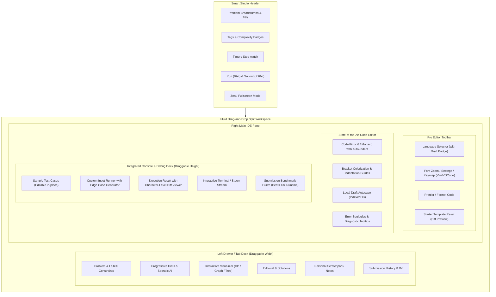

To make the **BayesStack Coding Studio** the absolute state-of-the-art competitive and educational coding screen—rivaling and exceeding top-tier platforms like **Cursor, LeetCode, VS Code Web, CodeSignal, and Zed**—we have performed an architectural and visual audit of [`studios/coding/frontend`](file:///home/sagar/Desktop/bayesstack/bayesstack/studios/coding/frontend).

Here is the comprehensive assessment of **what is working well, critical friction points, what is missing, how to reorganize the layout, and the master UI/UX blueprint**.

---

## 1. Executive Audit: What Works vs. Critical Friction Points

### What is Working Well
- **Clean CQRS separation**: Clear decoupling between problem config, execution run, and submission polling in [`useCodingProblem.ts`](file:///home/sagar/Desktop/bayesstack/bayesstack/studios/coding/frontend/src/hooks/useCodingProblem.ts) and [`useCodeExecution.ts`](file:///home/sagar/Desktop/bayesstack/bayesstack/studios/coding/frontend/src/hooks/useCodeExecution.ts).
- **Comprehensive information architecture**: Problem Description, Editorial, and Submissions are already organized logically in [`LeftPane.tsx`](file:///home/sagar/Desktop/bayesstack/bayesstack/studios/coding/frontend/src/components/leftPane/LeftPane.tsx).
- **Clean tokenized design system**: Integrated with `@bayesstack/ui` design tokens (`--bs-ui-brand`, `--bs-ui-surface`, `--bs-ui-line`).

---

### Critical UX Flaws in Current Implementation

| Area | Current Implementation | Critical UX Problem | Benchmark Standard |
| :--- | :--- | :--- | :--- |
| **Workspace Layout** | Static CSS grid `minmax(380px, 46%) minmax(0, 1fr)` in [`CodingStudioLayout.tsx`](file:///home/sagar/Desktop/bayesstack/bayesstack/studios/coding/frontend/src/components/layout/CodingStudioLayout.tsx#L52) | **Zero split-resizing**. The user cannot drag the divider between the problem and the editor. On 13" laptops or ultrawide screens, the ratio is locked. | Smooth draggable horizontal & vertical split panes with double-click reset and snap-to-edge. |
| **Console Panel** | Stepped discrete toggle (`42px`, `260px`, `420px`) in [`ConsolePanel.tsx`](file:///home/sagar/Desktop/bayesstack/bayesstack/studios/coding/frontend/src/components/console/ConsolePanel.tsx#L71) | Jarring step jumps rather than fluid drag resizing; editor gets squeezed abruptly; no horizontal split option. | Smooth vertical splitter, quick collapse/drawer toggle, and detachable/floating panel. |
| **Editor Engine** | Custom `<textarea>` overlay with regex line highlighter in [`CodeEditor.tsx`](file:///home/sagar/Desktop/bayesstack/bayesstack/packages/ui/src/organisms/Editor/CodeEditor.tsx) | Lacks autocomplete/IntelliSense, syntax error diagnostics/squiggles, code folding, bracket color pairs, multi-cursor, minimap, or automated code formatting. | Full-fidelity Monaco / CodeMirror 6 with LSP diagnostics, Prettier/Black formatting, and Vim keybindings. |
| **Code Persistence** | In-memory `code` state in [`useCodingProblem.ts`](file:///home/sagar/Desktop/bayesstack/bayesstack/studios/coding/frontend/src/hooks/useCodingProblem.ts#L113) | **Data Loss Risk**: Switching languages or refreshing loses unsubmitted code! Switching from Python to C++ overwrites the editor with default starter code. | LocalStorage/IndexedDB persistent draft cache per problem and per language with an "Unsaved changes" indicator. |
| **Output Inspection** | Plain text box in [`ExecutionResultsView.tsx`](file:///home/sagar/Desktop/bayesstack/bayesstack/studios/coding/frontend/src/components/console/ExecutionResultsView.tsx#L198-L211) | When a test case fails, the user must manually read and compare strings character-by-character. No visual diff! | Side-by-side or inline character-level red/green diff viewer (Expected vs Actual). |
| **Keyboard Ergonomics** | Only mouse click triggers for Run/Submit in [`CodingStudioHeader.tsx`](file:///home/sagar/Desktop/bayesstack/bayesstack/studios/coding/frontend/src/components/layout/CodingStudioHeader.tsx) | No keyboard shortcuts for power users (`Ctrl/Cmd + Enter` to Run, `Ctrl/Cmd + Shift + Enter` to Submit, `Ctrl + '` for console). | Full keyboard command palette (`Cmd/Ctrl + K`), customizable key bindings, and shortcut indicator badges. |
| **Mathematical Formulas** | Raw text in [`ProblemDescriptionTab.tsx`](file:///home/sagar/Desktop/bayesstack/bayesstack/studios/coding/frontend/src/components/leftPane/ProblemDescriptionTab.tsx) and [`EditorialTab.tsx`](file:///home/sagar/Desktop/bayesstack/bayesstack/studios/coding/frontend/src/components/leftPane/EditorialTab.tsx) | Recurrence relations and constraints (e.g. $O(N \cdot W)$, $dp[i][w] = \max(...)$) render as raw ascii/markdown instead of polished KaTeX math. | Native LaTeX math equations with KaTeX rendering (which is already in `packages/ui/package.json`). |
| **Pedagogical Hinting** | All-or-nothing editorial in [`EditorialTab.tsx`](file:///home/sagar/Desktop/bayesstack/bayesstack/studios/coding/frontend/src/components/leftPane/EditorialTab.tsx) | Clicking "Editorial" reveals the entire solution and source code immediately, spoiling the learning process. | Progressive disclosure: Hint 1 $\to$ Hint 2 $\to$ Approach $\to$ Complexity $\to$ Solution with "Click to Reveal". |

---

## 2. Target Architecture & UX Blueprint



---

## 3. What Needs to Be Reorganized & Re-engineered

### A. Layout System & Ergonomics
1. **Draggable Resizers (Horizontal & Vertical Splitters)**:
   - Replace the static CSS grid in [`CodingStudioLayout.tsx`](file:///home/sagar/Desktop/bayesstack/bayesstack/studios/coding/frontend/src/components/layout/CodingStudioLayout.tsx) with a responsive **two-dimensional split-pane** (e.g. horizontal divider between Left Pane and Right Pane, vertical divider between Editor and Console).
   - Support:
     - Minimum constraints (e.g., left pane min 320px, max 60%; console min 40px, max 80%).
     - Double-click resizer to snap back to default 50/50 or 40/60 ratio.
     - Collapsible sidebar toggle (`Cmd + B` / click icon) that completely collapses the left pane into a vertical icon rail for maximum editor width.
2. **Zen / Focus Mode**:
   - In addition to standard browser fullscreen, provide a **Zen Coding Mode** that hides platform headers/navbars, focuses the editor and test console, and introduces subtle ambient distraction-free dark mode styling.

---

### B. Pro Editor Experience
1. **Multi-Language Draft Isolation & Auto-Saving**:
   - Currently, if a learner writes 50 lines in Python, clicks JavaScript, and switches back to Python, their code is reset or overwritten by starter code.
   - **Fix**: Maintain a persistent state dictionary keyed by `problemId:language`:
     ```typescript
     interface ProblemDrafts {
       [language: string]: {
         code: string;
         updatedAt: number;
         isDirty: boolean;
       };
     }
     ```
   - Persist to `localStorage` or `IndexedDB` with auto-save debounced at 300ms.
   - Show a subtle `● Saved` or `● Unsaved changes` pill in the editor status bar.
2. **Reset with Diff Safety**:
   - Replacing code with starter code is currently irreversible.
   - Add a confirm modal showing a **side-by-side git-style diff** comparing the user's current edits against the original starter code before resetting.
3. **Editor Controls Bar**:
   - Add **Format Code** button (formats Python / JS / C++ / Java).
   - Add **Font Size toggle** (Small / Medium / Large).
   - Add **Keybinding mode switcher** (Standard VS Code / Vim / Emacs).

---

### C. Problem Description & Pedagogy UX ([`ProblemDescriptionTab.tsx`](file:///home/sagar/Desktop/bayesstack/bayesstack/studios/coding/frontend/src/components/leftPane/ProblemDescriptionTab.tsx))
1. **KaTeX Formula Rendering**:
   - Mathematical notations like time complexity $O(N \cdot W)$, indices $A[i]$, and constraints $1 \le N \le 10^5$ should be parsed and rendered with KaTeX.
2. **Progressive Hint Disclosure System**:
   - Rather than jumping straight to the editorial, introduce progressive hint cards:
     - **Hint 1: Conceptual observation** (e.g. "Notice that each item is either included or excluded...")
     - **Hint 2: Subproblem breakdown** (e.g. "Can you define $dp[i][w]$ in terms of smaller capacities?")
     - **Hint 3: Edge cases to check** (e.g. "What if capacity is 0 or all weights exceed capacity?")
   - Each hint starts collapsed with a "Reveal Hint" trigger.
3. **Personal Problem Scratchpad / Notes Tab**:
   - Add a "My Notes" tab where learners can jot down pseudo-code, edge cases, and thoughts in markdown that persist per user per problem.

---

### D. Test Runner & Execution Deck ([`TestCaseView.tsx`](file:///home/sagar/Desktop/bayesstack/bayesstack/studios/coding/frontend/src/components/console/TestCaseView.tsx) & [`ExecutionResultsView.tsx`](file:///home/sagar/Desktop/bayesstack/bayesstack/studios/coding/frontend/src/components/console/ExecutionResultsView.tsx))
1. **Inline Editable Test Cases**:
   - Instead of static read-only boxes for sample cases, allow learners to click "+ Add Testcase", clone an existing case, and directly edit the inputs/expected outputs to test custom scenarios.
2. **Visual Diff Viewer for Failed Cases**:
   - In [`ExecutionResultsView.tsx`](file:///home/sagar/Desktop/bayesstack/bayesstack/studios/coding/frontend/src/components/console/ExecutionResultsView.tsx), when `actual !== expected`:
     - Render a character-level unified or side-by-side diff.
     - Highlight mismatched tokens in red/green (e.g., extra trailing newline, off-by-one difference, or missed item).
3. **Runtime & Memory Performance Distribution**:
   - On full submission acceptance, display a LeetCode-style performance distribution:
     - "Runtime: 42 ms (Beats 87.4% of submissions)"
     - "Memory: 14.2 MB (Beats 73.1% of submissions)"
     - With an interactive SVG bell-curve chart.
4. **ANSI Color Support for Compiler Output**:
   - Compiler warnings and errors (GCC/Clang/Rustc/Python tracebacks) currently render as raw uncolored text. Adding ANSI escape sequence parsing (`ansi-to-react` / tokenized colors) highlights error line numbers and messages cleanly.

---

### E. Global Keyboard Shortcuts & Command Palette
Implement standard competitive coding keyboard shortcuts:

| Shortcut | Action |
| :--- | :--- |
| `Ctrl / Cmd + Enter` | **Run Sample Tests** |
| `Ctrl / Cmd + Shift + Enter` | **Submit Solution** |
| `Ctrl / Cmd + '` | **Toggle Test Console Collapse/Expand** |
| `Ctrl / Cmd + B` | **Toggle Problem Description Sidebar** |
| `Ctrl / Cmd + K` | **Open Command Palette** (Reset, Change Lang, Format, Docs) |
| `Ctrl / Cmd + S` | **Format & Save Code** (prevent default browser save page) |
| `Esc` | **Focus back to editor stage** |

Provide a `⌨ Shortcuts` button in the header that opens an interactive cheatsheet modal.

---

## 4. Modern Visual Aesthetic & Design System Enhancements

1. **Dark/Light Theme Harmonization**:
   - [x] Ensure seamless theme coherence between the editor and surrounding UI panels. Cohesive dark studio shell (slate-900 background, crisp emerald/teal borders, muted telemetry text).
2. **Status Bar & Telemetry in Editor Footer**:
   - [x] Telemetry in the code editor footer:
     - Line & Column counter (`Ln 24, Col 12`).
     - Spaces/Tabs indicator (`Spaces: 4`).
     - Encoding (`UTF-8`).
     - Live dirty state indicator (`Saved to draft`).
3. **Micro-Interactions & Feedback**:
   - [x] Smooth progress pulse animation while code is running in Docker sandbox.
   - [x] Subtle celebratory micro-confetti effect when all test cases pass on `Accepted` submission.
   - [x] Distinct audio cue toggle (subtle pleasant click on run, chime on accept, soft notification on failure).
4. **Psychological Retention Hooks**:
   - [x] Daily streak flame tracker (`🔥 3 Days`) with loss aversion prompt.
   - [x] Instant "Next Challenge ➔ (+50 XP)" continuation loop upon acceptance.

---

## 5. Recommended Phased Implementation Roadmap

### Phase 1: High-Impact Ergonomics & Layout (Quick Wins)
- [x] Add **smooth draggable splitters** for Left-Right workspace and Editor-Console panels (supporting Bottom and Side-by-side splits).
- [x] Implement **Console Panel fluid drawer, layout switcher, and floating popout modal** with keyboard shortcuts (`Cmd+'` console drawer toggle, `Cmd+Shift+L` bottom/side toggle, `Esc` close modal).
- [x] Add **LocalStorage draft auto-persistence** per problem and language to prevent data loss.
- [x] Upgrade **Editor Engine** to lightweight CodeMirror 6 at the component level with tree-sitter highlighting, autocompletion, bracket matching, font sizing, tab spacing, and format controls.
- [x] Add a **collapsible sidebar toggle** to maximize editor width.

### Phase 2: Diagnostic & Editor Polish
- [x] Build a **visual diff viewer** in [`ExecutionResultsView.tsx`](file:///home/sagar/Desktop/bayesstack/bayesstack/studios/coding/frontend/src/components/console/ExecutionResultsView.tsx) with side-by-side, inline, and character-level red/green diffing for failed test comparisons.
- [x] Add **KaTeX mathematical formula rendering** to [`ProblemDescriptionTab.tsx`](file:///home/sagar/Desktop/bayesstack/bayesstack/studios/coding/frontend/src/components/leftPane/ProblemDescriptionTab.tsx) and [`EditorialTab.tsx`](file:///home/sagar/Desktop/bayesstack/bayesstack/studios/coding/frontend/src/components/leftPane/EditorialTab.tsx) with auto-enrichment of constraints, recurrence relations, and complexities.
- [x] Implement **Global Keyboard Ergonomics** (`Cmd+Enter` to Run, `Cmd+Shift+Enter` to Submit, `Cmd+'` for Console, `Cmd+B` for Sidebar, `Cmd+Shift+L` for Dock), shortcut indicator badges on header buttons, and a **Command Palette / Shortcuts Cheatsheet Modal** (`Cmd/Ctrl + K`).
- [x] Enable **custom testcase cloning and in-place editing**.
- [x] Add **Reset confirmation with side-by-side diff preview**.

### Phase 3: Advanced Pedagogical & Competitive Features
- [x] Implement **Progressive Hints system** (Reveal Hint 1, 2, 3, Approach, Complexity, and Spoiler-Shielded Solution Code) with master "Reveal All / Hide All" control and progress tracking.
- [x] Add **Submission Performance Distribution Chart** (Beats X% runtime & memory bell curve).
- [x] Add **Personal Notes tab** with auto-saved Markdown support.
- [ ] Optional: Integrate Socratic AI assistant to explain failed test cases without leaking code solutions.

### Phase 4: Aesthetic Polish & Sensory Experience Verification
- [x] **Dark/Light Theme Harmonization**: Slate-900 shell (`#0f172a`), Slate-800 panels (`#1e293b`), emerald borders, and cohesive dark mode textareas, inputs, and SVG chart elements.
- [x] **Editor Footer Telemetry**: Live dirty state (`Saved to draft`), `Ln/Col` counter, space indentation, character length, encoding, and keymap mode.
- [x] **Sensory Engagement System**: Web Audio API synthesizer for tactile mechanical click, harmonic major arpeggio chime, and gentle retry tones, paired with Canvas micro-confetti particle burst on `Accepted`.
- [x] **Verification**: All 14 test files and 64 tests in `@bayesstack/studio-coding` pass; zero typecheck errors (`tsc --noEmit`); zero visual bugs or React styling warnings.