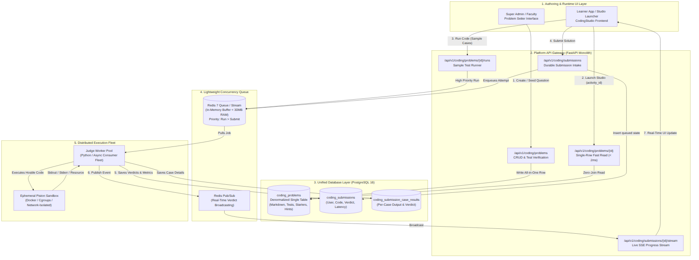
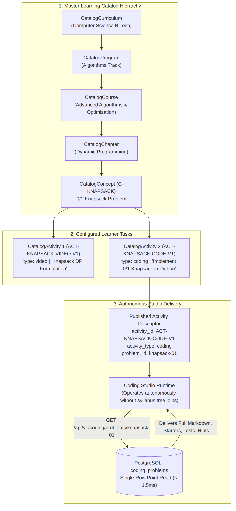
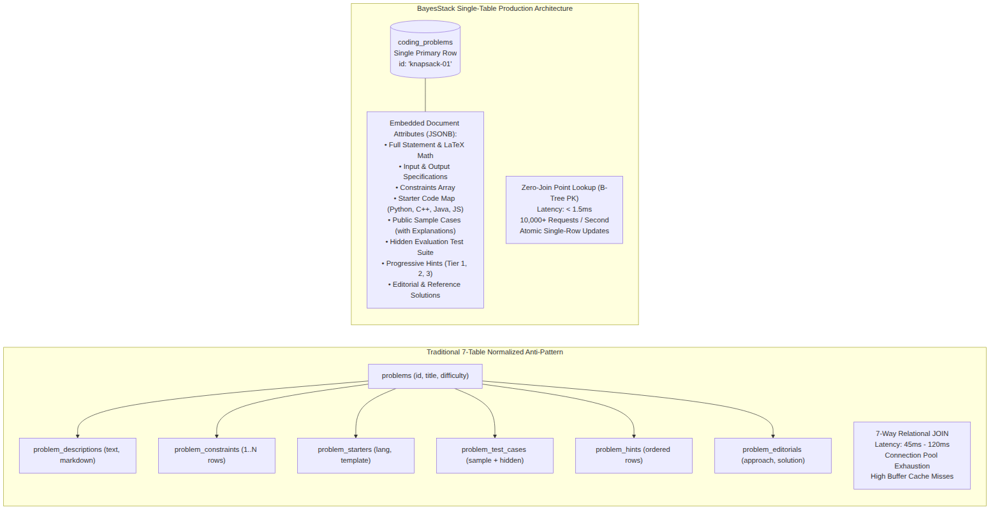
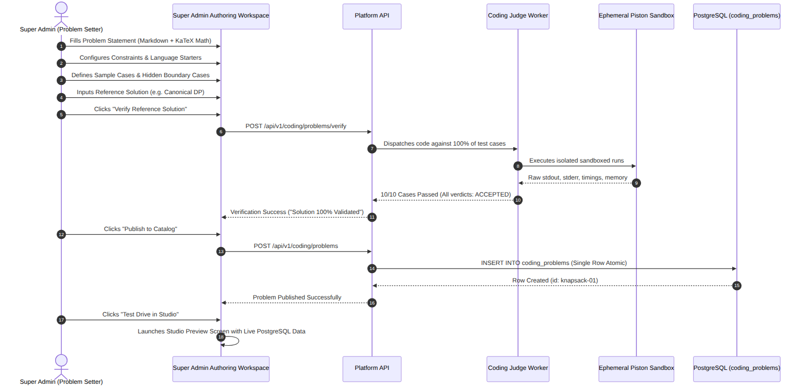
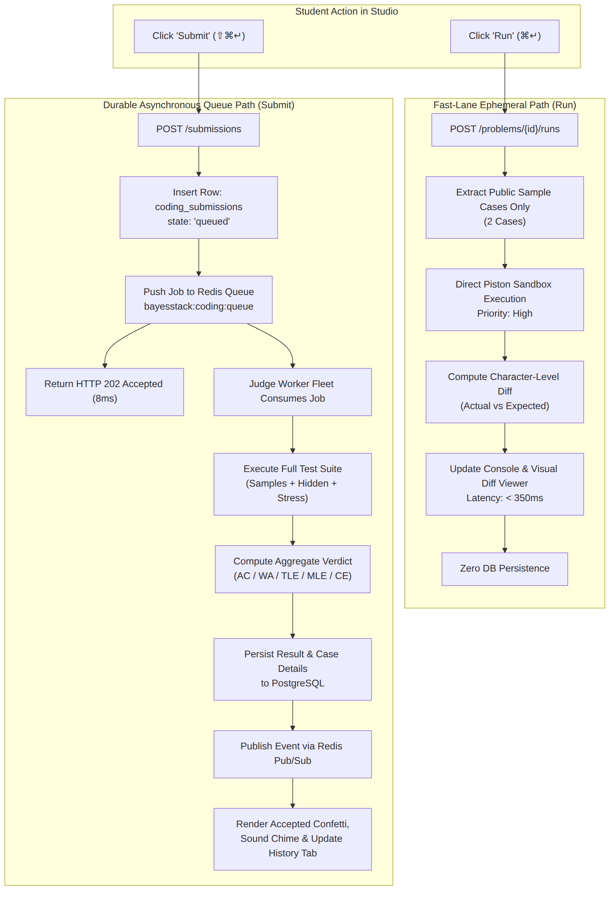
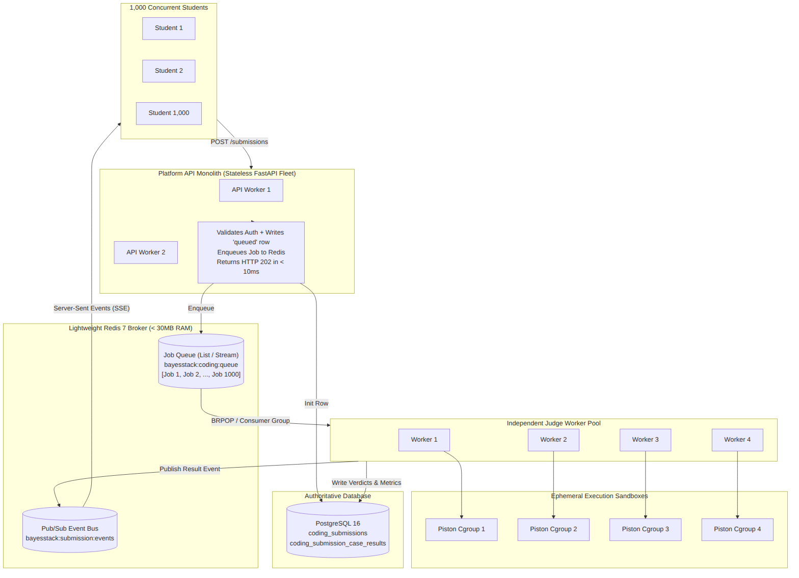
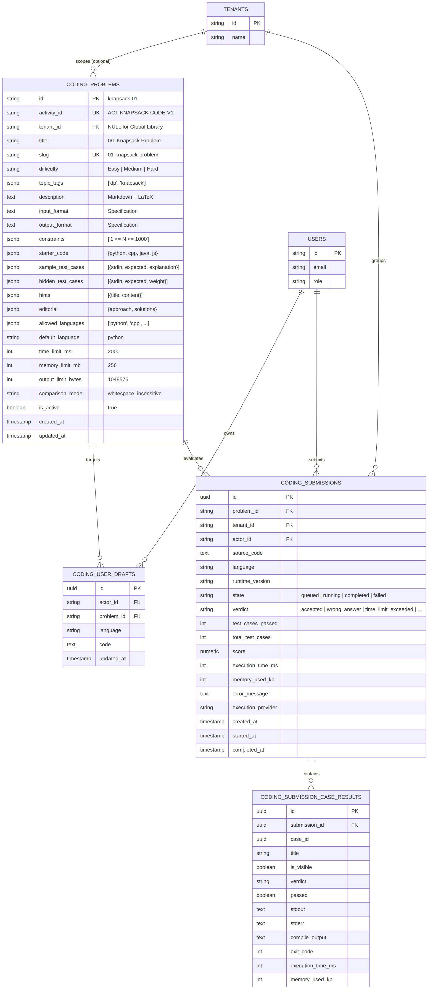
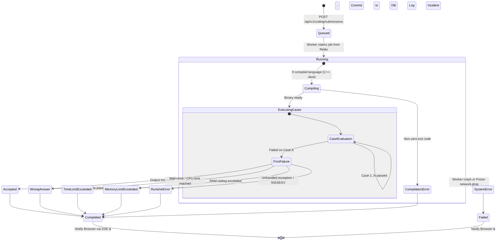
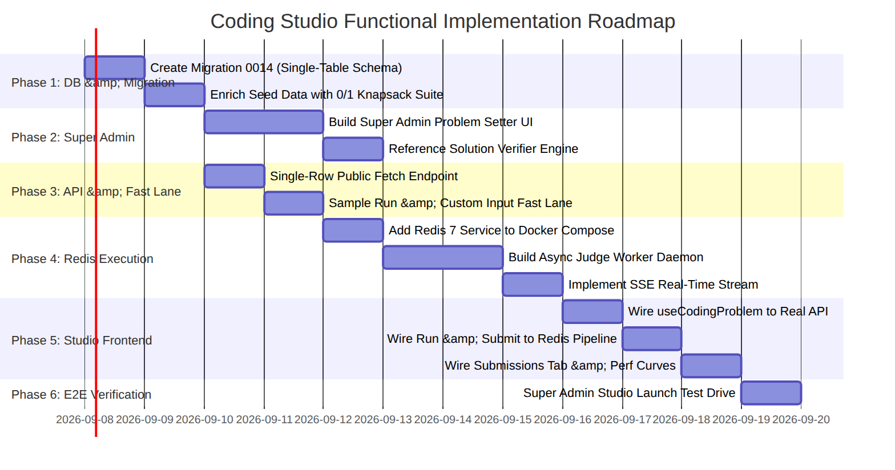

# BayesStack Coding Studio: End-to-End Functional Architecture & Implementation Blueprint

```text
Document:    08-sep-2026.md
Topic:       Coding Studio End-to-End Functional Architecture, Database Design & Execution Pipeline
Status:      Architecture Specification & Actionable Implementation Roadmap
Date:        2026-09-08
Author:      BayesStack Core Architecture Team
Location:    docs/todo/08-sep-2026.md
Target Apps: studios/coding, services/api, apps/super, compose.yaml
```

---

## Executive Summary

The BayesStack Coding Studio features an ergonomic, pro-grade user interface with draggable splitters, CodeMirror 6 editing, visual test diffing, progressive hint disclosure, and performance distribution charts. However, **it is currently decoupled from real backend data and execution**:
1. Problem statements, math constraints, starter templates, and hints are hardcoded or fragmented across catalog activity configs and isolated tables.
2. The super admin and future faculty lack a dedicated authoring interface to set, test, and publish coding questions into the library.
3. Submissions currently rely on mock execution or in-process background tasks that collapse under classroom concurrency (1,000+ simultaneous students).
4. Submissions are not yet synchronized with the student's Submissions tab with historical diffs, pass/fail verdicts, and runtime percentiles.

This document serves as both a **comprehensive Developer's Guide** explaining the entire system mechanics through compiled architectural diagrams and **production-grade code specifications**, as well as an **actionable, step-by-step implementation roadmap** to make the Coding Studio completely functional end-to-end.

---

# Part I: Developer's Guide to Coding Studio Backend Architecture



*Source file: [`docs/todo/img/coding_studio_system_topology.mmd`](file:///home/sagar/Desktop/bayesstack/bayesstack/docs/todo/img/coding_studio_system_topology.mmd)*

---

## 1. Concept $\to$ Activity $\to$ Studio Relationship

To understand how the backend interacts with the database, we trace how BayesStack translates an abstract curriculum into an interactive coding workspace.



*Source file: [`docs/todo/img/concept_activity_studio_resolution.mmd`](file:///home/sagar/Desktop/bayesstack/bayesstack/docs/todo/img/concept_activity_studio_resolution.mmd)*

### The Educational Hierarchy
```text
CatalogCurriculum
  └── CatalogProgram
        └── CatalogCourse
              └── CatalogChapter
                    └── CatalogConcept (Atomic Learning Objective, e.g. "0/1 Knapsack Problem")
                          ├── CatalogActivity 1 (type: "video", e.g. "Knapsack DP Formulation")
                          └── CatalogActivity 2 (type: "coding", e.g. "Implement 0/1 Knapsack in Python")
```

### The Studio Runtime Invariant
> **Core Architectural Rule**: *A Studio runtime must be able to operate an activity without knowing the curriculum, degree program, chapter, or institutional tenant hierarchy that brought the student there.*

When a user clicks on an activity in the platform:
1. The platform resolves the user's enrolled publication and extracts the **`CatalogActivity` descriptor**:
   ```json
   {
     "id": "ACT-KNAPSACK-CODE-V1",
     "concept_id": "C-KNAPSACK",
     "activity_type": "coding",
     "title": "Implement 0/1 Knapsack in Python",
     "config": {
       "problem_id": "knapsack-01"
     }
   }
   ```
2. The UI mounts `<CodingStudio activity={activity} />`.
3. The Studio frontend receives `problem_id = "knapsack-01"` (or uses `activity.id = "ACT-KNAPSACK-CODE-V1"` as fallback).
4. The Studio calls `GET /api/v1/coding/problems/knapsack-01` to fetch everything needed to render the workspace in a single point lookup.

---

## 2. The "Single Big Table / Zero Joins" Database Philosophy

### Comparison: Normalized Relational Joins vs. Denormalized Single-Row Fetch



*Source file: [`docs/todo/img/single_table_vs_normalized.mmd`](file:///home/sagar/Desktop/bayesstack/bayesstack/docs/todo/img/single_table_vs_normalized.mmd)*

### The High-Concurrency Read Bottleneck
In a traditional relational schema for an online judge, problem data is fragmented across 6–8 normalized tables:
- `problems` (title, difficulty)
- `problem_descriptions` (markdown text, author)
- `problem_constraints` (one row per constraint)
- `problem_starter_templates` (language $\to$ code)
- `problem_hints` (ordered hints)
- `problem_editorials` (approach, solution codes)
- `problem_test_cases` (stdin, stdout, is_sample)

**Why this fails in production**:
When 5,000 students join an exam or live coding lab at 10:00 AM, thousands of concurrent requests execute 7-way table joins. This leads to:
- Database connection pool exhaustion.
- Cache thrashing on Postgres buffer pools.
- High query latency (>80ms per fetch) when it should take under 2ms.
- Fragile transactions when a problem author updates a question.

### The BayesStack Denormalized Solution: `coding_problems`
Every single piece of data needed to **render**, **understand**, **hint**, **scaffold**, and **evaluate** a coding problem is stored in **one primary row** in `coding_problems`.

| Column | Type | Purpose |
| :--- | :--- | :--- |
| `id` | `VARCHAR(64) PK` | Canonical problem identifier (e.g. `knapsack-01`) |
| `activity_id` | `VARCHAR(64) UNIQUE` | Associated platform catalog activity ID |
| `tenant_id` | `VARCHAR(64) FK (NULL)` | `NULL` for global library; Tenant ID for custom institutional problems |
| `title` | `VARCHAR(255)` | Problem title ("0/1 Knapsack Problem") |
| `slug` | `VARCHAR(255) UNIQUE` | URL slug ("01-knapsack-problem") |
| `difficulty` | `VARCHAR(32)` | `Easy` / `Medium` / `Hard` |
| `topic_tags` | `JSONB (list[str])` | `["dynamic-programming", "arrays", "knapsack"]` |
| `description` | `TEXT` | Full Markdown + LaTeX mathematical formulation |
| `input_format` | `TEXT` | Standard input specification |
| `output_format` | `TEXT` | Standard output specification |
| `constraints` | `JSONB (list[str])` | `["1 <= N <= 1000", "1 <= W <= 1000"]` |
| `starter_code` | `JSONB (dict)` | `{"python": "...", "cpp": "...", "java": "...", "javascript": "..."}` |
| `sample_test_cases` | `JSONB (list[dict])` | Public cases `[{stdin, expected, explanation}]` |
| `hidden_test_cases` | `JSONB (list[dict])` | Private judge test suite for evaluation and grading |
| `hints` | `JSONB (list[dict])` | Progressive hints `[{order, title, content}]` |
| `editorial` | `JSONB (dict)` | `{approach, time_complexity, space_complexity, solutions}` |
| `allowed_languages` | `JSONB (list[str])` | `["python", "cpp", "java", "javascript"]` |
| `default_language` | `VARCHAR(32)` | Default editor language (`"python"`) |
| `time_limit_ms` | `INTEGER` | Per-case execution timeout (default: 2000ms) |
| `memory_limit_mb` | `INTEGER` | Per-case memory ceiling (default: 256MB) |
| `output_limit_bytes`| `INTEGER` | Output clamp protection (default: 1MB) |
| `comparison_mode` | `VARCHAR(32)` | `whitespace_insensitive` \| `exact` \| `float_tol` |
| `is_active` | `BOOLEAN` | Published / Hidden flag |
| `created_at` / `updated_at` | `TIMESTAMPTZ` | Audit timestamps |

#### Why This Works Brilliantly:
1. **Zero-Join Fetch**: `SELECT * FROM coding_problems WHERE id = :id` takes **< 1.2ms** from PostgreSQL.
2. **Atomic Updates**: When an author saves an edit or adds a test case, it is a single atomic `UPDATE` transaction—no dangling foreign keys.
3. **Public vs. Private Projection**: When the frontend requests problem details, the API queries this single table and simply strips `hidden_test_cases` from the JSON serialization before returning to the browser.
4. **Offline / Cache Friendly**: The entire problem payload can be cached in Redis with `SET problem:knapsack-01` for instant sub-millisecond retrieval under extreme load.

---

## 3. Super Admin & Faculty Problem Authoring Workflow



*Source file: [`docs/todo/img/problem_setter_workflow.mmd`](file:///home/sagar/Desktop/bayesstack/bayesstack/docs/todo/img/problem_setter_workflow.mmd)*

### Authoring Interface Structure:
- **Tab 1: Basic Info & Metadata**: Title, Slug, Difficulty badge, Topic tags, Allowed languages, Limits (Time/Memory).
- **Tab 2: Problem Statement & Math**: Markdown editor with live KaTeX preview ($O(N \cdot W)$, $dp[i][w] = \max(...)$), Input format, Output format, Constraints builder.
- **Tab 3: Starter Code (Pre-Code)**: Syntax-highlighted templates for Python, C++, Java, JavaScript with standard IO scaffolds.
- **Tab 4: Test Suite Builder**:
  - *Sample Cases*: Visible to learners, includes markdown explanations.
  - *Hidden / Boundary Cases*: Edge cases ($N=0$, large numbers, timeout stress tests).
  - *Bulk Importer*: Upload zip or JSON containing `.in` and `.out` files.
- **Tab 5: Progressive Hints & Editorial**: Multi-tier hints, complexity analysis, reference code.
- **Self-Grading Test Verification**: A problem cannot be published until the author's reference solution runs against 100% of the test cases and passes with a clean `Accepted` verdict.

---

## 4. Run vs. Submit: Two Fundamentally Different Lifecycles

In competitive and educational coding platforms, mixing up "Run" and "Submit" is the #1 architectural pitfall.



*Source file: [`docs/todo/img/run_vs_submit_lifecycle.mmd`](file:///home/sagar/Desktop/bayesstack/bayesstack/docs/todo/img/run_vs_submit_lifecycle.mmd)*

| Feature | Run Code ("Run") | Submit Solution ("Submit") |
| :--- | :--- | :--- |
| **Intent** | Fast feedback, experimentation, syntax debugging | Formal evaluation, grading, progress record |
| **Test Cases** | Public sample cases only (or user custom input) | Full suite: Sample + Hidden + Boundary cases |
| **Execution Path** | Synchronous or high-priority fast lane | Asynchronous job queue |
| **Database Persistence**| **None** (Ephemeral execution) | **Durable record** in `coding_submissions` |
| **Latency Target** | $< 350\text{ ms}$ | $< 2.5\text{ s}$ (queued and processed safely) |
| **Progress Impact** | Does not mark activity completed | Marks activity completed if verdict is `accepted` |
| **History View** | Replaces active console output | Appended to user's Submissions Tab |

---

## 5. Scalability: Solving the 1,000 Concurrent Student Submission Surge

### The Scenario:
Imagine 1,000 students enrolled in an Algorithms course taking a 60-minute midterm exam. In the last 5 minutes, 800 students repeatedly hit **Submit** simultaneously.

### Why In-Process Background Tasks Fail:
FastAPI's `background_tasks.add_task(...)` spawns asynchronous coroutines in the **same Python process** as the web server:
- 1,000 concurrent network sockets opening to Piston exhaust file descriptors (`EMFILE`).
- High CPU load in the API process blocks the async event loop, causing health check timeouts and crashing the HTTP server.
- If the API container restarts or deploys, **all running submissions are permanently lost**.

### Evaluating Queue Technologies:

| Queue System | Pros | Cons | Verdict for BayesStack |
| :--- | :--- | :--- | :--- |
| **Google Cloud Pub/Sub / AWS SQS** | Fully managed | Cloud lock-in, latency (>100ms per msg), cost, requires internet egress in local dev | ❌ Overkill for on-prem / local dev |
| **Apache Kafka** | Extreme throughput | Heavy JVM memory footprint (>1.5GB RAM), complex ZooKeeper/KRaft clustering | ❌ Massive operational overhead |
| **RabbitMQ** | Erlang broker, AMQP | Requires dedicated broker service, extra management UI, ~200MB RAM | ⚠️ Decent, but heavy |
| **Redis 7 (Streams / LPUSH-BRPOP)** | **Sub-millisecond latency (<0.5ms)**, **<30MB RAM footprint**, single lightweight Docker container, atomic operations, built-in Pub/Sub for SSE/WebSockets | Needs persistence configuration (AOF/RDB) |  **Winner: Recommended Architecture** |

### The Lightweight Redis Execution Architecture:



*Source file: [`docs/todo/img/redis_execution_architecture.mmd`](file:///home/sagar/Desktop/bayesstack/bayesstack/docs/todo/img/redis_execution_architecture.mmd)*

#### Key Architecture Elements:
1. **Immediate HTTP Response (8ms)**: The API validates auth, writes a `queued` row to `coding_submissions`, enqueues `{submission_id, problem_id, language, source_code}` to Redis, and returns `HTTP 202 Accepted` immediately. The user never waits on execution.
2. **Decoupled Worker Scaling**: The API remains 100% responsive. As submissions surge, the Redis queue absorbs the spike. Workers consume jobs at their safe processing capacity. If load spikes, simply scale workers: `docker compose scale coding-judge-worker=4`.
3. **No Database Polling**: Instead of 1,000 browsers hammering `GET /submissions/{id}` every 500ms (2,000 DB queries/second!), the browser opens an **SSE (Server-Sent Events) connection**:
   ```text
   event: progress
   data: {"state": "running", "passed_cases": 4, "total_cases": 12}

   event: verdict
   data: {"state": "completed", "verdict": "accepted", "runtime_ms": 42, "memory_kb": 14200}
   ```
   Redis Pub/Sub forwards worker completion directly to the SSE stream. Database load drops to **1 read + 1 write per submission**.

---

# Part II: Complete Database Schema & Models

## 1. Entity-Relationship Diagram (ERD)



*Source file: [`docs/todo/img/coding_studio_erd.mmd`](file:///home/sagar/Desktop/bayesstack/bayesstack/docs/todo/img/coding_studio_erd.mmd)*

---

## 2. Submission State Machine



*Source file: [`docs/todo/img/submission_state_machine.mmd`](file:///home/sagar/Desktop/bayesstack/bayesstack/docs/todo/img/submission_state_machine.mmd)*

---

## 3. SQL DDL Migration (`0014_single_table_coding_problems.py`)

```sql
-- 1. Upgraded coding_problems table containing all problem data in a single row
ALTER TABLE coding_problems
    ADD COLUMN IF NOT EXISTS slug VARCHAR(255) UNIQUE,
    ADD COLUMN IF NOT EXISTS difficulty VARCHAR(32) NOT NULL DEFAULT 'Medium',
    ADD COLUMN IF NOT EXISTS topic_tags JSONB NOT NULL DEFAULT '[]'::jsonb,
    ADD COLUMN IF NOT EXISTS description TEXT NOT NULL DEFAULT '',
    ADD COLUMN IF NOT EXISTS input_format TEXT NOT NULL DEFAULT '',
    ADD COLUMN IF NOT EXISTS output_format TEXT NOT NULL DEFAULT '',
    ADD COLUMN IF NOT EXISTS constraints JSONB NOT NULL DEFAULT '[]'::jsonb,
    ADD COLUMN IF NOT EXISTS starter_code JSONB NOT NULL DEFAULT '{}'::jsonb,
    ADD COLUMN IF NOT EXISTS sample_test_cases JSONB NOT NULL DEFAULT '[]'::jsonb,
    ADD COLUMN IF NOT EXISTS hidden_test_cases JSONB NOT NULL DEFAULT '[]'::jsonb,
    ADD COLUMN IF NOT EXISTS hints JSONB NOT NULL DEFAULT '[]'::jsonb,
    ADD COLUMN IF NOT EXISTS editorial JSONB NOT NULL DEFAULT '{}'::jsonb,
    ADD COLUMN IF NOT EXISTS default_language VARCHAR(32) NOT NULL DEFAULT 'python';

CREATE INDEX IF NOT EXISTS ix_coding_problems_slug ON coding_problems (slug);
CREATE INDEX IF NOT EXISTS ix_coding_problems_activity_id ON coding_problems (activity_id);
CREATE INDEX IF NOT EXISTS ix_coding_problems_difficulty ON coding_problems (difficulty);

-- 2. User Drafts Persistence Table (cross-device autosave backup)
CREATE TABLE IF NOT EXISTS coding_user_drafts (
    id UUID PRIMARY KEY DEFAULT gen_random_uuid(),
    actor_id VARCHAR(64) NOT NULL REFERENCES users(id) ON DELETE CASCADE,
    problem_id VARCHAR(64) NOT NULL REFERENCES coding_problems(id) ON DELETE CASCADE,
    language VARCHAR(32) NOT NULL,
    code TEXT NOT NULL,
    updated_at TIMESTAMPTZ NOT NULL DEFAULT CURRENT_TIMESTAMP,
    CONSTRAINT uq_coding_user_draft UNIQUE (actor_id, problem_id, language)
);

CREATE INDEX IF NOT EXISTS ix_coding_user_drafts_lookup ON coding_user_drafts (actor_id, problem_id);

-- 3. Enhance coding_submissions for detailed analytics and leaderboard/percentiles
ALTER TABLE coding_submissions
    ADD COLUMN IF NOT EXISTS test_cases_passed INTEGER DEFAULT 0,
    ADD COLUMN IF NOT EXISTS total_test_cases INTEGER DEFAULT 0,
    ADD COLUMN IF NOT EXISTS score NUMERIC(5, 2) DEFAULT 0.00,
    ADD COLUMN IF NOT EXISTS error_message TEXT;

CREATE INDEX IF NOT EXISTS ix_coding_submissions_actor ON coding_submissions (actor_id, problem_id, created_at DESC);
CREATE INDEX IF NOT EXISTS ix_coding_submissions_metrics ON coding_submissions (problem_id, verdict, execution_time_ms);
```

---

## 4. SQLAlchemy 2.0 Async Models (`services/api/src/db/models/coding.py`)

```python
"""Authoritative single-table coding problem, user draft, and submission models."""

from datetime import datetime, timezone
from typing import Any, Optional
import uuid

from sqlalchemy import Boolean, DateTime, ForeignKey, Integer, Numeric, String, Text, UniqueConstraint
from sqlalchemy.dialects.postgresql import JSONB, UUID
from sqlalchemy.orm import Mapped, mapped_column

from core.database import Base


def utc_now() -> datetime:
    return datetime.now(timezone.utc)


class CodingProblem(Base):
    """Zero-join single-table record holding the complete problem definition."""

    __tablename__ = "coding_problems"

    id: Mapped[str] = mapped_column(String(64), primary_key=True)
    activity_id: Mapped[Optional[str]] = mapped_column(String(64), unique=True, nullable=True, index=True)
    tenant_id: Mapped[Optional[str]] = mapped_column(String(64), ForeignKey("tenants.id", ondelete="CASCADE"), nullable=True)
    
    # Core Metadata
    title: Mapped[str] = mapped_column(String(255), nullable=False)
    slug: Mapped[str] = mapped_column(String(255), unique=True, nullable=False, index=True)
    difficulty: Mapped[str] = mapped_column(String(32), default="Medium", nullable=False, index=True)
    topic_tags: Mapped[list[str]] = mapped_column(JSONB, default=list, nullable=False)

    # Problem Statement & Math Formulations (Markdown + LaTeX)
    description: Mapped[str] = mapped_column(Text, default="", nullable=False)
    input_format: Mapped[str] = mapped_column(Text, default="", nullable=False)
    output_format: Mapped[str] = mapped_column(Text, default="", nullable=False)
    constraints: Mapped[list[str]] = mapped_column(JSONB, default=list, nullable=False)

    # Code Scaffolds per Language (e.g. {"python": "...", "cpp": "..."})
    starter_code: Mapped[dict[str, str]] = mapped_column(JSONB, default=dict, nullable=False)
    allowed_languages: Mapped[list[str]] = mapped_column(JSONB, default=lambda: ["python", "cpp", "java", "javascript"], nullable=False)
    default_language: Mapped[str] = mapped_column(String(32), default="python", nullable=False)

    # Test Suites (Public Samples vs Protected Hidden Grading Cases)
    sample_test_cases: Mapped[list[dict[str, Any]]] = mapped_column(JSONB, default=list, nullable=False)
    hidden_test_cases: Mapped[list[dict[str, Any]]] = mapped_column(JSONB, default=list, nullable=False)

    # Pedagogical Hints & Editorial Solutions
    hints: Mapped[list[dict[str, str]]] = mapped_column(JSONB, default=list, nullable=False)
    editorial: Mapped[dict[str, Any]] = mapped_column(JSONB, default=dict, nullable=False)

    # Execution Ceilings
    time_limit_ms: Mapped[int] = mapped_column(Integer, default=2_000, nullable=False)
    memory_limit_mb: Mapped[int] = mapped_column(Integer, default=256, nullable=False)
    output_limit_bytes: Mapped[int] = mapped_column(Integer, default=1_048_576, nullable=False)
    comparison_mode: Mapped[str] = mapped_column(String(32), default="whitespace_insensitive", nullable=False)

    is_active: Mapped[bool] = mapped_column(Boolean, default=True, nullable=False)
    created_at: Mapped[datetime] = mapped_column(DateTime(timezone=True), default=utc_now, nullable=False)
    updated_at: Mapped[datetime] = mapped_column(DateTime(timezone=True), default=utc_now, onupdate=utc_now, nullable=False)


class CodingUserDraft(Base):
    """Server-side draft synchronization per user per problem and language."""

    __tablename__ = "coding_user_drafts"
    __table_args__ = (UniqueConstraint("actor_id", "problem_id", "language", name="uq_coding_user_draft"),)

    id: Mapped[uuid.UUID] = mapped_column(UUID(as_uuid=True), primary_key=True, default=uuid.uuid4)
    actor_id: Mapped[str] = mapped_column(String(64), ForeignKey("users.id", ondelete="CASCADE"), nullable=False, index=True)
    problem_id: Mapped[str] = mapped_column(String(64), ForeignKey("coding_problems.id", ondelete="CASCADE"), nullable=False, index=True)
    language: Mapped[str] = mapped_column(String(32), nullable=False)
    code: Mapped[str] = mapped_column(Text, nullable=False)
    updated_at: Mapped[datetime] = mapped_column(DateTime(timezone=True), default=utc_now, onupdate=utc_now, nullable=False)


class CodingSubmission(Base):
    """Durable attempt record powering the Submissions Tab and distribution charts."""

    __tablename__ = "coding_submissions"

    id: Mapped[uuid.UUID] = mapped_column(UUID(as_uuid=True), primary_key=True, default=uuid.uuid4)
    problem_id: Mapped[str] = mapped_column(String(64), ForeignKey("coding_problems.id", ondelete="RESTRICT"), nullable=False, index=True)
    tenant_id: Mapped[Optional[str]] = mapped_column(String(64), ForeignKey("tenants.id", ondelete="SET NULL"), nullable=True, index=True)
    actor_id: Mapped[Optional[str]] = mapped_column(String(64), ForeignKey("users.id", ondelete="SET NULL"), nullable=True, index=True)
    
    source_code: Mapped[str] = mapped_column(Text, nullable=False)
    language: Mapped[str] = mapped_column(String(32), nullable=False)
    runtime_version: Mapped[Optional[str]] = mapped_column(String(32), nullable=True)
    
    # Lifecycle: queued -> running -> completed | failed
    state: Mapped[str] = mapped_column(String(16), default="queued", nullable=False, index=True)
    verdict: Mapped[Optional[str]] = mapped_column(String(32), nullable=True, index=True)
    
    # Aggregate Metrics
    test_cases_passed: Mapped[int] = mapped_column(Integer, default=0, nullable=False)
    total_test_cases: Mapped[int] = mapped_column(Integer, default=0, nullable=False)
    score: Mapped[float] = mapped_column(Numeric(5, 2), default=0.0, nullable=False)
    execution_time_ms: Mapped[Optional[int]] = mapped_column(Integer, nullable=True)
    memory_used_kb: Mapped[Optional[int]] = mapped_column(Integer, nullable=True)
    error_message: Mapped[Optional[str]] = mapped_column(Text, nullable=True)
    
    execution_provider: Mapped[Optional[str]] = mapped_column(String(32), nullable=True)
    created_at: Mapped[datetime] = mapped_column(DateTime(timezone=True), default=utc_now, nullable=False, index=True)
    started_at: Mapped[Optional[datetime]] = mapped_column(DateTime(timezone=True), nullable=True)
    completed_at: Mapped[Optional[datetime]] = mapped_column(DateTime(timezone=True), nullable=True)
```

---

# Part III: Step-by-Step Implementation Roadmap & Actionable To-Do



*Source file: [`docs/todo/img/coding_studio_roadmap.mmd`](file:///home/sagar/Desktop/bayesstack/bayesstack/docs/todo/img/coding_studio_roadmap.mmd)*

---

## Phase 1: Database Migration & Rich Problem Seeding

### Task 1.1: Generate and Apply Migration `0014_single_table_coding_problems.py`
- [ ] Create `services/api/migrations/versions/0014_single_table_coding_problems.py`.
- [ ] Add columns to `coding_problems`: `slug`, `difficulty`, `topic_tags`, `description`, `input_format`, `output_format`, `constraints`, `starter_code`, `sample_test_cases`, `hidden_test_cases`, `hints`, `editorial`, `default_language`.
- [ ] Create table `coding_user_drafts` with compound unique constraint `(actor_id, problem_id, language)`.
- [ ] Add `test_cases_passed`, `total_test_cases`, `score`, and `error_message` to `coding_submissions`.
- [ ] Run `./.venv/bin/alembic upgrade head`.

### Task 1.2: Enrich Canonical 0/1 Knapsack Seed in `services/api/src/db/seed.py`
- [ ] Populate `CodingProblem("knapsack-01")` with the complete canonical dataset:
  - **Full Description**: Mathematical 0/1 knapsack formulation with LaTeX formatting.
  - **Input / Output Format**:
    ```text
    Input:
    Line 1: N W (number of items, capacity)
    Line 2: N integers representing weights
    Line 3: N integers representing values
    Output:
    Single integer representing maximum achievable value
    ```
  - **Constraints**: `$1 \le N \le 1000$`, `$1 \le W \le 1000$`, `$1 \le \text{weights}[i] \le 1000$`, `$1 \le \text{values}[i] \le 1000$`.
  - **Starter Codes**: Clean templates with standard I/O parsing for Python 3, C++ 17, Java 21, and JavaScript Node.js.
  - **Sample Test Cases**: 2 transparent sample cases with step-by-step selection explanations.
  - **Hidden Test Cases**: 8 rigorous boundary cases:
    - Case 3: Zero capacity ($W=0 \implies 0$).
    - Case 4: All weights exceed capacity.
    - Case 5: Exact fit where all items fit.
    - Case 6: Greedy trap (high value/weight ratio item blocks optimal combination).
    - Cases 7–10: Large random arrays testing $O(N \cdot W)$ performance within 2000ms.
  - **Progressive Hints**:
    - Hint 1: Optimal substructure identification.
    - Hint 2: 2D DP recurrence definition: $dp[i][w] = \max(dp[i-1][w], dp[i-1][w-wt] + val)$.
    - Hint 3: 1D memory optimization iterating backwards from $W$ down to $wt$.
  - **Editorial**: Comprehensive algorithmic walkthrough, time complexity $O(N \cdot W)$, space complexity $O(W)$, and working reference solutions in all 4 languages.

---

## Phase 2: Super Admin Problem Setter Interface

### Task 2.1: Problem Setter Authoring Workspace (`apps/super/app/library/new-problem/page.tsx`)
- [ ] Create a dedicated authoring screen in the Super Admin app with `@bayesstack/ui` components:
  - Markdown editor with live KaTeX preview.
  - Test case manager: add, delete, clone, toggle `is_sample`.
  - Starter code multi-tab editor for Python, C++, Java, JS.
  - Progressive hint builder.
- [ ] Provide an instant **"Test Drive in Studio"** button: launches the live `<CodingStudio />` modal loaded with the draft problem state.

### Task 2.2: Problem Solution Auto-Verification Engine
- [ ] Implement `POST /api/v1/coding/problems/verify`:
  - Accepts problem test suite and an author's reference solution.
  - Evaluates reference code against all test cases.
  - Returns pass rate, per-case execution timings, and flags potential timeout risks before publication.

---

## Phase 3: Platform API Endpoints & Fast-Lane Execution

### Task 3.1: Zero-Join Public Problem Resolver
- [ ] Update `GET /api/v1/coding/problems/{problem_id}`:
  - Query `coding_problems` by ID or by `activity_id` (`SELECT * FROM coding_problems WHERE id = :id OR activity_id = :id`).
  - Strip `hidden_test_cases` from public response payload.
  - Return complete manifest in $< 2\text{ ms}$:
    ```json
    {
      "id": "knapsack-01",
      "activity_id": "ACT-KNAPSACK-CODE-V1",
      "title": "0/1 Knapsack Problem",
      "slug": "01-knapsack-problem",
      "difficulty": "Medium",
      "description": "...",
      "input_format": "...",
      "output_format": "...",
      "constraints": ["..."],
      "starter_code": { "python": "...", "cpp": "..." },
      "sample_test_cases": [{ "stdin": "...", "expected": "...", "explanation": "..." }],
      "hints": [{ "title": "...", "content": "..." }],
      "editorial": { "approach": "...", "solutions": {} },
      "allowed_languages": ["python", "cpp", "java", "javascript"]
    }
    ```

### Task 3.2: Fast-Lane Sample Runner (`POST /api/v1/coding/problems/{id}/runs`)
- [ ] Run code synchronously against public sample cases only.
- [ ] Bypasses database writes to `coding_submissions`.
- [ ] Returns structured case results for the frontend visual diff viewer:
  ```json
  {
    "verdict": "wrong_answer",
    "passed": false,
    "execution_time_ms": 24,
    "results": [
      {
        "case_id": "sample-1",
        "passed": true,
        "actual": "220\n",
        "expected": "220\n"
      },
      {
        "case_id": "sample-2",
        "passed": false,
        "actual": "70\n",
        "expected": "90\n",
        "diff": { "mismatched_index": 0 }
      }
    ]
  }
  ```

---

## Phase 4: Lightweight Redis Queue & Distributed Worker Pipeline

### Task 4.1: Integrate Redis 7 in `compose.yaml`
- [ ] Add Redis service to `compose.yaml`:
  ```yaml
  redis:
    image: redis:7-alpine
    container_name: bayesstack_redis
    restart: unless-stopped
    ports:
      - "6379:6379"
    command: ["redis-server", "--appendonly", "yes", "--maxmemory", "128mb", "--maxmemory-policy", "noeviction"]
    volumes:
      - redis_data:/data
    healthcheck:
      test: ["CMD", "redis-cli", "ping"]
      interval: 5s
      timeout: 3s
      retries: 5
  ```
- [ ] Add `redis_data` volume and wire `REDIS_URL=redis://redis:6379/0` into `api` and `coding-judge`.

### Task 4.2: Asynchronous Judge Worker Daemon
- [ ] Create `studios/coding/backend/src/worker.py`:
  - Connects to Redis queue (`bayesstack:coding:queue`).
  - Uses `BRPOP` or Redis Streams consumer group to pop pending submission jobs.
  - Fetches problem hidden test cases.
  - Dispatches execution tasks to Piston / sandbox.
  - Evaluates results with `WhitespaceInsensitiveComparator`.
  - Writes final verdict, latency, memory, and per-case records to PostgreSQL.
  - Publishes completion event to Redis Pub/Sub channel `bayesstack:submission:{submission_id}`.

### Task 4.3: Real-Time SSE Stream Endpoint
- [ ] Implement `GET /api/v1/coding/submissions/{submission_id}/stream`:
  - Authenticates student user.
  - Listens to Redis Pub/Sub channel for that submission.
  - Streams real-time lifecycle states: `queued` $\to$ `running (case 3/10)` $\to$ `completed`.
  - Closes connection cleanly upon terminal verdict.

---

## Phase 5: Coding Studio Frontend Real Backend Integration

### Task 5.1: Wire `useCodingProblem.ts` to Real API
- [ ] Modify `useCodingProblem.ts` to hydrate state directly from the enriched API endpoint:
  - Set `description`, `input_format`, `output_format`, `constraints` in `ProblemDescriptionTab`.
  - Set `starterCodeMap` from `problem.starter_code`.
  - Set `testCases` from `problem.sample_test_cases`.
  - Set `hints` and `editorial` from `problem.hints` and `problem.editorial`.
- [ ] Fallback gracefully to `activity.config` if offline or running in disconnected test mode.

### Task 5.2: Wire `useCodeExecution.ts` to Fast-Lane Run & Queued Submit
- [ ] **Run Code Trigger**: Calls `POST /api/v1/coding/problems/{id}/runs` with active editor code. Feeds visual diff viewer in `OutputDiffViewer.tsx`.
- [ ] **Submit Code Trigger**: Calls `POST /api/v1/coding/submissions`. Connects to SSE stream or polls `GET /api/v1/coding/submissions/{id}` until verdict.
- [ ] On `Accepted`: Triggers celebratory confetti and chime.

### Task 5.3: Wire Submissions Tab to Real User History
- [ ] Implement `useSubmissions.ts`:
  - Calls `GET /api/v1/coding/problems/{problem_id}/submissions`.
  - Renders previous attempts in `SubmissionsTab.tsx`: timestamp, language badge, runtime (ms), memory (MB), verdict badge (`Accepted`, `Wrong Answer`, `Time Limit Exceeded`).
  - Clicking an attempt displays the historical code snapshot with a "Load into Editor" or "Diff against Current Draft" option.
  - On `Accepted` submission, displays the **Performance Distribution Chart** (`PerformanceDistributionChart.tsx`) comparing the learner's runtime and memory against historical submissions.

---

## Phase 6: Super Admin Studio Launcher & End-to-End Verification

### Task 6.1: Super Admin Library Launch Test-Drive
- [ ] Open Super Admin app at `http://localhost:3005/library`.
- [ ] Filter by concept `0/1 Knapsack Problem` $\to$ Click `Implement 0/1 Knapsack in Python`.
- [ ] Verify that the Studio launches full-screen and **reads all data directly from PostgreSQL 5432**:
  - Problem description and LaTeX equations render via KaTeX.
  - Sample test cases render in the console.
  - Starter code loads for Python, C++, Java, JavaScript.
- [ ] Run code $\to$ passes sample cases with green badges.
- [ ] Submit solution $\to$ queues in Redis $\to$ evaluates against all 10 hidden test cases $\to$ returns `Accepted` in $< 1.5\text{ s}$.
- [ ] Open Submissions Tab $\to$ confirms the new submission appears with runtime percentiles.

---

## Summary of Completed vs. Pending Milestones

| Milestone | Component | Status | Target Completion |
| :--- | :--- | :--- | :--- |
| **Ergonomic Studio Frontend** | `studios/coding/frontend` |  Completed | 2026-09-07 |
| **Visual Diff Viewer & KaTeX** | `studios/coding/frontend` |  Completed | 2026-09-07 |
| **Progressive Hints & Audio** | `studios/coding/frontend` |  Completed | 2026-09-07 |
| **Database Migration 0014** | `services/api/migrations` | 🔲 Actionable Next | Phase 1 |
| **Canonical Knapsack Seeding** | `services/api/src/db` | 🔲 Actionable Next | Phase 1 |
| **Single-Row Zero-Join API** | `services/api/src/routers` | 🔲 Actionable Next | Phase 3 |
| **Redis 7 Queue & Compose** | `compose.yaml` | 🔲 Actionable Next | Phase 4 |
| **Distributed Judge Worker** | `studios/coding/backend` | 🔲 Actionable Next | Phase 4 |
| **Super Admin Problem Setter** | `apps/super/app/library` | 🔲 Actionable Next | Phase 2 |
| **Studio Live Backend Wiring** | `studios/coding/frontend` | 🔲 Actionable Next | Phase 5 |
| **End-to-End Verification** | Whole Platform | 🔲 Actionable Next | Phase 6 |

---

> **Key Takeaway**: By consolidating problem assets into the zero-join `coding_problems` table, buffering submissions through a lightweight Redis queue, and decoupling ephemeral sample runs from durable graded submissions, the BayesStack Coding Studio achieves sub-millisecond read latency, enterprise-grade test isolation, and smooth scalability for 1,000+ concurrent students without infrastructure bloat.
