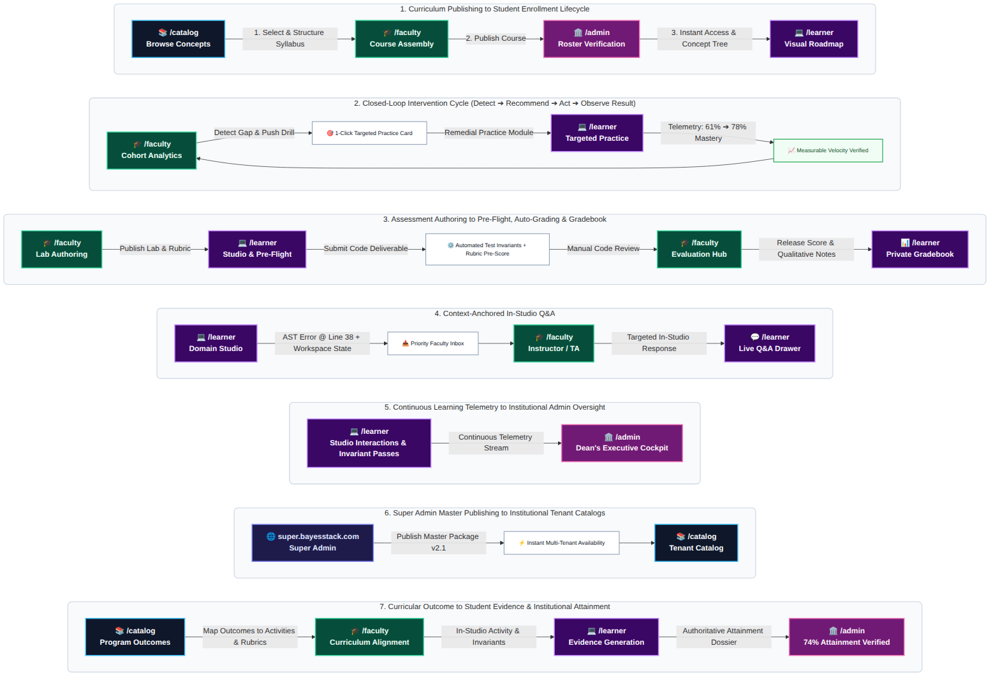
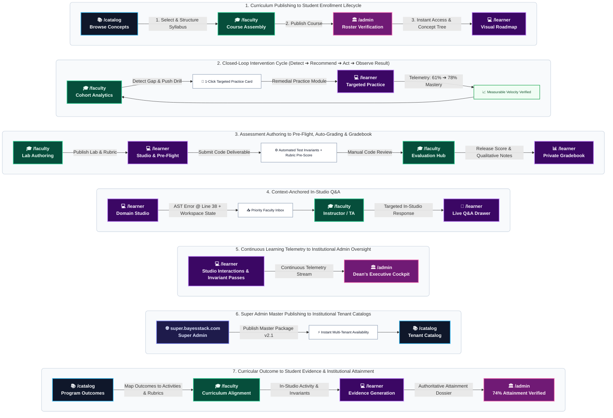

# BayesStack Platform Planning

## Vision

> **BayesStack is the academic capability company for institutions that need programs to evolve as quickly as the fields they teach.**

Knowledge advances exponentially. Artificial intelligence, computing, quantitative systems, and biotechnology reshape industries in months. Yet the institutions responsible for preparing the next generation remain constrained by multi-year curriculum cycles, administrative friction, and static courseware built for a world that came before.

We do not believe universities are broken; we believe they are underserved. They carry civilization's most important responsibility with tools that have failed to evolve at the speed of human discovery.

BayesStack equips institutions with the operational, curricular, and technical capability to launch modern programs in days, deliver active mastery-based learning, and verify genuine student competence. When the frontier of a discipline moves, the institution moves with it.

---

## What We Will NOT Do (The Negatives First)

Focusing means saying no to a hundred good ideas. To build maximum leverage, we intentionally refuse to build the following:

1. **General LMS / LXP**

- *Why Not*: Incumbents are entrenched. Competing here forces us into an administrative swamp of legacy course migrations, multi-decade feature bloat, and enterprise compliance bureaucracy instead of inventing a differentiated learning experience. (Note: True accessibility is architectural and core to our Domain Studios, but we will not build a commodity LMS wrapper).

2. **High-Stakes Exam Platform**

- *Why Not*: Uptime, proctoring, item leakage, appeals, and regulatory risks make this a high-anxiety, fragile wedge. You don't build early trust through test administration; you build it through mastery.

3. **Career Marketplace (Day One)**

- *Why Not*: A classic two-sided cold-start trap. Early student profiles have little value, and enterprises won't trust us yet. We will build the core learning platform first, acquire deep learner telemetry, and unlock the marketplace later.

4. **SIS / ERP Systems**

- *Why Not*: Multi-year implementation cycles, data migration friction, procurement bottlenecks, and mission-critical support. It is completely inconsistent with a capital-efficient software wedge.

5. **Physical Labs & Centers of Excellence**

- *Why Not*: Capital-intensive and relationship-heavy. While they generate revenue, they produce zero early software compounding.

6. **Ratings, Badges & University Rankings (e.g., QS Alternative)**

- *Why Not*: Authority cannot be declared upfront. An independent rating system is valuable only after the market deeply trusts our data and proven societal impact.

---

## The Institution's Causal Educational Loop

Education is not a collection of features. It is a causal loop. An institution designs knowledge, delivers experience, verifies capability, empowers faculty, unlocks careers, governs operations, provides infrastructure, and builds reputation.

| Stage / Dimension | Governing Question | High-Leverage Technology Wedge |
| :--- | :--- | :--- |
| **1. Academic Architecture** | *What should students learn, in what sequence, and why?* | Universal Concept Catalog & 1-Day Instant Program Launch |
| **2. Learning Delivery** | *How do learners experience, practice, and master knowledge?* | Domain Studios, Three-Tier Practice Engine & Contextual Copilot |
| **3. Evidence & Credentialing** | *How is capability demonstrated and trusted by the world?* | Multidimensional Evidence Ledger & Outcome Attainment Engine |
| **4. Faculty Empowerment** | *How do educators deliver world-class teaching effortlessly?* | Course Assembly Studio, Evaluation Hub & Closed-Loop Intervention |
| **5. Student Progression** | *How does learning translate into real-world impact?* | Skill-Matching Engine & Recruiter Multi-Campus Portal |
| **6. Academic Governance** | *How does the institution reliably run academic operations?* | Heuristic Timetabling & Academic Scheduling Solver |
| **7. Applied Infrastructure** | *What environments enable cutting-edge, hands-on practice?* | Pre-Provisioned Cloud Compute & Managed AI Machinery |
| **8. Standing & Reputation** | *How does the institution prove its societal impact?* | Independent Telemetry-Backed Institutional Benchmarking |

### The Product Filter

> **This entire loop is the real product.** Courses, videos, assignments, AI tutors, and dashboards are merely feature artifacts. Every feature we write must directly strengthen a node in this causal loop. If a proposed feature does not accelerate or reinforce this loop, we do not build it.

> **System Design Rule: Don't Sell Analytics — Sell Intervention**:
> A Dean does not wake up wanting another academic BI dashboard or concept heatmap. They want to know:
> *"We found the problem, here is why it is happening, here is what faculty can do, and here is whether it worked."*
> 
> Every analytical surface across BayesStack must operate as an **Intervention Loop**:
> 
> ```
> PROBLEM             ──► Identifies where learning is breaking down
>   │
>   ▼
> WHY?                ──► Traces prerequisite gaps and root causes
>   │
>   ▼
> WHAT SHOULD I DO?   ──► Recommends high-leverage corrective action
>   │
>   ▼
> DO IT               ──► 1-click faculty / admin dispatch
>   │
>   ▼
> DID IT WORK?        ──► Empirically measures before-and-after outcome lift
> ```
> 
> If an analytical metric cannot complete this intervention chain, it is vanity telemetry and does not belong in the MRP.

> **The "Steve Jobs" Test: The One Thing We Do Extraordinarily Well**:
> If asked what one thing BayesStack does extraordinarily well, our answer cannot be *"we are an entire academic ecosystem"*—that is too broad.
> 
> **Our singular, extraordinary promise is:**
> > **"BayesStack makes modern applied education dramatically faster to build and dramatically better to experience."**
> 
> **The Definitive 5-Minute Demo**:
> Faculty selects a modern frontier track: **Applied AI**.
> Within 5 minutes, the system materializes a complete, functioning academic experience:
> 
> > **Course** ⟶ **Concepts** ⟶ **Interactive Lessons** ⟶ **Coding Labs** ⟶ **Practice** ⟶ **Assessment** ⟶ **Project** ⟶ **Actionable Analytics**
> 
> That demo is extraordinary. Everything else in the platform exists solely to support, deliver, and verify that loop.

> **The Definition of "Remarkable"**:
> "Remarkable" does NOT mean accumulating sophisticated technology or bragging about using Monaco, WASM, or vector search. 
> 
> **Remarkable means the institution achieves an academic result it previously could not get without disproportionate effort:**
> * **Faculty**: *"I built a genuinely sophisticated course in 90 minutes."*
> * **Learner**: *"This platform knew exactly what I needed to do next."*
> * **Program Head**: *"I launched a modern applied-AI module without six months of development."*
> * **Dean**: *"I can see where learning is breaking down and intervene immediately."*
> 
> If a feature delivers complex technology without producing this disproportionate leverage, it fails the MRP filter.

> **The "Paul Graham" Test: Who Desperately Wants This?**:
> The answer is NOT "every university." Traditional, highly bureaucratic, slow-moving mega-universities will take two years just to form an exploratory committee.
> 
> **The early customers who desperately want BayesStack right now are:**
> * **Institutions actively launching or refreshing technical programs** where speed, student employability, and differentiated applied learning are existential matters.
> * **Forward-leaning private universities and autonomous colleges** that compete aggressively on graduate placement outcomes and practical skill readiness.
> * **Scaled higher-education organizations and professional institutes** launching frontier technical degrees (Applied AI, Cloud Architecture, Quantitative Finance, Data Engineering) that cannot afford an 18-month curriculum design cycle.
> 
> When you sell to someone who has an urgent problem to solve this semester, the sales cycle collapses from 18 months to 4 weeks.

> **The "Naval" Test: Where Is the Leverage?**:
> Our leverage is NOT the number of engineers or curriculum authors we can hire. Content volume by itself is never a defensible moat.
> 
> **Our compounding software leverage is the self-reinforcing flywheel:**
> 
> ```
> One expert builds an atomic concept once
>   │
>   ▼
> Concept reused across hundreds of institutions
>   │
>   ▼
> AI production and domain studios drop marginal delivery cost to zero
>   │
>   ▼
> Deep learner usage generates telemetry and learning evidence
>   │
>   ▼
> Telemetry refines diagnostic quality and invariant precision
>   │
>   ▼
> Proven learning outcomes drive network-wide adoption
> ```
> 
> **The Existential Risk: The Technical Founder Trap**:
> The primary existential risk for BayesStack is NOT that we are solving a nonexistent problem.
> 
> **The real risk is spending 18 months building a phenomenal, comprehensive platform before learning which specific part of it institutions actually pay for.**
> 
> A technically compelling architecture can easily blind us into building every tier simultaneously, only to discover in the field:
> * *"The Dean actually only cared about rapid course transformation and turnkey applied labs—they don't care about the rest yet."*
> * *Or: "Faculty exclusively adopted the platform for automated code evaluation and grading relief."*
> * *Or: "The institution solely needed market-aligned curriculum modernization to pass accreditation audits."*
> 
> **Operating Rule**: We do not let internal architectural elegance dictate the product hierarchy. **Early customer purchasing evidence must dictate the product hierarchy.** Every release gate requires validating what unlocks budget before expanding surface area.
> 
> **Educational Modeling Rule: Capability Evidence vs. Simplistic "Mastery"**:
> "Mastery" is not a single, directly observable scalar. Treating a concept as simply `Mastery = 83%` looks productized, but educationally it hides critical nuance: a learner might excel at procedural recognition while failing completely at transfer or problem-solving.
> 
> **The Capability Evidence Architecture**:
> While user-facing interfaces may surface an aggregated index (e.g., *Mastery Index: 83%*), BayesStack's internal engine models a multi-dimensional capability evidence graph:
> 
> ```
> Knowledge / Recognition   ──────┐
> Procedural Application   ──────┤
> Open Problem Solving     ──────┤   Capability Evidence Model
> Synthesis and Creation   ──────┤   (Trusted Institutional Signal)
> Retention over Time      ──────┤
> Contextual Transfer      ──────┘
> ```
> 
> By grounding competence in a structured evidence model rather than a flattened percentage, universities, accreditation bodies, and corporate recruiters can genuinely trust the signal.

> **Institutional Core Rule: "Outcome → Evidence" as a First-Class Workflow**:
> Traditional LMS platforms report on vanity activity proxies: *"74% of students completed the course"* or *"91% video watch time."* These metrics tell leadership nothing about whether true education occurred.
>
> The central institutional question is:
> **"Is the assessment actually measuring the intended outcome, and did the learner attain it?"**
>
> BayesStack treats **Outcome Attainment** as an end-to-end first-class workflow, mapping every learning activity directly to institutional proof:
> 
> ```
> PROGRAM OUTCOME     ──► Student can build and evaluate machine-learning models
>   │
>   ▼
> Courses             ──► Curricular distribution across degree tracks
>   │
>   ▼
> Concepts            ──► Atomic conceptual foundations and prerequisites
>   │
>   ▼
> Activities          ──► Hands-on domain studios and guided problem sets
>   │
>   ▼
> Assessments         ──► Evaluations designed specifically to test the target outcome
>   │
>   ▼
> Evidence            ──► Code artifacts, test invariants, rubric evaluations
>   │
>   ▼
> OUTCOME ATTAINMENT  ──► 74% of learners demonstrated the intended outcome
> ```
>
> An institution-level statement like *"74% of learners demonstrated the intended outcome"* is incomparably more defensible, actionable, and valuable to Deans and accreditation bodies (ABET, NBA, NAAC) than *"74% completed the course."* It naturally forms the bedrock of institutional analytics and quality audits.

---

## What We WILL Do

We do not build generic administrative software. We build the high-leverage technology wedge for each node in the Causal Educational Loop, architected across eight progressive stages:
* **Stages 1–4**: The Core Academic Engine (**Minimum Remarkable Product — Phase 1**)
* **Stage 5**: Student Progression & Career Matchmaking (**Phase 2 Initiative**)
* **Stage 7**: Applied Infrastructure & Cloud Lab Ecosystems (**Phase 3 Initiative**)
* **Stage 6**: Academic Operations & Timetabling Governance (**Phase 4 Initiative**)
* **Stage 8**: Global Standing & Independent Quality Benchmarking (**Phase 5 Initiative**)

---

### Stage 1: Academic Architecture (What Should Students Learn, in What Sequence, and Why?)

Stage 1 is solved by a single flagship product: **The Universal Concept Catalog**.

#### Core Product: The Universal Concept Catalog

A pre-built, composable learning engine that replaces multi-year curriculum development with a plug-and-play repository of ready-to-teach concepts, interactive labs, and ready-to-deploy programs.

#### Four Sellable Capabilities:

1. **One-Day Instant Program Launch**

* **Capability**: Launch complete, ready-to-teach programs (e.g., Data Structures & Algorithms, Applied AI) or compose custom courses in a single afternoon.

* **Value**: Drag and drop pre-packaged atomic concepts pre-loaded with interactive practice, code sandboxes, diagnostic questions, and guided prompts. Zero authoring delay.

2. **Continuous Skill & Industry Signal Mapping**

* **Capability**: Continuously maps curriculum to external skill requirements and industry signals to inform academic program design.

* **Value**: Instead of chasing noisy job-posting buzzwords or claiming an opaque algorithm dictates syllabus requirements, BayesStack aggregates longitudinal industry skill shifts and presents structured market signals. Faculty and curriculum committees keep human judgment in the loop to decide how and when to evolve core learning tracks.

3. **Practitioner & Faculty Review Metadata**

* **Capability**: Transparent concept-level peer and practitioner review metadata embedded directly into course material.

* **Value**: Lightweight, credible assurance for faculty and curriculum committees via structured metadata on concepts (`Reviewed by: [Name], [Role/Affiliation], Last reviewed: [Date]`) without building a complex external trust-mark verification ecosystem.

4. **Curriculum Traceability & Outcome Attainment Support**

* **Capability**: End-to-end outcome-to-evidence mapping and empirical attainment verification for university quality teams and accreditation bodies.

* **Governing Question**: *Is the assessment actually measuring the intended outcome?*

* **The Outcome → Evidence Workflow Chain**:

  > **Program Outcomes** ⟶ **Courses** ⟶ **Concepts** ⟶ **Activities** ⟶ **Assessments** ⟶ **Evidence** ⟶ **Outcome Attainment**

* **Value**: Delivers clear curricular traceability from formal program outcomes down to rubric-backed evidence. Rather than reporting shallow course completion, it enables authoritative institution-level statements (e.g., Program Outcome: *"Student can build and evaluate machine-learning models"* → Attainment Result: *"74% of learners demonstrated the intended outcome"*). This gives academic committees, deans, and accreditation reviewers (ABET, NBA, NAAC) defensible, audit-ready proof of educational efficacy without manual faculty overhead.

---

### Stage 2: Learning Delivery (How Do Learners Experience, Practice, and Master Knowledge?)

Learning delivery is not passive video streaming. It is an integrated academic operating system organized into three core product pillars: **Learn (Domain Studios)**, **Practice (The Three-Tier Application Engine)**, and **Community (Purpose-Built Academic Collaboration)**.

#### Product 1: Domain Studios (Learn)

* **Product Premise**: Every academic discipline requires its own native medium. We combine multi-modal theory with runtime-initialized domain studios.

* **Core Capabilities**:

* **Multi-Modal Theory Canvas**: Synchronized micro-lectures with auto-pausing video checkpoints, structured reading, and interactive simulation widgets.

* **Runtime-Mounted Domain Studios**: Instantly spins up specialized UI environments when a concept is launched:
  * **Computer Science & AI**: Monaco IDE, multi-file virtual filesystem, sub-50ms test execution, and AST shape verification.
  * **Accounting & Audit**: Reactive spreadsheet canvas with live formula engines, balancing invariants, and audit trails.
  * **Quantitative Finance**: Interactive options chain visualizers, live Greek calculations, and payoff manifolds.
  * **Mathematics & Statistics**: Explorable probability distributions and interactive parameter manifolds.

* **Studio Accessibility Architecture (Non-Negotiable Procurement Gate)**: Built-in universal access across rich interactive workspaces:
  * **Keyboard-First Navigation & Focus Trapping**: Strict focus management ensuring every code action, spreadsheet cell transition, and simulation control is 100% operable via keyboard alone.
  * **Screen-Reader Semantics & ARIA Landmarks**: Full semantic tree exposure for Monaco editor buffers, reactive spreadsheet grids, and interactive canvas components.
  * **Accessible Media & Telemetry**: Synchronized captions and interactive transcripts for all video micro-lectures with bi-directional scrub points.
  * **Color-Independent Meaning & Contrast**: Strict compliance with WCAG AAA contrast ratios; states (tests passing/failing, balance invariants, code errors) are never communicated solely through color.
  * **Accessible Visualizations & Alternative Representations**: Interactive manifolds, charts, and payoff curves feature companion data tables, textual summaries, and assistive speech cues.

#### Product 2: The Three-Tier Practice & Application Engine (Practice)

* **Product Premise**: Practice is not a single test bank. It is a three-tier mastery progression that bridges immediate comprehension, multi-concept laboratory synthesis, and real-world authentic execution.

* **Tier 1: Formative Concept Drills (Topic Level)**

* *Governing Question*: Did the student understand this specific concept?

* *Experience*: Studio-integrated exercise banks, bite-sized comprehension checks, and sub-second automated test invariants built right into the learning loop.

* **Tier 2: Virtual Institutional Labs (Chapter / Multi-Concept Level)**

* *Governing Question*: Can the student synthesize and apply multiple concepts together?

* *Experience*: Full digitization of the university laboratory syllabus. Step-by-step digital lab manuals, pre-configured cloud environments, automated invariant test assertions, and an institutional lab performance ledger for grading.

* **Tier 3: Authentic Capstone Projects & Assignments (Course / Program Level)**

* *Governing Question*: Can the student solve a large-scale, open-ended real-world problem?

* *Experience*: A heavy-duty project and assignment primitive complete with problem briefs, team role allocation, shared workspaces, structured submission rubrics, video demo uploads, and evidence portfolios.

#### Product 3: Purpose-Built Academic Community & Messaging (Collaborate)

* **Product Premise**: We do not build an educational social network. We build a high-leverage collaboration tool strictly focused on academic productivity, peer learning, and learning-related communication.

* **Core Capabilities**:

* **Concept-Anchored Discussion Threads**: Q&A pinned directly to specific code lines, lab steps, or lecture timestamps (eliminating dead, unorganized generic forums).

* **Study Groups & Project Teams**: Structured cohort spaces for peer help, group assignments, and collaborative workspace sharing.

* **Actionable Notification & Academic Messaging Engine**: Notifications are never passive alert feeds; every notification strictly follows the system-wide design principle: **Context + Consequence + Action** (e.g., *"Lab 4 is due tomorrow at 11:59 PM [Context]. You will miss the grading deadline [Consequence]. Resume where you stopped [1-Click Direct Action]"* or *"Professor Rao returned Assignment 2 with rubric notes. Review feedback and submit reflection"*). Deep-links directly into the exact runtime workspace, code line, or reflection pane.

#### Product 4: The Contextual Learning Copilot (Socratic Studio Intelligence)

* **Product Premise**: We do not build an unconstrained generic AI chatbot that floats alongside the LMS and hallucinates answers. The AI is **attached to the learner's work, not attached to the application**. Because BayesStack unites the atomic concept, domain studio, student code, runtime state, and mastery history into a single execution context, the copilot operates with an unusually rich, grounded context window.

* **The Critical Product Principle: Attached to the Learner's Work, Not Attached to the Application**:
  * **Commodity AI Failure ("Ask AI Anything")**: Unanchored chatbots floating in application chrome lack grounding; they give generic StackOverflow snippets, hallucinate solutions, or short-circuit learning by writing code for the student.
  * **The BayesStack Grounding Advantage**: The AI is physically bound to the learner's active workspace. When a student asks:
    > *"Why is my model overfitting?"*
    
    The system already inspects the unified work vector:
    * **Course & Chapter**: Curricular boundaries and active learning objectives.
    * **Concept**: Target theoretical principles and prerequisite dependencies.
    * **Assignment**: Problem constraints, rubric criteria, and required invariants.
    * **Code & AST**: Editor buffer, model architectures, loss definitions, and hyperparameters.
    * **Dataset & Runtime**: Train/validation splits, data batching, and training manifold curves.
    * **Attempt History**: Prior run records, code diffs across runs, and regression patterns.
    * **Errors & Invariants**: Exact execution stack traces, shape mismatches, and assertion logs.
    * **Rubric & Standards**: Target institutional rubric dimensions and coding standards.
    * **Previous Hints**: Prior scaffolding delivered during the session to avoid repetitive loops.

* **Core Capabilities**:
  * **Socratic Problem-Solving Guidance**: Guides the learner to isolate bugs or conceptual misconceptions through targeted questions and diagnostic hints without revealing direct solutions or completing assignments for them.
  * **Invariant & AST Diagnostic Hints**: Reads hidden runtime assertions and linting errors to explain *why* an invariant failed in plain conceptual terms.
  * **Prerequisite Bridge Prompts**: If a learner is stuck due to a foundational gap (e.g., misunderstanding learning rate dynamics because of calculus fundamentals), the copilot surfaces a 2-minute refresher snippet directly in the drawer.

---

### Stage 3: Evidence & Credentialing (How Is Capability Demonstrated and Trusted by the World?)

Stage 3 aligns institutional assessment rigor with student career proof without creating administrative friction or privacy exposure.

#### The Two-Tier Assessment Architecture:

* **Tier 1: Continuous Evaluation (Labs, Projects & Assignments)**

* Captures ongoing practical competence across weekly virtual lab runs, multi-step problem sets, and collaborative capstone projects.

* **Tier 2: Summative Exams & Graded Reflections**

* Milestone examinations, timed assessments, and conceptual oral or written reflections for formal certification.

#### Core Product: Learning Evidence, Grade Ledger & Portfolio Showcase

* **Product Premise**: The university remains the official system of record; BayesStack acts as the system of learning evidence. We avoid the regulatory and administrative overhead of official transcripts (registrar policies, transfer credits, formal accreditation audit trails) in favor of deep assessment evidence, private grade calculation, and seamless export into institutional systems.

* **Core Capabilities**:

* **Private Institutional Grade Ledger**: Keeps all grading curves, rubrics, cohort diagnostics, and performance data strictly confidential to faculty and departmental admins.

* **Multidimensional Capability Evidence Ledger & Export**: Captures granular capability vectors across knowledge recognition, procedural execution, open problem-solving, project synthesis, retention, and transfer (e.g., code execution traces, rubric breakdowns, project evaluations) and generates standardized grade and evidence exports (e.g., CSV, standard SIS/LMS formats) for the institution's official system of record.

* **First-Class Outcome Attainment Engine (Outcome → Evidence Verification)**:
  * **Governing Assessment Validation**: Systematically verifies whether assigned activities, runtime studio labs, and assessment rubrics are genuinely measuring the intended Program Outcomes rather than passive completion or tangential mechanics.
  * **Bidirectional Traceability Chain**:

    > **Program Outcomes** ⟷ **Courses** ⟷ **Concepts** ⟷ **Activities** ⟷ **Assessments** ⟷ **Evidence** ⟷ **Outcome Attainment**

  * **Authoritative Institution-Level Statements**: Aggregates multi-tiered evaluation evidence into definitive cohort attainment metrics (e.g., *"74% of learners in cohort CS-2026 demonstrated Program Outcome PO-4: Student can build and evaluate machine-learning models"*—a statistically rigorous claim far superior to *"74% completed the course"*).
  * **Accreditation-Ready Evidence Dossiers**: Automates the compilation of audit-ready compliance dossiers for accreditation reviews (ABET, NBA, NAAC), linking every institutional outcome directly to verified student execution traces, code diffs, and faculty-approved rubric evaluations.

* **Student-Controlled Project Showcase**: Students selectively publish verified capstone projects, working code repositories, and interactive models to their public profile (e.g., LinkedIn) to prove capability to employers without exposing sensitive internal test scores.

---

### Stage 4: Faculty & Institutional Admin Empowerment (How Do Educators & Admins Deliver World-Class Teaching Effortlessly?)

Stage 4 provides faculty and academic administrators with high-leverage authoring, evaluation, analytics, communication, executive oversight, and scheduling tools.

#### Product 1: The Course Builder (Assembly Studio)

* **Product Premise**: Faculty should not spend months configuring course mechanics from scratch.

* **Core Capabilities**:

* **Catalog Course Assembly**: Directly leverages the Universal Concept Catalog (Stage 1) to compose, customize, and launch complete courses and lab tracks via drag-and-drop in minutes.

* **Instant Syllabus Customization**: Faculty can adopt pre-built programs out of the box or customize individual concepts with local instructions and assets.

#### Product 2: Assessment & Grading Suite (Evaluation Hub)

* **Product Premise**: Managing submissions, designing tests, and calculating grades should not consume 80% of a professor's time. The system drastically reduces faculty grading workload while ensuring that academic authority and final accountability remain entirely in the instructor's hands.

* **The Four-Stage Evaluation Hierarchy**:
  1. **Machine Evaluation (Deterministic)**: Objective code execution test suites, hidden invariant assertion runners, formula balance checks, and AST shape verification.
  2. **AI-Assisted Evaluation (Signals & Style)**: Non-deterministic rubric assistance analyzing architectural patterns, code readability, mathematical reasoning explanations, and structural feedback signals.
  3. **Faculty Review**: Instructors review aggregated test outcomes, inspect code diffs and execution traces, and calibrate AI feedback hints against local grading policies.
  4. **Final Academic Decision (Instructor Accountable)**: The instructor retains exclusive authority to adjust rubric points, override automated scores, and commit final grades.

* **Core Capabilities**:

* **Flexible Assessment Authoring**: Design and schedule continuous assessments (labs, projects, assignments) and summative examinations with custom weightage and rubrics.

* **Multi-Tiered Automated Scoring with Faculty Calibration**: Submissions execute machine invariants immediately; AI rubric assistants propose formative feedback signals; faculty retain one-click confirmation and complete override power before releasing final grades.

#### Product 3: Real-Time Cohort Analytics & Telemetry Hub

* **Product Premise**: A professor should have instant diagnostic visibility into cohort engagement, not discover dropouts at the end of the term.

* **Cohort Mastery & Engagement Heatmap**: Real-time telemetry tracking concept mastery distribution and where cohorts hit conceptual roadblocks.

* **Learners Needing Attention (Support Signal Engine)**: Replaces simplistic login counters (which penalize offline study or reward empty clicks) with a holistic, compassionate support signal combining:
  * Pacing progression vs. cohort benchmarks
  * Formative practice invariant struggles
  * Assessment performance & rubric trajectories
  * Concept mastery depth
  * Submission velocity patterns
  * Unresolved in-studio help queries and error states
  * Identifies *"Learners who may need attention"* to prompt timely faculty support without stigmatizing or ethically problematic "at-risk" labels.

* **Deadline & Submission Tracking**: Instant visibility into submission velocity and overdue deliverables across all enrolled cohorts.

* **Closed-Loop Diagnostic & Intervention Engine (Problem → Why → What → Do It → Did It Work)**:
  Rather than stopping at passive diagnostic charts, BayesStack transforms every insight into a completed outcome loop:
  1. **PROBLEM (Detect)**: Identifies where learning breaks down across a section (e.g., *14 learners struggling with Linear Regression*).
  2. **WHY? (Understand)**: Traces concept graph dependencies to identify root cause (e.g., *Likely missing prerequisite: Probability Distributions*).
  3. **WHAT SHOULD I DO? (Recommend)**: Suggests high-leverage corrective action (e.g., *Assign 12-minute interactive remedial drill on Probability Distributions*).
  4. **DO IT (Act)**: Instructor confirms and dispatches in a single click (`[Assign to all 14]`).
  5. **DID IT WORK? (Observe Result)**: Measures before-and-after capability telemetry (e.g., *Pre-intervention capability: 61% → Post-intervention capability: 78%*), proving to faculty and Deans that software interventions produce measurable academic lift.

#### Product 4: Communication & Broadcast Command

* **Product Premise**: We do not replace general email or enterprise chat; we own all learning-critical communication to drive student accountability and faculty efficiency.

* **Core Capabilities**:

* **Multi-Tier Academic Broadcasts**: Send rich announcements, syllabus updates, calendar events, and notices at the section, course, department, or institution-wide level.

* **One-Click Targeted Interventions**: Faculty inspect submission status and dispatch actionable reminders structured by **Context + Consequence + Action** (e.g., notifying unsubmitted students with deadline consequences and a direct one-click action to launch their saved workspace draft). Delivered across in-platform notification cards and verified institutional email.

* **Context-Linked Direct Messaging**: Send targeted direct messages to individual students or project groups with pre-attached workspace state and actionable next steps.

#### Product 5: Institutional Health & Action Hub (Admin Operational Suite)

* **Product Premise**: Passive dashboards fail because they simply report that something happened without empowering leadership to act. BayesStack replaces static charts with an actionable executive cockpit (`Insight → Action`). Every provost-level diagnostic couples directly to an administrative workflow: reallocating teaching resources, triggering departmental reviews, or addressing retention drop-offs.

* **Core Capabilities (Insight → Action Workflows)**:

* **Executive Vitality Overview & Pacing Triggers**: High-level telemetry on active courses, student lab hours, and completion rates. When completion drops below threshold, admins can trigger an automated departmental review request in one click.

* **Actionable Program Diagnostics**: Identifies systemic roadblocks across courses or majors with direct intervention actions (e.g., dispatching targeted academic support resources or alerting department chairs to prerequisite friction).

* **Empirical ROI & Efficacy Tracking**: Replaces vanity visualizations with proven outcome deltas—measuring how faculty interventions and student practice directly move retention and pass rates over time.

* **Program Outcome Attainment vs. Completion Cockpit**: Replaces blunt completion percentages (*"74% completed the course"*) with rigorous institutional outcome attainment metrics (*"74% of cohort demonstrated Program Outcome PO-4: Student can build and evaluate ML models"*). Displays an interactive matrix of Program Outcomes mapped down through courses, concepts, assessments, and rubric evidence, allowing Deans and Department Chairs to audit whether assessments actually measure intended outcomes and trigger curricular interventions where attainment lags.

* **Faculty Teaching Enablement**: Identifies courses with heavy grading backlogs or bottlenecked Q&A inboxes, allowing deans to allocate supplementary TA support with a single click.

#### Product 6: Roster & Enrollment Synchronization (Operational Bridge)

* **Product Premise**: BayesStack never attempts to become an SIS; however, without seamless roster management, course operations quickly break down. The platform maintains accurate mapping of students, sections, assigned faculty, and teaching assistants, synchronizing enrollment updates without manual friction.

* **Progressive Integration Architecture**:
  * **Pilot Phase (Day 1)**: Formatted CSV roster import and export (handling students, section designations, faculty leads, and assigned TAs) with automated collision and duplicate detection.
  * **Scale Phase (Standard Connectors)**: LTI 1.3 / Advantage integration, Google Workspace / Microsoft 365 directory sync, standard SIS flat-file / SFTP synchronization, and RESTful roster APIs for drops, adds, and section transfers.

* **Core Capabilities**:
  * **Role-Aware Section Topology**: Explicitly maps who is enrolled, in which laboratory section, led by which faculty member, and supported by which TA.
  * **Enrollment Lifecycle Handling**: Handles late adds, section swaps, and drop-outs gracefully, preserving existing learning telemetry and submission history.

#### Product 7: Universal Academic Command Palette & Search (⌘K Engine)

* **Product Premise**: Once an institution accumulates 500 courses, 10,000 concepts, 50,000 assessment items, and thousands of capstone projects, traditional tree/menu navigation collapses. Search is not a secondary toolbar widget; it is the primary navigation and retrieval backbone for students, instructors, and executives.

* **Unified ⌘K Interface Across All Personas**:
  * **For Learners**: Instant recall across personal learning history ("Search everything I know" — concepts mastered, notebook code snippets, lecture timestamps, open assignments, and instructor comments).
  * **For Faculty**: Rapid curricular discovery ("Find every concept involving regularization", diagnostic questions for Bayes Theorem, or student submissions across cohorts).
  * **For Administrators & Quality Teams**: Longitudinal program oversight ("Find all programs and courses assessing Outcome P4", courses flagged with high drop-off rates, or accredited curriculum rubrics).

* **Progressive Search Architecture**:
  * **Day 1 (MRP)**: Sub-50ms indexed full-text search across atomic concepts, courses, assignments, faculty profiles, and learning artifacts with instant keyboard shortcuts (⌘K / Ctrl+K).
  * **Phase 2 Expansion**: Cross-corpus vector and semantic search powering natural language queries, intelligent concept graph recommendations, and cross-disciplinary prerequisite matching.

---

### Stage 5: Student Progression & Career Matchmaking (Phase 2 Initiative)

Stage 5 unlocks enterprise recruiter revenue and student career outcomes. Sequenced as **Phase 2** because it delivers the highest **Revenue per Unit of Effort (ROI)**: once Phase 1 paid pilots generate verified student telemetry, corporate employers will pay immediately for access to pre-vetted entry-level talent.

#### Product 1: Learner Skill-Matching & Career Progress Engine

* **Steve Jobs Premise**: Students should never guess what skills they lack for their dream role. We match actual student telemetry against live job market requirements.

* **Core Capabilities**:

* **Telemetry-Driven Skill Matching**: Automatically compares student mastery data across domain concepts against real-world employer job postings for internships and entry-level positions.

* **Actionable Skill-Gap Diagnostics**: Highlights exact missing concepts required to build high confidence for specific career tracks (e.g., showing a student: "Master PyTorch Autograd and CUDA Allocation to reach 92% readiness for Machine Learning Engineer roles").

* **Internship & Entry-Level Job Board**: Direct access to curated job opportunities and internship postings aligned with verified student competency profiles.

#### Product 2: Recruiter Multi-University Broadcast Portal

* **Steve Jobs Premise**: Corporate recruiters waste months visiting individual campuses. We give them 1-click access to verified entry-level talent across all partner institutions.

* **Core Capabilities**:

* **1-Click Multi-Campus Job Broadcast**: Enterprise recruiters can post an internship or entry-level ad and broadcast it instantly across all participating university partner pools (or target specific selected institutions).

* **Verified Talent Discovery**: Filters applicant pools based on verified proof-of-work, lab performance, and concept mastery rather than unverified resume buzzwords.

#### Product 3: Institutional Placement & Career Operations Hub

* **Steve Jobs Premise**: University placement offices struggle with manual spreadsheets. We give placement admins full visibility and control over student career outcomes.

* **Core Capabilities**:

* **Placement Telemetry & Funnel Analytics**: Real-time dashboard for institutional admins tracking student application volume, interview conversion, and company recruitment activity across departments.

* **Partner Broadcast Governance**: Admin control over incoming employer opportunity broadcasts, allowing institutions to approve and curate career opportunities for their cohorts.

---

### Stage 7: Applied Infrastructure & Ecosystem (Phase 3 Initiative)

Stage 7 delivers high-performance computing infrastructure. Sequenced as **Phase 3** to capture premium lab licensing tiers and cloud compute margins as advanced programs scale.

#### Product 1: Cloud Compute, AI Machinery & Quantum Infrastructure Hub

* **Product Premise**: Advanced disciplines require high-performance hardware and specialized infrastructure that individual universities cannot easily provision or maintain at scale.

* **Core Capabilities**:

* **Pre-Provisioned AI & GPU Clusters**: Cloud compute machinery, remote GPU access, and AI framework sandboxes built directly into advanced course studios.

* **Cutting-Edge Lab Ecosystems**: Remote access to specialized hardware environments, quantum computing simulators, and enterprise dataset hubs.

---

### Stage 6: Academic Operations & Governance (Phase 4 Initiative)

Stage 6 automates complex university logistics. Sequenced as **Phase 4** because while operational lock-in is high, the algorithmic complexity (NP-hard constraint solving) and institutional policy friction yield a lower initial Revenue per Unit of Effort compared to employer recruiting and lab compute.

#### Product 1: Heuristic Timetabling & Academic Scheduling Engine

* **Product Premise**: University-wide timetabling is a massive, multi-variable constraint problem that institutions still manage through manual spreadsheets and administrative friction. We build a heuristic optimization engine to automate complex academic scheduling.

* **Core Capabilities**:

* **Constraint-Optimized Timetabling**: Multi-constraint heuristic solver that harmonizes room allocations, instructor availability, student section conflicts, and facility capacities simultaneously.

* **Academic Logistics Automation**: Automated conflict-free scheduling for university exam calendars, recurring faculty office hours, and laboratory time slots without manual reconciliation.

---

### Stage 8: Standing & Reputation (Phase 5 Initiative)

Stage 8 establishes independent, telemetry-backed institutional quality ratings once global platform adoption is achieved.

#### Product 1: Independent Institutional Quality & Impact Benchmarking (QS Alternative)

* **Product Premise**: Authority cannot be declared upfront; it is earned after platform trust compounds. Once majority market adoption is achieved, we issue objective, telemetry-backed university quality ratings.

* **Core Capabilities**:

* **Telemetry-Backed Quality Rating**: Objective institutional quality benchmarks based on verified student mastery growth, graduate velocity, and employer recruitment trust.

---

## The Commercial Implementation Strategy

### The Product Manager Prioritization Framework: 6 Evaluation Vectors

Building a generational software company requires ruthless discipline in capital allocation and engineering bandwidth. We do not prioritize features based on theoretical completeness or academic elegance; we prioritize them based on **compounding enterprise value and capital efficiency**.

Every candidate initiative beyond the foundational Minimum Remarkable Product (MRP) is evaluated across six rigorous vectors:

1. **Revenue Potential & Pricing Power**: What is the maximum revenue ceiling? Does it enable direct seat expansion, high-margin consumption pass-through, or net-new B2B budgets?

2. **Velocity to Cash (Sales Cycle Length)**: How fast does the feature turn into cash in the bank? Does it close in 2 to 4 weeks (corporate recruiter credit cards) or 9 to 18 months (university governance committees)?

3. **Engineering Complexity & Algorithmic Risk**: What is the true engineering cost? Is it deterministic application engineering (APIs, workflows, databases) or high-risk algorithmic research (NP-hard combinatorial optimization, complex distributed infrastructure)?

4. **Buyer Alignment & Procurement Friction**: Who signs the check? Does our existing champion (Dean / Head of Academics) hold the budget, or must we start a brand-new, politically fraught enterprise sales motion with a different stakeholder (Registrar, Facilities, IT)?

5. **Operational Blast Radius & Failure Cost**: What happens if the software experiences a bug or edge-case failure on day one? (A minor candidate search glitch vs. a catastrophic double-booking that paralyzes an entire university campus).

6. **Flywheel Compounding & Switching Moat**: Does this capability generate proprietary telemetry that feeds the rest of the ecosystem, making BayesStack permanently indispensable?

---

### Multi-Parameter Product Tradeoff & Decision Matrix

The following scoring matrix evaluates the foundational MRP and all post-MRP expansion candidates on a 1-to-10 scale across every critical business and engineering parameter:

| Candidate Product / Initiative | Stage | Revenue Ceiling (1-10) | Velocity to Cash (1-10) | Engineering Ease (1-10) | Buyer Alignment (1-10) | Low Blast Radius (1-10) | Flywheel Moat (1-10) | Revenue / Unit of Effort | Overall PM Decision |
| :--- | :--- | :--- | :--- | :--- | :--- | :--- | :--- | :--- | :--- |
| **Minimum Remarkable Product (MRP)** | **Stages 1-4** | **10** | **7** | **7** | **10** | **8** | **10** | **Extreme** | **Phase 1 (The Core Academic Engine)** |
| **Career Progression & Recruiter Network** | **Stage 5** | **9** | **9** | **8** | **9** | **9** | **10** | **Highest (10/10)** | **Phase 2 (Immediate Monetization)** |
| **Cloud Compute & Managed AI Machinery** | **Stage 7** | **8** | **8** | **6** | **9** | **7** | **8** | **High (8.5/10)** | **Phase 3 (Expansion ACV & Labs)** |
| **Heuristic Timetabling & Scheduling** | **Stage 6** | **4** | **3** | **2** | **3** | **2** | **6** | **Lowest (3.5/10)** | **Phase 4 (Deferred Operations)** |
| **Independent Institutional Benchmarking** | **Stage 8** | **10** | **2** | **6** | **7** | **9** | **10** | **Scale-Gated (N/A early)**| **Phase 5 (Long-Term Network Moat)** |

---

### Strategic Product Manager Teardown: Why the Sequence Works

#### 1. Why the Minimum Remarkable Product (MRP) Must Come First (Phase 1)

No university will purchase an incomplete loop. If we offer a curriculum catalog without an active IDE, students cannot practice. If we offer practice without automated grading, faculty cannot run their classes. If we offer grading without the Dean's Executive Health Dashboard, the economic buyer who signs the check cannot see the return on investment.

Phase 1 delivers the closed institutional loop:

* Stage 1: Universal Concept Catalog (market-aligned, instant-launch curricula).

* Stage 2: Domain Studios, 3-Tier Practice Engine, and Academic Messaging.

* Stage 3: Learning Evidence, Grade Ledger & Institutional System Export.

* Stage 4: Faculty Assembly Studio, Evaluation Hub, Cohort Telemetry, and the Dean's Executive Health & Action Hub.

**Targeted Go-To-Market Wedge**: We do not sell "university-wide everything" upfront. We sell a tight departmental beachhead:

> **University** ⟶ **School** ⟶ **Program** ⟶ **5–10 Courses** ⟶ **500–2,000 Learners**

**The Core Validation Milestone**: The primary MRP gate is not closing 25 broad institutions—it is proving that **3 unrelated institutions pay for essentially the same outcome** within an initial departmental beachhead (\$30k–\$80k pilot ACV) before expanding campus-wide.

#### 2. The Great Timetabling Trap: Why Stage 6 Drops to Phase 4

At first glance, university timetabling looks like an appealing operational feature because every campus struggles with it. However, from a Product Management and venture capital perspective, building a heuristic timetabling solver in Phase 2 is a catastrophic resource trap:

* **The NP-Hard Engineering Sinkhole**: Academic timetabling is a notoriously complex multi-variable constraint satisfaction problem. It involves thousands of conflicting variables: faculty personal constraints, room equipment requirements, laboratory capacity limits, cross-department elective collisions, and sudden room maintenance. It requires months of specialized operations research engineering for minimal commercial payoff.

* **The Buyer Disconnect**: The buyer of timetabling is the University Registrar or Central Campus Facilities Committee. The buyer of our Phase 1 MRP is the Academic Dean or Department Chair. Attempting to sell timetabling in Phase 2 fragments our sales team into a separate, bureaucratic sales cycle with a completely different institutional buyer.

* **Catastrophic Blast Radius**: If a learning module has a minor bug, one student submits a support ticket. If a timetabling solver produces a single room double-booking on day one of the semester, three hundred students and two professors collide in a locked lecture hall. The entire campus revolts, and the platform gets blamed.

* **Low Incremental ACV**: Universities treat scheduling software as a cheap administrative utility (\$15k to \$30k/year add-on), yielding a terrible Revenue per Unit of Effort ratio.

* **The PM Verdict**: We deliberately push Timetabling to **Phase 4**. We only build it once BayesStack already hosts all university courses, student rosters, faculty assignments, and classroom data natively. At that stage, constraint solving is ten times easier because the data is already clean, and our institutional lock-in is unbreakable.

#### 3. Why Career Progression & Recruiter Matchmaking Wins Phase 2

Once Phase 1 MRP is deployed across the first 10,000 students, BayesStack sits on an unprecedented goldmine: real-time, verified student skill telemetry, authentic project repositories, and cheat-proof mastery metrics.

Monetizing this through Stage 5 in Phase 2 is the highest-leverage decision a tech company can make:

* **Maximum Revenue per Unit of Effort**: We do not need to invent new algorithms. The student competence data already exists. Building a recruiter search portal, candidate filtering engine, and multi-campus broadcast hub is fast, high-margin web engineering.

* **Unlocks Fast Corporate Hiring Budgets**: University sales cycles take 9 to 12 months. Corporate recruiter sales cycles take 2 to 4 weeks. Enterprise companies routinely pay \$5k to \$25k per successful technical hire, or \$15k to \$50k/year for talent search platform subscriptions. Phase 2 opens a second, high-velocity revenue engine that funds company expansion.

* **Drives High-Velocity University Expansion & Renewal**: The single most important metric for any university Dean or Provost is their **placement percentage**. When BayesStack directly connects their students to top-tier employers, our university contract becomes an indispensable institutional asset. Paid pilot renewals, cross-department expansions, and referenceable case studies compound automatically.

#### 4. Why Cloud Compute & AI Machinery Follows in Phase 3

Stage 7 provides browser-based GPU clusters, containerized sandboxes, and advanced AI machinery.

* **Direct ACV Expansion with Existing Buyers**: Unlike timetabling, Cloud Compute is sold to the *exact same* Academic Dean and Computer Science department who bought Phase 1. There is zero incremental customer acquisition cost.

* **Hardware CAPEX Displacement**: Physical computer labs cost universities \$200k to \$500k every 3 years to upgrade physical workstations and GPU rigs. BayesStack Cloud Labs completely eliminates this physical hardware expenditure, allowing universities to redirect those physical budgets directly to BayesStack.

* **High-Margin Infrastructure Pass-Through**: We bill a lab infrastructure fee of \$30 to \$60 per student per semester, maintaining a healthy 30% to 40% margin on underlying cloud compute hours.

#### 5. Why Institutional Quality Benchmarking is the Phase 5 Endgame

Stage 8 (the independent QS/NIRF alternative) provides objective, telemetry-backed university rankings based on verified student skill velocity and employer hiring demand.

* This cannot be launched early; authority cannot be declared, it must be earned through scale.

* Once BayesStack powers 50+ major universities and hundreds of thousands of learners, our telemetry represents the only tamper-proof, objective index of educational quality in the world.

* At Phase 5, this benchmark cements an unassailable global monopoly. Universities will restructure their entire programs around our metrics, transforming BayesStack into the global standard for higher education.

---

### The Master Commercial Implementation Map

| Phase | Stage / Dimension | Product / Capability | Target Buyer Persona | Monetization Model & Commercial Driver | Engineering Complexity | PM Priority & Sequence |
| :--- | :--- | :--- | :--- | :--- | :--- | :--- |
| **Phase 1 (MRP)** | **Stage 1: Architecture** | **Universal Concept Catalog** | Dean / Academic Senate | Closes institutional contract: enables 1-day launch of market-vetted curricula. | Moderate (Curriculum & Concept Graphs) | **P0 (Must Have)** |
| **Phase 1 (MRP)** | **Stage 2: Delivery** | **Domain Studios** | Dean / Faculty / Students | Core product experience: active domain learning (IDE, Spreadsheets, Quant). | Moderate to High (Studio Architecture) | **P0 (Must Have)** |
| **Phase 1 (MRP)** | **Stage 2: Delivery** | **Three-Tier Practice & Lab Engine** | Department Chairs / Faculty | Mandatory adoption requirement: formative drills, virtual labs, capstones. | Moderate (Test Runners & Invariants) | **P0 (Must Have)** |
| **Phase 1 (MRP)** | **Stage 2: Delivery** | **Academic Community & Messaging** | Students / Teaching Assistants | Daily retention engine: concept-anchored Q&A, study circles, notifications. | Low to Moderate (Real-time Messaging) | **P1 (High)** |
| **Phase 1 (MRP)** | **Stage 2: Delivery** | **Contextual Learning Copilot** | Students / Faculty Leads | In-studio retention & unblocking: grounded Socratic reasoning assistance (`Cmd+J`). | Moderate (Context Injection & LLM Prompts) | **P0 (Must Have)** |
| **Phase 1 (MRP)** | **Stage 3: Evidence** | **Learning Evidence & Grade Ledger** | University Administration / Faculty | Zero administrative friction: private institutional grade ledger + assessment evidence export. | Low (Audit Logging, Grade Calculations & Export) | **P0 (Must Have)** |
| **Phase 1 (MRP)** | **Stage 3: Evidence** | **Outcome Attainment Engine** | Deans / Accreditation Teams | Accreditation defensibility: verified outcome-to-evidence proof vs. completion. | Moderate (Traceability Graph & Analytics) | **P0 (Must Have)** |
| **Phase 1 (MRP)** | **Stage 4: Faculty** | **Course Assembly Studio** | Faculty / Course Leads | Faculty enablement: drag-and-drop course composition in under 2 hours. | Moderate (Visual Tree/List UI) | **P0 (Must Have)** |
| **Phase 1 (MRP)** | **Stage 4: Faculty** | **Assessment & Evaluation Hub** | Faculty / Evaluators | Direct operational time-saver: auto-grading with instructor rubric authority. | Moderate (Grading Workflows) | **P0 (Must Have)** |
| **Phase 1 (MRP)** | **Stage 4: Faculty** | **Cohort Analytics & Telemetry Hub** | Department Heads / Faculty | Retention driver: real-time concept mastery heatmaps and student support signals. | Moderate (Telemetry Aggregators) | **P1 (High)** |
| **Phase 1 (MRP)** | **Stage 4: Faculty** | **Communication Command Hub** | Faculty / TAs | High daily utility: 1-click reminders for overdue work and cohort blasts. | Low (Notification Dispatch) | **P1 (High)** |
| **Phase 1 (MRP)** | **Stage 4: Admin (Buyer)** | **Institutional Health & Action Hub**| Dean / Provost / University Board | The Economic Buyer Hub: provost-level ROI, closed-loop interventions, and program health. | Moderate (Executive Analytics BI) | **P0 (Must Have)** |
| **Phase 1 (MRP)** | **Stage 4: Operations** | **Roster & Enrollment Sync** | Registrar / Department Ops | Frictionless onboarding: CSV import/export, collision detection, LTI/SIS bridge. | Low to Moderate (ETL & Directory Sync) | **P0 (Must Have)** |
| **Phase 1 (MRP)** | **Stage 4: Navigation** | **Universal Academic Command (⌘K)** | All Academic Personas | Daily operating backbone: sub-50ms omni-search across concepts, code, and audits. | Moderate (Inverted Index & Keystroke UX) | **P0 (Must Have)** |
| **Phase 2** | **Stage 5: Progression** | **Learner Skill-Matching Engine** | Corporate Recruiters & Students | Fast B2B Corporate Revenue: matches student mastery to job skill profiles. | Moderate (Full-Text & Vector Search) | **P1 (Phase 2)** |
| **Phase 2** | **Stage 5: Progression** | **Recruiter Multi-Campus Portal** | Enterprise Talent Acquisition | Maximum ROI: corporate job broadcasts, candidate search (\$10k–\$50k subscriptions). | Moderate (Multi-Tenant Recruiter UI) | **P1 (Phase 2)** |
| **Phase 2** | **Stage 5: Progression** | **Placement Operations Hub** | University Placement Office | High university stickiness: placement funnel analytics and offer governance. | Low to Moderate (Workflow Management) | **P1 (Phase 2)** |
| **Phase 3** | **Stage 7: Infrastructure**| **Cloud Compute & AI Machinery** | Academic Deans & CS Depts | High Expansion ACV: eliminates physical computer labs; \$30–\$60/student lab fees. | High (Container/MicroVM Orchestration) | **P2 (Phase 3)** |
| **Phase 4** | **Stage 6: Operations** | **Heuristic Timetabling Engine** | University Registrar / Operations | Operational lock-in: multi-constraint scheduling solver built on native roster data. | Extreme / NP-Hard (Constraint Solvers) | **P3 (Phase 4)** |
| **Phase 5** | **Stage 8: Reputation** | **Institutional Quality Benchmark** | University Presidents & Boards | Global Monopolistic Moat: telemetry-backed university rankings (QS Alternative). | Moderate (Platform Scale Required) | **P4 (Phase 5)** |

---

### Phase Target Outcomes, Revenue Milestones, and Capital Health

* **Phase 1: Minimum Remarkable Product (MRP)**

* **Target Milestone**: Prove repeatable product-market fit across **3 unrelated higher-ed institutions paying for the same outcome** (expanding to 10–12 departmental beachheads of 500–2,000 learners each).

* **Financial Target**: \$250k to \$1.0M Annual Recurring Revenue (ARR) across initial departmental contracts (\$30k–\$80k ACV per program beachhead).

* **Operational Gate**: High-velocity pilot conversion (Pilot → Paid renewal, Pilot → Cross-department expansion, Pilot → Referenceable institutional case study); 80%+ student weekly active engagement; 90%+ course completion rate.

* **Phase 2: Career Monetization & Recruiter Network Expansion**

* **Target Milestone**: 50+ corporate recruiting partners active on the platform.

* **Financial Target**: \$3M to \$7M ARR (combining institutional university renewals with corporate recruitment subscriptions and hiring fees).

* **Operational Gate**: Verified placement rate increases by 25%+ for participating partner universities; strong net revenue retention (NRR) driven by multi-department campus expansion and paid contract renewals.

* **Phase 3: Managed Cloud Infrastructure & Advanced Lab Expansion**

* **Target Milestone**: 50,000+ students running daily cloud computing, GPU sandboxes, and AI labs on BayesStack.

* **Financial Target**: \$8M to \$15M ARR with high-margin infrastructure pass-through revenue.

* **Operational Gate**: Replaces physical computer lab infrastructure for 60%+ of contracted engineering departments.

* **Phase 4: Academic Operations & Timetabling Automation**

* **Target Milestone**: University-wide operational adoption across registrars, room scheduling, and faculty logistics.

* **Financial Target**: \$15M to \$25M ARR with deepening multi-department institutional contracts.

* **Operational Gate**: Zero-conflict scheduling achieved across 100% of participating campus faculties.

* **Phase 5: Global Standing & Institutional Benchmarking**

* **Target Milestone**: BayesStack established as the definitive international quality standard for technical and professional higher education.

* **Financial Target**: \$30M+ ARR with long-term institutional data index subscriptions, global recruiting dominance, and permanent market leadership.

---

## Minimum Remarkable Product (MRP): Multi-Tenant App Architecture & Feature Specification

BayesStack operates as a multi-tenant platform. Every contracted institution receives an isolated, branded subdomain under the root domain **bayesstack.com**.

### Domain & Routing Topology

```text

INSTITUTIONAL TENANT SUBDOMAINS:

├── ashoka.bayesstack.com/auth      ──► Centralized Auth & Role Router

├── ashoka.bayesstack.com/learner   ──► The Learner App (Students)

├── ashoka.bayesstack.com/faculty   ──► The Faculty App (Professors, Instructors, TAs)

├── ashoka.bayesstack.com/admin     ──► Institutional Admin App (Deans, Provosts, Chairs)

└── ashoka.bayesstack.com/catalog   ──► Universal Concept Catalog (Faculty & Admins)

PLATFORM DEVELOPER HUB (TENANT-AGNOSTIC):

└── super.bayesstack.com            ──► Super Admin App (Platform Creators / Developers)

```

---

### App-by-App Capability Specification (MRP Only)

#### App 0: Centralized Auth & Role Router (`{tenant}.bayesstack.com/auth`)

*Target Users*: All institutional members (Learners, Faculty, Teaching Assistants, Institutional Admins).

1. **Institutional Single Sign-On (SSO)**: Authenticate with university identity providers (SAML 2.0, Google Workspace, Microsoft 365, or verified institutional email magic links).

2. **Automatic Role-Based Redirection**: Inspects verified user credentials against tenant database tables and redirects instantly to the authorized primary app:

* Role `student` ──► `{tenant}.bayesstack.com/learner`

* Role `faculty` ──► `{tenant}.bayesstack.com/faculty`

* Role `admin`   ──► `{tenant}.bayesstack.com/admin`

3. **Tenant-Scoped Session Token Management**: Issues cryptographically signed HTTP-only session cookies scoped strictly to `*.{tenant}.bayesstack.com`, preventing cross-tenant data leakage.

4. **Self-Service Credential Recovery**: Built-in institutional password resets, two-factor authentication (2FA) provisioning, and active device session management.

---

#### App 1: The Learner App (`{tenant}.bayesstack.com/learner`)

*Target Users*: Students and enrolled institutional learners.

1. **Enrolled Program Navigator**: View all active and completed degree programs, semester tracks, and elective courses with live completion percentages and deadline countdowns.

2. **Visual Curriculum Roadmap**: Interactive dependency graph and structured chapter roadmap displaying mastered concepts, current active topics, and locked downstream concepts.

3. **Hero Smart Continue Engine**: Single-click resumption card on the home dashboard that launches the student directly into their exact last-active concept, editor line number, or video frame in under 400ms.

4. **Runtime-Mounted Domain Studios**:
   * Unified learning and creation environment tailored to each academic domain:
     * **Coding Studio**: Full browser Monaco IDE with multi-file explorer, syntax highlighting, sub-50ms local unit test runner, AST linting, and terminal output.
     * **Spreadsheet Studio**: Reactive spreadsheet canvas with formula engine and double-entry accounting invariants.
     * **Quant & Math Studios**: Explorable parameter manifolds, interactive probability visualizers, and payoff diagrams.

5. **Three-Tier Practice Engine (Practice)**:

* *Formative Topic Drills*: Bite-sized comprehension checks with instant pass/fail invariant feedback built directly into the studio.

* *Virtual Institutional Labs*: Digital lab manual, step-by-step instructions, pre-configured cloud environments, and automated invariant test assertions.

* *Capstone Projects & Assignments*: Multi-file project workspace with problem briefs, submission checklists, demo video uploads, and evidence archiving.

6. **Concept-Anchored In-Line Q&A**: Highlight a specific code line, lab step, or lecture timestamp to ask a question; view verified instructor replies and peer answers directly in context.

7. **Pre-Flight Submission Verification**: Submit lab exercises and problem sets with an automated diagnostic pre-flight runner that catches syntax errors, failing unit tests, or performance regressions before final hand-in.

8. **Confidential Gradebook & Capability Evidence Hub**: View official scores, automated invariant test run reports, qualitative instructor rubric comments, and multidimensional capability vectors (Knowledge, Procedural Application, Problem Solving, Synthesis, Retention, Transfer) without exposing private exam data publicly.

9. **Actionable Notification Center (Context + Consequence + Action)**:
   * Replaces passive notifications ("You have a notification") with high-intent cards embedding:
     * **Context**: What event occurred or what deliverable is pending.
     * **Consequence**: The academic impact or timeline implication.
     * **Action**: Single-click primary deep-link button (e.g., *"Lab 4 due tomorrow. Resume where you stopped"*, *"Faculty returned your project. Review feedback"*, *"Your group milestone is due tonight. Open workspace"*).

10. **Verified Proof-of-Skill Showcase**: Opt-in portfolio builder where learners selectively publish verified capstone projects, clean code repositories, and authenticated capability credentials to external platforms (e.g., LinkedIn, GitHub) without exposing private exam grades.

11. **Universal Accessibility & Assistive Modes**:
    * Full keyboard navigation mode with persistent shortcut guide, visible focus rings, and focus trapping across nested studio panes.
    * Screen-reader optimized layouts with descriptive ARIA live regions for test executions, balance invariant status, and terminal streams.
    * Closed captions, interactive searchable transcripts, and high-contrast color themes designed to WCAG 2.1 AA/AAA specifications.

12. **Universal Academic Search & Command Palette (⌘K)**:
    * Instant omni-search across the student's entire learning history ("Search everything I know"): concepts, code snippets, formula definitions, lab runs, lecture timestamps, notes, and pending assignments.

13. **Contextual Learning Copilot (`Cmd + J`)**:
    * Socratic, in-studio AI assistant physically attached to the learner's active work (not floating on the application chrome). When a student asks e.g. *"Why is my model overfitting?"*, the copilot draws upon the unified work context—course, active concept, assignment brief, editor code & AST, dataset splits, attempt history, runtime errors, and rubric criteria—to provide targeted diagnostic reasoning hints without completing work for the learner.

---

#### App 2: The Faculty App (`{tenant}.bayesstack.com/faculty`)

*Target Users*: Professors, Course Directors, Instructors, and Teaching Assistants.

1. **Course Assembly Studio**: Assemble complete, accredited courses in under two hours by dragging and dropping ready-to-teach atomic concepts from the Universal Concept Catalog (`/catalog`) into structured modules.

2. **Concept Customization & Local Overrides**: Customize any catalog concept with localized professor notes, custom video lectures, custom starter code, or institution-specific assignment prompts.

3. **Cohort Roster & Section Management**: Inspect enrolled student lists per section, track enrollment invitations, and assign Teaching Assistants to specific laboratory sections.

4. **Assessment & Exam Authoring with Outcome Mapping**: Schedule continuous deliverables (weekly labs, quizzes, capstones) and timed summative examinations with custom point weightage, release dates, hard cut-offs, and explicit alignment of rubric criteria to target Course Learning Outcomes (CLOs) and Program Outcomes (POs).

5. **Automated & Rubric Evaluation Hub (The Four-Stage Grading Pipeline)**:
   * Central submission inbox displaying incoming student deliverables filtered by section, status, and outcome tags.
   * **Stage 1: Machine Evaluation (Deterministic)**: Sub-50ms automated test suites, hidden invariant assertion runners, formula balance checks, and AST shape verification upon receipt.
   * **Stage 2: AI-Assisted Evaluation (Signals & Style)**: Generates preliminary diagnostic feedback on code architecture, readability, mathematical reasoning, and rubric hints without committing scores.
   * **Stage 3: Faculty Review & Calibration**: Interface for instructors to inspect execution traces, review code diffs, accept or calibrate suggested rubric points, and attach qualitative guidance.
   * **Stage 4: Final Academic Decision (Instructor-Accountable)**: Exclusive instructor authority to finalize scores, commit grades, and bulk-publish results to student gradebooks with full academic accountability.

6. **Real-Time Cohort Analytics & Telemetry**:

* *Cohort Concept Mastery Heatmap*: Visual matrix displaying which concepts the class has mastered versus where students encounter common bottlenecks.

* *Learners Needing Attention Indicator*: Replaces blunt inactivity flags with a multidimensional support signal combining pacing velocity, practice invariant struggles, submission patterns, and pending help requests to prompt supportive faculty outreach.

* *Closed-Loop Intervention Dispatcher*: Automated prerequisite diagnostic suggestions (e.g., *Bottleneck: Linear Regression → Root Cause: Missing Probability prerequisite → Suggested Action: 12-min review drill*) with 1-click cohort assignment and before-vs-after efficacy tracking (e.g., *61% pre-intervention → 78% post-intervention*).

* *Submission Velocity Monitor*: Live countdown tracking submissions received versus pending for upcoming assignment deadlines.

7. **Communication & Broadcast Command Hub**:

* Post formatted announcements, syllabus updates, and urgent notices to specific sections or whole courses.

* **1-Click Targeted Interventions**: Filter students by condition (e.g., "17 students who have not submitted Lab 2") and dispatch a targeted reminder blast via in-platform notification and email in a single click.

8. **Instructor Priority Q&A Inbox**: Centralized queue of student questions sorted by course topic, with the student's exact workspace snapshot, highlighted line number, and AST error state pre-attached for rapid resolution.

9. **Universal Curricular Search & Command Palette (⌘K)**:
   * Instant search across the catalog and active courses: "Find every concept involving regularization", pull up diagnostic questions, find student submissions, or jump directly to specific lecture checkpoints.

---

#### App 3: The Institutional Admin App (`{tenant}.bayesstack.com/admin`)

*Target Users*: Deans, Provosts, Vice Chancellors, Department Chairs, and Academic Directors.

1. **Executive Institutional Health & Action Cockpit (Insight → Action)**: High-level overview of campus-wide academic vitality coupled directly to administrative workflows: 1-click departmental review requests when completion lags, teaching assistant allocations to courses with heavy grading backlogs, and closed-loop intervention tracking.

2. **Department & Program Performance Telemetry**: Comparative performance telemetry across departments (e.g., Computer Science vs. Data Science vs. Business) tracking retention, pacing velocity, and concept capability depth.

3. **Longitudinal Velocity & Improvement Trends**: Week-over-week performance tracking comparing student engagement, submission punctuality, and mastery benchmarks to demonstrate institutional ROI.

4. **Faculty Performance & Teaching Telemetry**: Monitor teaching activity across departments, tracking course delivery milestones, grading turnaround speeds, and student engagement health.

5. **Campus Roster & Enrollment Synchronization**:
   * **Pilot Ready (Day 1)**: Robust CSV bulk-import/export mapping students, sections, lead professors, and assigned TAs with validation and duplicate detection.
   * **Scale Connectors**: Directory synchronization (Google Workspace, Active Directory, LDAP, SAML/SSO), LTI 1.3 / Advantage, and standard SIS flat-file ingestion.
   * **Enrollment Lifecycle Governance**: Real-time management of section transfers, late adds, and drops without losing student mastery history or assessment records.

6. **Seat & License Allocation**: Real-time visibility into contracted seat utilization, active licenses, and department quota management.

7. **First-Class Outcome Attainment & Accreditation Dossiers**:
   * **Institutional Attainment Statements**: Elevates executive reporting from passive completion rates (*"74% completed the course"*) to definitive capability proof (*"74% of learners demonstrated Program Outcome PO-4: Student can build and evaluate ML models"*).
   * **Bidirectional Outcome-to-Evidence Audit**: Allows leadership and reviewers to click into any Program Outcome or Student Learning Outcome (SLO) to inspect the entire supporting chain: `Outcome` → `Course` → `Concept` → `Activity` → `Assessment` → `Evidence`.
   * **1-Click Regulatory Audit Packages**: Export verified syllabus coverage, attainment distributions, rubric evaluation sheets, and artifact samples for institutional accreditation boards (e.g., ABET, NBA, NAAC).

8. **Institutional Oversight Command Palette (⌘K)**:
   * Instant cross-program search for academic leadership: "Find all programs assessing Outcome P4", look up specific faculty course loads, inspect underperforming cohorts, or jump directly to audit packages.

---

#### App 4: The Universal Concept Catalog App (`{tenant}.bayesstack.com/catalog`)

*Target Users*: Faculty, Course Directors, and Institutional Admins (Restricted from students).

1. **Universal Curriculum Discovery Engine**: Search and filter thousands of pre-built atomic concepts across Computer Science, Artificial Intelligence, Quantitative Systems, Mathematics, and Business.

2. **Interactive Concept Sandbox Preview**: Test-drive any concept before adopting it: view lecture notes, run code in the embedded domain studio, inspect test assertions, and review diagnostic prompts.

3. **Turnkey Program Explorer (The 5-Minute Launch Engine)**: Browse complete, market-engineered, university-adoptable degree tracks and semester packages (e.g., 4-year B.Tech CS curriculum, Master's in Applied AI) with pre-mapped outcomes. Powers the definitive 5-minute academic demo: select track → course → concepts → interactive lessons → coding labs → practice → assessment → project → actionable telemetry.

4. **Industry Skill Signal Inspector**: Inspect longitudinal industry skill trends, emerging tool adoption signals, and concept review metadata associated with each curriculum item.

5. **1-Click Turnkey Course Adoption**: Add an individual concept, module, or entire pre-engineered course track directly into the Faculty Course Assembly Studio (`/faculty`) with a single click, instantly initializing student visual roadmaps, domain studio environments, and automated evaluation suites.

---

#### App 5: The Super Admin App (`super.bayesstack.com`)

*Target Users*: BayesStack Core Platform Creators and System Developers (Tenant-Agnostic).

1. **Tenant Provisioning & Onboarding**: Provision new institutional subdomains (`{tenant}.bayesstack.com`), configure custom branding (university logos, theme colors), and establish tenant database schemas in seconds.

2. **Cross-Tenant Telemetry & Observability**: Real-time cross-tenant health monitor showing total platform MAU/WAU, active studio runtime sessions, test runner throughput, and API latency.

3. **Global Concept Catalog Publishing Hub**: Author, test, version, and publish master concept packages to the universal repository so all tenant catalogs receive updates instantly.

4. **Enterprise License & Contract Governance**: Set tenant seat limits, trial expiration dates, and monitor contract renewal timelines.

5. **Infrastructure & Sandbox Fleet Oversight**: Monitor browser execution sandboxes, container runners, and platform error rates across all university subdomains.

---

### Tight Couplings Across Apps (The MRP Neural Network)

Features in BayesStack do not exist in isolation. The power of the platform comes from **explicit, bidirectional tight couplings** across the individual apps:



<details>
<summary><b>View Mermaid Source Code (The MRP Coupling Matrix)</b></summary>



</details>

#### Detailed Coupling Specifications:

1. **Curriculum Publishing to Student Enrollment Lifecycle**:

* *Action in Faculty App (`/faculty`)*: Professor selects concepts from the Catalog (`/catalog`), organizes the syllabus, and clicks "Publish Course".

* *Coupled Reaction in Learner App (`/learner`)*: The course immediately renders on the student's Enrolled Programs view. The Visual Roadmap generates the concept dependency tree, and the Hero Smart Continue Card targets Concept 1.

2. **Closed-Loop Intervention Cycle (Detect → Recommend → Act → Observe Result)**:

* *Detect & Understand in Faculty App (`/faculty`)*: Cohort Analytics detects 14 students struggling with Linear Regression, tracing the prerequisite failure back to Probability Distributions. The engine recommends a 12-minute remedial drill.

* *Action in Faculty App (`/faculty`)*: Instructor reviews the recommendation and clicks `[Assign Remedial Drill to all 14]`.

* *Coupled Reaction in Learner App (`/learner`)*: An actionable notification card appears for those 14 learners: *"Targeted Practice Recommended [Context] → Solidify probability foundations to master Linear Regression [Consequence] → Launch 12-min practice module [Action]"*.

* *Observe Result in Faculty App (`/faculty`)*: After the cohort completes the drill, the intervention card updates with empirical before-vs-after telemetry (*"Pre-intervention mastery: 61% → Post-intervention mastery: 78%"*), proving measurable learning velocity.

3. **Assessment Authoring to Pre-Flight, Auto-Grading & Gradebook**:

* *Action in Faculty App (`/faculty`)*: Instructor publishes a programming lab with hidden unit test invariants and a 3-point rubric.

* *Coupled Reaction in Learner App (`/learner`)*: The lab workspace activates. The student writes code, runs local tests, executes the automated pre-flight diagnostic, and submits.

* *Coupled Reaction in Faculty App (`/faculty`)*: The submission lands in the Evaluation Hub with an automated pre-score. The professor reviews code diffs, adjusts rubric points, and clicks "Release Grade".

* *Coupled Reaction in Learner App (`/learner`)*: The student's private gradebook updates instantly, displaying the score and inline qualitative rubric feedback.

4. **Context-Anchored In-Studio Q&A**:

* *Action in Learner App (`/learner`)*: A student hits an AST error on line 38 of their PyTorch code, highlights the line, and clicks "Ask Instructor".

* *Coupled Reaction in Faculty App (`/faculty`)*: The query lands in the Instructor Priority Inbox with the student's active workspace state, line number, and error log pre-attached. The instructor writes a targeted response.

* *Coupled Reaction in Learner App (`/learner`)*: The response updates in real-time within the student's in-studio Q&A drawer without requiring a page refresh.

5. **Continuous Learning Telemetry to Institutional Admin Oversight**:

* *Action in Learner App (`/learner`)*: Thousands of daily student interactions (concept completions, lab time, practice invariant passes, dropouts) emit structured telemetry events.

* *Coupled Reaction in Institutional Admin App (`/admin`)*: The Dean's Executive Health Dashboard aggregates this data in real-time, displaying live cohort velocity, percentages of learners needing attention, and department retention metrics.

6. **Super Admin Master Publishing to Institutional Tenant Catalogs**:

* *Action in Super Admin App (`super.bayesstack.com`)*: The core BayesStack team updates a master concept package (e.g., adding a new CUDA memory profiling exercise).

* *Coupled Reaction in Tenant Catalog App (`{tenant}.bayesstack.com/catalog`)*: The updated concept is instantly available across all university tenant catalogs for faculty adoption, requiring zero manual migration or database downtime.

7. **Curricular Outcome to Student Evidence & Institutional Attainment**:

* *Curricular Mapping in Catalog (`/catalog`) & Faculty App (`/faculty`)*: Department adopts Program Outcomes (e.g., *"Student can build and evaluate machine-learning models"*). Faculty maps the outcome directly to courses, concepts, studio activities, and rubric criteria.

* *Evidence Generation in Learner App (`/learner`)*: Students build models in domain studios, satisfy test assertions, and submit capstone deliverables.

* *Coupled Reaction in Institutional Admin App (`/admin`)*: The Executive Cockpit aggregates verified rubric scores and test invariant runs into authoritative outcome attainment metrics (*"74% of cohort demonstrated Program Outcome PO-4"*), automatically generating audit-ready compliance dossiers for accreditation reviews.

